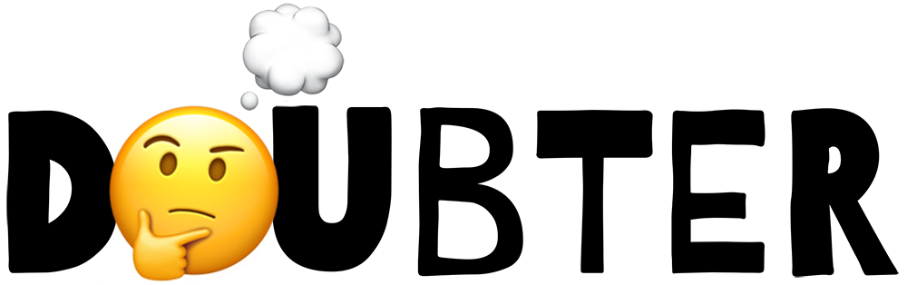

<p align="center">
  <br/>
  
  <br/>
  <br/>
  <a href="https://github.com/smikhalevski/doubter/actions/workflows/master.yml">
    
  </a>
</p>

<br/>

No-hassle runtime validation and transformation library.

- TypeScript first;
- Zero dependencies;
- Sync and async validation and transformation flows;
- [Human-oriented type coercion;](#type-coercion)
- [High performance and low memory consumption;](#performance)
- [Just 10 kB gzipped](https://bundlephobia.com/result?p=doubter) and tree-shakable;

🔥&ensp;[**Try Doubter on CodeSandbox**](https://codesandbox.io/s/doubter-example-y5kec4)

```shell
npm install --save-prod doubter
```

**Core features**

- [Basics](#basics)
- [Shapes](#shapes)
- [Parsing and trying](#parsing-and-trying)
- [Validation errors](#validation-errors)
- [Checks](#checks)
- [Refinements](#refinements)
- [Transformations](#transformations)
- [Parsing context](#parsing-context)
- [Shape piping](#shape-piping)
- [Exclude](#exclude)
- [Include](#include)
- [Replace](#replace)
- [Optional and non-optional](#optional-and-non-optional)
- [Nullable and nullish](#nullable-and-nullish)
- [Fallback value](#fallback-value)
- [Branded types](#branded-types)
- [Sub-shape at key](#sub-shape-at-key)
- [Localization](#localization)
- [Integrations](#integrations)
- [Guarded functions](#guarded-functions)

[**Type coercion**](#type-coercion)
- [Coerce to string](#coerce-to-string)
- [Coerce to number](#coerce-to-number)
- [Coerce to boolean](#coerce-to-boolean)
- [Coerce to bigint](#coerce-to-bigint)
- [Coerce to enum](#coerce-to-enum)
- [Coerce to array](#coerce-to-array)
- [Coerce to `Date`](#coerce-to-date)
- [Coerce to `Promise`](#coerce-to-promise)
- [Coerce to `Map`](#coerce-to-map)
- [Coerce to `Set`](#coerce-to-set)

[**Cookbook**](#cookbook)

- [Rename object keys](#rename-object-keys)
- [Type-safe URL query params](#type-safe-url-query-params)

[**Performance**](#performance)

[**Data types**](#data-types)

- Strings<br>
  [`string`](#string)

- Numbers<br>
  [`number`](#number)
  [`integer`](#integer)
  [`int`](#integer)
  [`finite`](#finite)
  [`nan`](#nan)
  [`bigint`](#bigint)

- Booleans<br>
  [`boolean`](#boolean)
  [`bool`](#boolean)

- Symbols<br>
  [`symbol`](#symbol)

- Literal values<br>
  [`enum`](#enum)
  [`const`](#const)
  [`null`](#null)
  [`undefined`](#undefined)
  [`void`](#void)

- Objects<br>
  [`object`](#object)
  [`record`](#record)
  [`instanceOf`](#instanceof)

- Collections<br>
  [`array`](#array)
  [`tuple`](#tuple)
  [`set`](#set)
  [`map`](#map)

- Dates<br>
  [`date`](#date)

- Promises<br>
  [`promise`](#promise)

- Shape composition<br>
  [`union`](#union)
  [`or`](#union)
  [`intersection`](#intersection)
  [`and`](#intersection)

- Unconstrained values<br>
  [`any`](#any)
  [`unknown`](#unknown)
  [`never`](#never)

- Other<br>
  [`transform`](#transform)
  [`lazy`](#lazy)
  [`json`](#json)

# Basics

Let's create a simple shape of a user object:

```ts
import * as d from 'doubter';

const userShape = d.object({
  name: d.string(),
  age: d.int().gte(18).lt(100)
});
// ⮕ Shape<{ name: string, age: number }>
```

This shape can be used to validate a value:

```ts
userShape.parse({
  name: 'John Belushi',
  age: 30
});
// ⮕ { name: 'John Belushi', age: 30 }
```

If an incorrect value is provided, a validation error is thrown:

```ts
userShape.parse({
  name: 'Peter Parker',
  age: 17
});
// ❌ ValidationError: numberGreaterThanOrEqual at /age: Must be greater than or equal to 18
```

Infer user type from the shape:

```ts
type User = typeof userShape['output'];

const user: User = {
  name: 'Dan Aykroyd',
  age: 27
};
```

# Shapes

Shapes are validation and transformation pipelines that have an input and an output. Here's a shape that restricts an
input to a string and produces a string as an output:

```ts
d.string();
// ⮕ Shape<string>
```

Shapes can have different input and output types. For example, the shape below allows strings and
[replaces `undefined`](#optional-and-non-optional) input values with a default value "Mars":

```ts
const shape = d.string().optional('Mars');
// ⮕ Shape<string | undefined, string>

shape.parse('Pluto');
// ⮕ 'Pluto'

shape.parse(undefined);
// ⮕ 'Mars'
```

Infer the input and output types of the shape:

```ts
type ShapeInput = typeof shape['input'];
// ⮕ string | undefined

type ShapeOutput = typeof shape['output'];
// ⮕ string
```

## Async shapes

[Transformations](#transformations) and reliance on [promise shapes](#promise) make your shapes async.

Here's a shape of a promise that is expected to be fulfilled with a number:

```ts
const asyncShape = d.promise(d.number());
// ⮕ Shape<Promise<number>>
```

You can check that the shape is async:

```ts
asyncShape.async // ⮕ true
```

Async shapes don't support synchronous `parse` method, and would throw an error if it is called:

```ts
asyncShape.parse(Promise.resolve(42));
// ❌ Error: Shape is async
```

Use `parseAsync` with async shapes instead:

```ts
asyncShape.parseAsync(Promise.resolve(42));
// ⮕ Promise<42>
```

Any shape that relies on an async shape becomes async as well:

```ts
const objectShape = d.object({
  foo: asyncShape
});
// ⮕ Shape<{ foo: Promise<number> }>

objectShape.async // ⮕ true
```

# Parsing and trying

Each shape can parse input values and there are several methods for that purpose.

Methods listed in this section can be safely detached from the shape instance:

```ts
const { parseOrDefault } = d.string();

parseOrDefault('Jill');
// ⮕ 'Jill'

parseOrDefault(42);
// ⮕ undefined
```

## `parse`

You're already familiar with `parse` that takes an input value and returns an output value, or throws a validation error
is parsing fails:

```ts
const shape = d.number();
// ⮕ Shape<number>

shape.parse(42);
// ⮕ 42

shape.parse('Mars');
// ❌ ValidationError: type at /: Must be a number
```

Use `parseAsync` with [async shapes](#async-shapes). It has the same semantics and returns a promise.

## `parseOrDefault`

Sometimes you don't care about validation errors, and want a default value to be returned if things go south:

```ts
const shape = d.number();
// ⮕ Shape<number>

shape.parseOrDefault(42);
// ⮕ 42

shape.parseOrDefault('Mars');
// ⮕ undefined

shape.parseOrDefault('Pluto', 5.3361);
// ⮕ 5.3361
```

If you need a fallback value for a nested shape [consider using `catch`](#fallback-value).

Use `parseOrDefaultAsync` with [async shapes](#async-shapes). It has the same semantics and returns a promise.

## `try`

It isn't always convenient to write a try-catch blocks to handle validation errors. Use `try` method in such cases:

```ts
const shape = d.number();
// ⮕ Shape<number>

shape.try(42);
// ⮕ { ok: true, value: 42 }

shape.try('Mars');
// ⮕ { ok: false, issues: [{ code: 'type', … }] }
```

Use `tryAsync` with [async shapes](#async-shapes). It has the same semantics and returns a promise.

# Validation errors

Validation errors which are thrown by the `parse*` methods, and
[`Err`](https://smikhalevski.github.io/doubter/interfaces/Err.html) objects returned by the `try*` methods have the
`issues` property which holds an array of validation issues:

```ts
const shape = d.object({ age: d.number() });
// ⮕ Shape<{ age: number }>

const result = shape.try({ age: 'Seventeen' });
// ⮕ { ok: false, issues: … }
```

In the example above `result.issues` would contain a single issue:

```ts
[{
  code: 'type',
  path: ['age'],
  input: 'Seventeen',
  message: 'Must be a number',
  param: 'number',
  meta: undefied
}]
```

<dl>
<dt><code>code</code></dt>
<dd>

Is the code of the validation issue. Shapes provide various checks and each check has a unique code.
In the example above, `type` code refers to a failed number type check. See the table of known codes below. You can
add [a custom check](#checks) to any shape and return an issue with your custom code.

</dd>
<dt><code>path</code></dt>
<dd>

Is the object path, represented as an array that may contain strings, numbers (array indices and such), symbols, and
any other values (since they can be `Map` keys).

</dd>
<dt><code>input</code></dt>
<dd>

Is the input value that caused a validation issue. Note that if [coercion](#type-coercion) is enabled this contains a
coerced value.

</dd>
<dt><code>message</code></dt>
<dd>

Is the human-readable issue message. Refer to [Localization](#localization) section for more details.

</dd>
<dt><code>param</code></dt>
<dd>

Is the parameter value associated with the issue. Parameter value usually depends on `code`, see the table below.

</dd>
<dt><code>meta</code></dt>
<dd>

Is the optional metadata associated with the issue. Refer to [Metadata](#metadata) section for more details.

</dd>
</dl>

<br/>

| Code | Caused by | Param |
| :-- | :-- | :-- |
| `arrayMinLength` | [`d.array().min(n)`](#array) | The minimum array length `n` |
| `arrayMaxLength` | [`d.array().max(n)`](#array) | The maximum array length `n` |
| `const` | [`d.const(x)`](#const) | The expected constant value `x` |
| `enum` | [`d.enum([x, y, z])`](#enum) | The list of unique expected values`[x, y, z]` |
| `exclusion` | [`shape.exclude(x)`](#exclude) | The excluded value `x` |
| `instance` | [`instanceOf(Class)`](#instanceof) | The class constructor `Class` |
| `intersection` | [`d.and(…)`](#intersection) | — |
| `json` | [`d.json()`](#json) | The message from `JSON.parse()` |
| `predicate` | [`shape.refine(…)`](#refinements) | The callback passed to `refine`  |
| `numberInteger` | [`d.integer()`](#integer) | — |
| `numberFinite` | [`d.finite()`](#finite) | — |
| `numberGreaterThan` | [`d.number().gt(x)`](#number) | The exclusive minimum value `x` |
| `numberGreaterThanOrEqual` | [`d.number().gte(x)`](#number) | The minimum value `x` |
| `numberLessThan` | [`d.number().lt(x)`](#number) | The exclusive maximum value `x` |
| `numberLessThanOrEqual` | [`d.number().lte(x)`](#number) | The maximum value `x` |
| `numberMultipleOf` | [`d.number().multipleOf(x)`](#number) | The divisor `x` |
| `setMinSize` | [`d.set().min(n)`](#set) | The minimum `Set` size `n` |
| `setMaxSize` | [`d.set().max(n)`](#set) | The maximum `Set` size `n` |
| `stringMinLength` | [`d.string().min(n)`](#string) | The minimum string length `n` |
| `stringMaxLength` | [`d.string().max(n)`](#string) | The maximum string length `n` |
| `stringRegex` | [`d.string().regex(re)`](#string) | The regular expression `re` |
| `type` | All shapes | The expected input value type <a href="#value-types"><sup>✱</sup></a> |
| `tuple` | [`d.tuple([…])`](#tuple) | The expected tuple length |
| `union` | [`d.or(…)`](#union) | The array of expected input value types <a href="#value-types"><sup>✱</sup></a> |
| `unknownKeys` | [`d.object().exact()`](#unknown-keys) | The array of unknown keys |

<a href="#value-types" name="value-types"><sup>✱</sup></a> The list of known value types:

- `array`
- `bigint`
- `boolean`
- `date`
- `function`
- `object`
- `map`
- `never`
- `null`
- `number`
- `promise`
- `set`
- `string`
- `symbol`
- `undefined`

# Checks

Checks allow constraining the input value beyond type assertions. For example, if you want to constrain an input number
to be greater than 5:

```ts
const shape1 = d.number().check(value => {
  if (value <= 5) {
    // 🟡 Return a partial issue
    return { code: 'kaputs' };
  }
});
// ⮕ Shape<number>

shape1.parse(10);
// ⮕ 10

shape1.parse(3);
// ❌ ValidationError: kaputs at /
```

A check callback receives an input value and returns a partial issue or an array of partial issues if the value is
invalid.

> **Note**&ensp; Check callbacks can safely throw a `ValidationError` to notify Doubter that parsing issues occurred.
> While this has the same effect as returning an array of issues, it is recommended to throw a `ValidationError` as the
> last resort since catching errors has a high performance penalty.

If value is valid, a check callback must return `null` or `undefined`.

Most shapes have a set of built-in checks. The check we've just implemented above is called `gt` (greater than):

```ts
d.number().gt(5);
```

Add as many checks as you need to the shape. They are executed the same order they are defined.

```ts
d.string().max(4).regex(/a/).parse('Pluto');
```

In the example above, a validation error would be thrown with a single issue:

```ts
[{
  code: 'stringMaxLength',
  path: [],
  input: 'Pluto',
  message: 'Must have the maximum length of 4',
  param: 4,
  meta: undefied
}]
```

> **Note**&ensp;You can find the list of issue codes and corresponding param values in
> [Validation errors](#validation-errors) section.

Doubter halts parsing and raises a validation error as soon as the first issue was encountered. Sometimes you may want
to collect all issues that prevent input from being successfully parsed. To do this, pass a `verbose` option to a parse
method.

If you want a check to be executed even if the previous check on the shape has failed, pass the `unsafe` option to the
check method:

```ts
const shape2 = d.string()
  .max(4)
  // 🟡 Unsafe regex check is executed even if max fails
  .regex(/a/, { unsafe: true });

shape.parse('Pluto', { verbose: true });
// ❌ ValidationError
```

The validation error contains following issues:

```ts
[
  {
    code: 'stringMaxLength',
    path: [],
    input: 'Pluto',
    message: 'Must have the maximum length of 4',
    param: 4,
    meta: undefied
  },
  {
    code: 'stringRegex',
    path: [],
    input: 'Pluto',
    message: 'Must regex the pattern /a/',
    param: /a/,
    meta: undefied
  }
]
```

## Add, get and delete checks

Let's consider the same check being added to the shape twice:

```ts
const emailCheck: d.CheckCallback = (value, options) => {
  if (!value.includes('@')) {
    return { code: 'email' };
  }
};

const shape = d.string().check(emailCheck).check(emailCheck);
// ⮕ Shape<string>
```

`emailCheck` check would be added to the shape only once, because Doubter makes checks to be distinct.

You can later delete a check you've added:

```ts
shape.deleteCheck(emailCheck);
// ⮕ Shape<string>
```

Using a check callback as an identity isn't always convenient, so you can pass a `key` option:

```ts
shape.check(emailCheck, { key: 'okay' });
// ⮕ Shape<string>
```

Now you should use this key to delete the check:

```ts
shape.deleteCheck('okay');
// ⮕ Shape<string>
```

You can retrieve a check by its key. If `key` option was omitted, the check callback identity is used as a key:

```ts
shape.check(emailCheck);

shape.getCheck(emailCheck);
// ⮕ { callback: emailCheck, unsafe: false, param: undefined }
```

## Metadata

Built-in checks have the `meta` option. Its value is later assigned to the `meta` property of the raised
[validation issue](#validation-errors).

```ts
const shape = d.number().gt(5, { meta: 'Useful data' });
// ⮕ Shape<number>

const result = shape.try(2);
// ⮕ { ok: false, issues: … }

if (!result.ok) {
  result.issues[0].meta // ⮕ 'Useful data'
}
```

This comes handy if you want to enhance an issue with an additional data that can be used later during issues
processing. For example, during [localization](#localization).

# Refinements

Refinements are a simplified checks that use a predicate to validate an input. For example, the shape below would raise
an issue if the input string is less than three characters long.

```ts
d.string().refine(value => value.length >= 3);
// ⮕ Shape<string>
```

Use refinements to [narrow](https://www.typescriptlang.org/docs/handbook/2/narrowing.html) the output type of the shape:

```ts
function isMarsOrPluto(value: string): 'Mars' | 'Pluto' {
  return value === 'Mars' || value === 'Pluto';
}

d.string().refine(isMarsOrPluto)
// ⮕ Shape<string, 'Mars' | 'Pluto'>
```

# Transformations

Along with validation, shapes can transform values. Let's consider a shape that takes a string as an input and converts
it to number:

```ts
const shape = d.string().transform(parseFloat);
// ⮕ Shape<string, number>
```

This shape ensures that the input value is a string and passes it to a transformation callback:

```ts
shape.parse('42');
// ⮕ 42

shape.parse('Seventeen');
// ⮕ NaN
```

Throw a `ValidationError` inside the transformation callback to notify parser that transformation cannot be successfully
completed:

```ts
function toNumber(input: string): number {
  const output = parseFloat(input);

  if (isNaN(output)) {
    throw new d.ValidationError([{ code: 'kaputs' }]);
  }
  return output;
}

const shape = d.string().transform(toNumber);

shape.parse('42');
// ⮕ 42

shape.parse('Seventeen');
// ❌ ValidationError: kaputs at /
```

## Async transformations

Let's consider a _sync_ transformation:

```ts
const syncShape1 = d.string().transform(
  value => 'Hello, ' + value
);
// ⮕ Shape<string>

syncShape1.async // ⮕ false

syncShape1.parse('Jill');
// ⮕ 'Hello, Jill'
```

The transformation callback receives and returns a string and so does `syncShape1`.

Now lets return a promise from the transformation callback:

```ts
const syncShape2 = d.string().transform(
  value => Promise.resolve('Hello, ' + value)
);
// ⮕ Shape<string, Promise<string>>

syncShape2.async // ⮕ false

syncShape2.parse('Jill');
// ⮕ Promise<string>
```

Notice that `syncShape2` is asymmetric: it expects a string input and transforms it to a `Promise<string>`. `syncShape2`
is still sync, since the transformation callback _synchronously wraps_ a value in a promise.

Now let's create an _async_ shape using the async transformation:

```ts
const asyncShape1 = d.string().transformAsync(
  value => Promise.resolve('Hello, ' + value)
);
// ⮕ Shape<string>

// 🟡 Notice that the shape is async
asyncShape1.async // ⮕ true

await asyncShape1.parseAsync('Jill');
// ⮕ 'Hello, Jill'
```

Notice that `asyncShape1` still transforms the input string value to output string but the transformation itself is
async.

A shape is async if it uses async transformations. Here's an async object shape:

```ts
const asyncShape2 = d.object({
  foo: d.string().transformAsync(
    value => Promise.resolve(value)
  )
});
// ⮕ Shape<{ foo: string }>

asyncShape2.async // ⮕ true
```

> **Note**&ensp;Composite shapes are async if they rely on a [`promise`](#promise) shape:
>
> ```ts
> const shape = d.object({
>   foo: d.promise(d.string())
> });
> // ⮕ Shape<{ foo: Promise<string> }>
> 
> shape.async // ⮕ true
> ```

# Parsing context

Inside [check](#checks) and [transform](#transformations) callbacks you can access options passed to the parser. The
`context` option may store arbitrary data, which is `undefined` by default.

The example below shows how you can transform numbers to formatted strings using context:

```ts
const shape = d.number().transform(
  (value, options) => new Intl.NumberFormat(options.context.locale).format(value)
);
// ⮕ Shape<number, string>

shape.parse(
  1000,
  {
    // 🟡 Pass a context
    context: { locale: 'en-US' }
  }
);
// ⮕ '1,000'
```

# Shape piping

With shape piping you to can pass the shape output to another shape.

```ts
const shape1 = d.string().transform(parseFloat);
// ⮕ Shape<string, number>

shape1.to(number().lt(5).gt(10));
// ⮕ Shape<string, number>
```

Piping is particularly useful in conjunction with [transformations](#transformations) and [JSON shape](#json). The
example below shows how you can parse input JSON string and ensure that the output is an object:

```ts
const shape2 = d.json().to(
  d.object({ foo: d.bigint() }).coerce()
);

shape2.parse('{"foo":"6889063"}');
// ⮕ { foo: BigInt(6889063) }
```

# Exclude

Consider the enum shape:

```ts
const shape1 = d.enum(['Mars', 'Pluto', 'Jupiter']);
// ⮕ Shape<'Mars' | 'Pluto' | 'Jupiter'>
```

To exclude a value from this enum you can use `exclude`:

```ts
shape1.exclude('Pluto');
// ⮕ Shape<'Mars' | 'Jupiter'>
```

Value exclusion works with any shape. For example, you can exclude a number:

```ts
const shape2 = d.number().exclude(42);
// ⮕ Shape<number>

shape2.parse(33);
// ⮕ 33

shape2.parse(42);
// ❌ ValidationError: exclusion at /: Must not be equal to 42
```

Exclude prohibits value for _both input and output_:

```ts
const shape3 = d.number().transform(value => value * 2).exclude(42);
// ⮕ Shape<number>

shape3.parse(21);
// ❌ ValidationError: exclusion at /: Must not be equal to 42
```

# Include

You can add a value to a multitude of input values:

```ts
d.const('Mars').include('Pluto');
// ⮕ Shape<'Mars' | 'Pluto'>
```

Included values don't go through checks and transformations of the underlying shape:

```ts
const shape = d.number().gt(3).include('Seventeen');
// ⮕ Shape<number | 'Seventeen'>

shape.parse(2);
// ❌ ValidationError: numberGreaterThan at /: Must be greater than 3

shape.parse(100);
// ⮕ Shape<100>

// 🟡 Notice that parsed value doesn't satisfy the number type and gt constraints
shape.parse('Seventeen');
// ⮕ 'Seventeen'
```

# Replace

Include a value as an input and replace it with another value on the output side:

```ts
const shape = d.const('Mars').replace('Pluto', 'Jupiter');
// ⮕ Shape<'Mars' | 'Pluto', 'Mars' | 'Jupiter'>

shape.parse('Mars');
// ⮕ 'Mars'

shape.parse('Pluto');
// ⮕ 'Jupiter'
```

Note that `replace` treats passed values as literals but in TypeScript type system not all values can be literals. For
example, there's no literal type for `NaN` which may cause unexpected result:

```ts
// 🔴 Note that the shape output is unexpectedly typed as 0
d.number().replace(NaN, 0);
// ⮕ Shape<number, 0>
```

Why is output inferred as 0 and not as a `number`? This occurs because `typeof NaN` is `number` and it is excluded from
the output type of the shape. For this particular case use `nan` method of number shape:

```ts
// 🟡 Note that the shape output is a number
const shape = d.number().nan(0);
// ⮕ Shape<number>

shape.parse(NaN);
// ⮕ 0
```

# Optional and non-optional

Marking a shape as optional allows `undefined` in both its input and output:

```ts
d.string().optional();
// ⮕ Shape<string | undefined>
```

You can provide a default value of any type, so it would be used as an output if input value is `undefined`:

```ts
d.string().optional(42);
// ⮕ Shape<string | undefined, string | 42>
```

You can achieve the same behaviour as `optional` using a union:

```ts
d.or([
  d.string(),
  d.undefined()
]);
// ⮕ Shape<string | undefined>
```

Or using an inclusion:

```ts
d.string().include(undefined);
// ⮕ Shape<string | undefined>
```

You can mark any shape as non-optional which effectively [excludes `undefined`](#exclude) values from both input and
output. For example, lets consider a union of an optional string and a number:

```ts
const shape1 = d.or([
  d.string().optional(),
  d.number()
]);
// ⮕ Shape<string | undefined | number>

shape1.parse(undefined);
// ⮕ undefined
```

Now let's mark this shape as non-optional:

```ts
const shape2 = shape1.nonOptional();
// ⮕ Shape<string | number>

shape2.parse(undefined);
// ❌ ValidationError: exclusion at /: Must not be equal to undefined
```

# Nullable and nullish

Marking a shape as nullable allows `null` for both input and output:

```ts
d.string().nullable();
// ⮕ Shape<string | null>
```

You can provide a default value, so it would be used as an output if input value is `null`:

```ts
d.string().nullable(42);
// ⮕ Shape<string | null, string | 42>
```

To allow both `null` and `undefined` values use `nullish`:

```ts
d.string().nullish();
// ⮕ Shape<string | null | undefined>
```

`nullish` also supports the default value:

```ts
d.string().nullish(8080);
// ⮕ Shape<string | null | undefined, string | 8080>
```

# Fallback value

If issues were detected during parsing a shape can return a fallback value.

```ts
const shape1 = d.string().catch('Mars');

shape1.parse('Pluto');
// ⮕ 'Pluto'

shape1.parse(42);
// ⮕ 'Mars'
```

Pass a callback as a fallback value, it would be executed every time the catch clause is reached:

```ts
const shape2 = d.number().catch(Date.now);

shape2.parse(42)
// ⮕ 42

shape2.parse('Pluto');
// ⮕ 1671565311528

shape2.parse('Mars');
// ⮕ 1671565326707
```

# Branded types

TypeScript's type system is structural, which means that any two types that are structurally equivalent are considered
the same.

```ts
interface Cat {
  name: string;
}

interface Dog {
  name: string;
}

declare function petCat(cat: Cat): void;

const fidoDog: Dog = {
  name: 'Fido'
};

petCat(fidoDog);
// ✅ Ok yet types are different
```

In some cases, its can be desirable to simulate nominal typing inside TypeScript. For instance, you may wish to write a
function that only accepts an input that has been validated by Doubter. This can be achieved with branded types:

```ts
const catShape = d.object({ name: d.string() }).brand<'Cat'>();

type Cat = typeof catShape['input'];

declare function petCat(cat: Cat): void;

petCat(catShape.parse({ name: 'Simba' }));
// ✅ Ok, since the cat was validated

petCat({ name: 'Fido' });
// ❌ Error: Expected BRAND to be Cat
```

Under the hood, this works by attaching a "brand" to the inferred type using an intersection type. This way,
plain/unbranded data structures are no longer assignable to the inferred type of the shape.

Note that branded types do not affect the runtime result of `parse`. It is a static-only construct.

# Sub-shape at key

Object, array, union ond other shapes provide access to their nested shapes:

```ts
const objectShape = d.object({
  name: d.string(),
  age: d.number()
});
// ⮕ Shape<{ name: string, age: number }>

objectShape.shapes.name // ⮕ Shape<number>

const unionShape = d.or([d.string(), objectShape]);
// ⮕ Shape<string | { name: string, age: number }>

unionShape.shapes[1] // ⮕ objectShape
```

`at` method derives a sub-shape at the given key, and if there's no key `null` is returned:

```ts
objectShape.at('age');
// ⮕ Shape<number>

objectShape.at('unknownKey');
// ⮕ null
```

This is especially useful with composite shapes:

```ts
const shape = d.or([
  d.object({
    foo: d.string()
  }),
  d.object({
    foo: d.number()
  })
]);

shape.at('foo')
// ⮕ Shape<string | number>

shape.at('bar')
// ⮕ null
```

# Localization

All shape factories and built-in checks support custom issue messages:

```ts
d.string('Hey, string here').min(3, 'Too short');
```

Checks that have a param, such as `min` constraint in the example above, can use a `%s` placeholder that would be
interpolated with the param value.

```ts
d.string().min(3, 'Minimum length is %s');
```

Pass a function as a message, and it would receive a check param, an [issue code](#validation-errors), an input value,
[a metadata](#metadata), and parsing options and should return a formatted message value. The returned formatted message
can be of any type.

For example, when using with React you may return a JSX element:

```tsx
const gtMessage: d.Message = (param, code, input, meta, options) => (
  <span style={{ color: 'red' }}>
    Minimum length is {param}
  </span>
);

d.number().gt(5, gtMessage);
```

All rules described above are applied to the `message` option as well:

```ts
d.string().length(3, { message: 'Expected length is %s' })
```

# Integrations

How to validate an email or UUID? Combine Doubter with your favourite predicate library:

```ts
import * as d from 'doubter';
import isEmail from 'validator/lib/isEmail';

const emailShape = d.string().refine(isEmail, 'Must be an email');
// ⮕ Shape<string>

emailShape.parse('Not an email');
// ❌ ValidationError: predicate at /: Must be an email

emailShape.getCheck(isEmail);
// ⮕ { key: isEmail, … }
```

# Guarded functions

Returns a function which parses arguments using provided shapes:

```ts
const callback = d.guard([d.string(), d.boolean()], (arg1, arg2) => {
  // arg1 is string
  // arg2 is boolean
});
```

Or check all arguments with a shape that parses arrays:

```ts
const callback = d.guard(d.array(d.string()), (...args) => {
  // args is string[]
});
```

Or if you have a single non-array argument, you can pass its shape:

```ts
const callback = d.guard(d.string(), arg => {
  // arg is string
});
```

To guard multiple functions omit the callback parameter and a factory function would be returned:

```ts
const callbackFactory = d.guard(d.string());

const callback = callbackFactory(arg => {
  // arg is string
});
```

If you are want to use async shapes to parse arguments, use `guardAsync` which has the same signatures as `guard`.

# Type coercion

Type coercion is the process of converting value from one type to another (such as string to number, array to `Set`,
and so on).

When coercion is enabled, input values are implicitly converted to the required input type whenever possible.
For example, you can coerce input values to string type:

```ts
const shape1 = d.string().coerce();

shape1.parse([8080]);
// ⮕ '8080'

shape1.parse(null);
// ⮕ ''
```

Coercion can be enabled on shape-by-shape basis (as shown in the example above), or it can be enabled for all shapes
when `coerced` option is passed to a [parsing method](#parsing-and-trying):

```ts
const shape2 = d.object({
  name: d.string(),
  birthday: d.date()
});

shape2.parse(
  {
    name: ['Jake'],
    birthday: '1949-01-24'
  },
  { coerced: true }
);
// ⮕ { name: 'Jake', birthday: new Date(-660700800000) }
```

Coercion rules differ from JavaScript so the behavior is more predictable and human-like.

## Coerce to string

`null` and `undefined` are converted to an empty string:

```ts
const shape = d.string().coerce();

shape.parse(null);
// ⮕ ''
```

Finite numbers, boolean and bigint values are converted via `String(value)`:

```ts
shape.parse(BigInt(2398955));
// ⮕ '2398955'

shape.parse(8080);
// ⮕ '8080'

shape.parse(-Infinity);
// ❌ ValidationError: type at /: Must be a string
```

Valid dates are converted to an ISO formatted string:

```ts
shape.parse(new Date(1674352106419));
// ⮕ '2023-01-22T01:48:26.419Z'

shape.parse(new Date(NaN));
// ❌ ValidationError: type at /: Must be a string
```

Arrays with a single element are unwrapped and the value is coerced:

```ts
shape.parse([undefined]);
// ⮕ ''

shape.parse(['Jill', 'Sarah']);
// ❌ ValidationError: type at /: Must be a string
```

## Coerce to number

`null` and `undefined` values are converted to 0:

```ts
const shape = d.number().coerce();

shape.parse(null);
// ⮕ 0
```

Strings, boolean values and `Date` objects are converted using `+value`:

```ts
shape.parse('42');
// ⮕ 42

shape.parse('Seventeen');
// ❌ ValidationError: type at /: Must be a number
```

Arrays with a single element are unwrapped and the value is coerced:

```ts
shape.parse([new Date('2023-01-22')]);
// ⮕ 1674345600000

shape.parse([1997, 1998]);
// ❌ ValidationError: type at /: Must be a number
```

## Coerce to boolean

`null`, `undefined`, `'false'` and 0 are converted to `false`:

```ts
const shape = d.boolean().coerce();

shape.parse(null);
// ⮕ false
```

`'true'` and 1 are converted to `true`:

```ts
shape.parse('true');
// ⮕ true

shape.parse('yes');
// ❌ ValidationError: type at /: Must be a boolean
```

Arrays with a single element are unwrapped and the value is coerced:

```ts
shape.parse([undefined]);
// ⮕ false

shape.parse([0, 1]);
// ❌ ValidationError: type at /: Must be a boolean
```

## Coerce to bigint

`null` and `undefined` are converted to 0:

```ts
const shape = d.bigint().coerce();

shape.parse(null);
// ⮕ BigInt(0)
```

Number, string and boolean values are converted via `BigInt(value)`:

```ts
shape.parse('18588');
// ⮕ BigInt(18588)

shape.parse('Unexpected')
// ❌ ValidationError: type at /: Must be a bigint
```

Arrays with a single element are unwrapped and the value is coerced:

```ts
shape.parse([0xdea]);
// ⮕ BigInt(3562)

shape.parse([BigInt(1), BigInt(2)]);
// ❌ ValidationError: type at /: Must be a bigint
```

## Coerce to enum

If an enum is defined via a native TypeScript enum or via a const object, then enum element names are coerced to
corresponding values:

```ts
enum Users {
  JILL,
  SARAH,
  JAMES
}

const shape = d.enum(Users).coerce();

shape.parse('SARAH');
// ⮕ 1
```

Arrays with a single element are unwrapped and the value is coerced:

```ts
shape.parse(['JAMES']);
// ⮕ 2

shape.parse([1]);
// ⮕ 1

shape.parse([1, 2]);
// ❌ ValidationError: enum at /: Must be equal to one of 0,1,2
```

## Coerce to array

Iterables and array-like objects are converted to array via `Array.from(value)`:

```ts
const shape = d.array(d.string()).coerce();

shape.parse(new Set(['John', 'Jack']));
// ⮕ ['John', 'Jack']

shape.parse({ 0: 'Bill', 1: 'Jill', length: 2 });
// ⮕ ['Bill', 'Jill']
```

Scalars, non-iterable and non-array-like objects are wrapped into an array:

```ts
shape.parse('Rose');
// ⮕ ['Rose']
```

## Coerce to `Date`

Strings and numbers are converted via `new Date(value)` and if an invalid date is produced then an issue is raised:

```ts
const shape = d.date().coerce();

shape.parse('2023-01-22');
// ⮕ Date

shape.parse('Yesterday');
// ❌ ValidationError: type at /: Must be a Date
```

Arrays with a single element are unwrapped and the value is coerced:

```ts
shape.parse([1674352106419]);
// ⮕ Date

shape.parse(['2021-12-03', '2023-01-22']);
// ❌ ValidationError: type at /: Must be a Date
```

## Coerce to `Promise`

All values are converted to a promise by wrapping it in `Promise.resolve()`:

```ts
const shape = d.promise(d.number()).coerce();

shape.parseAsync(42);
// ⮕ Promise<number>
```

## Coerce to `Map`

Arrays, iterables and array-like objects that withhold entry-like elements (a tuple with two elements) are converted to
`Map` entries via `Array.from(value)`:

```ts
const shape = d.map(d.string(), d.number()).coerce();

shape.parse([
  ['Mars', 0.1199],
  ['Pluto', 5.3361]
]);
// ⮕ Map { 'Mars' → 0.1199, 'Pluto' → 5.3361 }

shape.parse(['Jake', 'Bill']);
// ❌ ValidationError: type at /: Must be a Map
```

Other objects are converted to an array of entries via `new Map(Object.entries(value))`:

```ts
shape.parse({
  Jake: 31,
  Jill: 28
});
// ⮕ Map { 'Jake' → 31, 'Jill' → 28 }
```

## Coerce to `Set`

Arrays, iterables and array-like objects converted to `Set` values via `Array.from(value)`:

```ts
const shape = d.set(d.string()).coerce();

shape.parse(['Boris', 'K']);
// ⮕ Set { 'Boris', 'K' }
```

Scalars, non-iterable and non-array-like objects are wrapped into an array:

```ts
shape.parse('J');
// ⮕ Set { 'J' }
```

# Cookbook

Tasty recipes from the chef.

## Rename object keys

```ts
const keyShape = d.enum(['foo', 'bar']).transform(
  value => value.toUpperCase() as 'FOO' | 'BAR'
);
// ⮕ Shape<'foo' | 'bar', 'FOO' | 'BAR'>

const shape = d.record(keyShape, d.number());
// ⮕ Shape<Record<'foo' | 'bar', number>, Record<'FOO' | 'BAR', number>>

shape.parse({ foo: 1, bar: 2 });
// ⮕ { FOO: 1, BAR: 2 }
```

## Type-safe URL query params

```ts
import qs from 'qs';

const queryShape = d.object({
  name: d.string().optional(),
  age: d.int().gt(0).coerce().catch().optional()
});
// ⮕ Shape<{ name: string | undefined, age: number | undefined }>

queryShape.parse(qs.parse('name=Frodo&age=50'));
// ⮕ { name: 'Frodo', age: 50 }

queryShape.parse(qs.parse('age=-33'));
// ⮕ { age: undefined }
```

# Performance

The chart below showcases the performance comparison in terms of millions of operations per second (greater is better).
Tests were conducted using [TooFast](https://github.com/smikhalevski/toofast).

<p align="center">
  
</p>

Clone this repo and use `npm ci && npm run perf` to run the performance testsuite.

Validation performance was measured for the following object:

```ts
const value = {
  a1: [1, 2, 3],
  a2: 'foo',
  a3: false,
  a4: {
    a41: 'bar',
    a42: 3.1415
  }
};
```

The Doubter shape under test:

```ts
const shape = d.object({
  a1: d.array(d.int()),
  a2: d.string().min(3),
  a3: d.boolean(),
  a4: d.object({
    a41: d.enum(['foo', 'bar']),
    a42: d.number()
  })
});
```

# Data types

🔎 [API documentation is available here.](https://smikhalevski.github.io/doubter/)

## `any`

An unconstrained value that is inferred as `any`:

```ts
d.any();
// ⮕ Shape<any>
```

Use `any` to create shapes that are unconstrained at runtime but constrained at compile time:

```ts
d.any<{ foo: string }>();
// ⮕ Shape<{ foo: string }>
```

Create a shape that is constrained by a
[narrowing predicate](https://www.typescriptlang.org/docs/handbook/2/narrowing.html):

```ts
d.any((value): value is string => typeof value === 'string');
// ⮕ Shape<any, string>
```

## `array`

Constrains a value to be an array:

```ts
d.array();
// ⮕ Shape<any[]>
```

Restrict array element types:

```ts
d.array(d.number());
// ⮕ Shape<number[]>
```

Constrain the length of an array:

```ts
d.array(d.string()).min(1).max(10);
```

Limit both minimum and maximum array length at the same time:

```ts
d.array(d.string()).length(5);
```

Transform array values during parsing:

```ts
d.array(d.string().transform(parseFloat));
// ⮕ Shape<string[], number[]>
```

## `bigint`

Constrains a value to be a bigint.

```ts
d.bigint();
// ⮕ Shape<bigint>
```

## `boolean`

Constrains a value to be boolean.

```ts
d.boolean();
// or
d.bool();
// ⮕ Shape<boolean>
```

## `const`

Constrains a value to be an exact value:

```ts
d.const('Mars');
// ⮕ Shape<'Mars'>
```

There are shortcuts for [`null`](#null), [`undefined`](#undefined) and [`nan`](#nan) constants.

Consider using [`enum`](#enum) if you want a value to be one of multiple literal values.

## `date`

Constrains a value to be a valid date.

```ts
d.date();
// ⮕ Shape<Date>
```

## `enum`

Constrains a value to be equal to one of predefined values:

```ts
d.enum(['Mars', 'Pluto', 'Jupiter']);
// ⮕ Shape<'Mars', 'Pluto', 'Jupiter'>
```

Or use a native TypeScript enum to limit possible values:

```ts
enum Planet {
  MARS,
  PLUTO,
  JUPITER
}

d.enum(Planet);
// ⮕ Shape<Planet>
```

Or use
[an object with a `const` assertion](https://www.typescriptlang.org/docs/handbook/release-notes/typescript-3-4.html#const-assertions):

```ts
const planets = {
  MARS: 'Mars',
  PLUTO: 'Pluto',
  JUPITER: 'Jupiter'
} as const;

d.enum(plants);
// ⮕ Shape<'Mars', 'Pluto', 'Jupiter'>
```

## `finite`

Constrains a value to be a finite number.

```ts
d.finite();
// ⮕ Shape<number>
```

## `instanceOf`

Constrains a value to be an object that is an instance of a class:

```ts
class User {
  name?: string;
}

d.instanceOf(User);
// ⮕ Shape<User>
```

## `integer`

Constrains a value to be an integer.

```ts
d.integer().min(5);
// ⮕ Shape<number>

d.int().max(5);
// ⮕ Shape<number>
```

This is a shortcut for number shape declaration:

```ts
d.number().integer();
// ⮕ Shape<number>
```

Integers follow [number type coercion rules](#coerce-to-number).

## `intersection`

Creates a shape that checks that the input value conforms to all shapes.

```ts
d.intersection([
  d.object({
    name: d.string()
  }),
  d.object({
    age: d.number()
  })
]);
// ⮕ Shape<{ name: string } & { age: number }>
```

Or use a shorter alias `and`:

```ts
d.and([
  d.array(d.string()),
  d.array(d.enum(['Peter', 'Paul']))
]);
// ⮕ Shape<string[] & Array<'Peter' | 'Paul'>>
```

### Intersecting objects

When working with objects, [extend objects](#extending-objects) instead of intersecting them whenever possible, since
object shapes are more performant than object intersection shapes.

There's a logical difference between extended and intersected objects. Let's consider two shapes that both contain the
same key:

```ts
const shape1 = d.object({
  foo: d.string(),
  bar: d.boolean(),
});

const shape2 = d.object({
  // 🟡 Notice that the type of foo property in shape2 differs from shape1.
  foo: d.number()
});
```

When you [extend an object](#extending-objects) properties of the left object are overwritten with properties of the
right object:

```ts
const shape = shape1.extend(shape2);
// ⮕ Shape<{ foo: number, bar: boolean }>
```

The intersection requires the input value to conform both shapes at the same time, it's no possible since there are no
values that can satisfy the `string | number` type. So the type of property `foo` becomes `never` and no value would be
able to satisfy the resulting intersection shape.

```ts
const shape = d.and([shape1, shape2]);
// ⮕ Shape<{ foo: never, bar: boolean }>
```

## `json`

Parses input strings as JSON:

```ts
d.json();
// ⮕ Shape<string, any>
```

Works best with [shape piping](#shape-piping):

```ts
const shape = d.json().to(
  d.object({
    foo: d.number()
  })
);
// ⮕ Shape<string, { foo: number }>

shape.parse('{"foo":42}');
// ⮕ { foo: 42 }
```

## `lazy`

With `lazy` you can declare recursive shapes. To showcase how to use it, let's create a shape that validates JSON data:

```ts
type Json =
  | number
  | string
  | boolean
  | null
  | Json[]
  | { [key: string]: Json };

const jsonShape: d.Shape<Json> = d.lazy(() =>
  d.or([
    d.number(),
    d.string(),
    d.boolean(),
    d.null(),
    d.array(jsonShape),
    d.record(jsonShape)
  ])
);

jsonShape.parse({ name: 'Jill' });
// ⮕ { name: 'Jill' }

jsonShape.parse({ tag: Symbol() });
// ❌ ValidationError: intersection at /tag: Must conform the intersection
```

Note that the `Json` type is defined explicitly, because it cannot be inferred from the shape which references itself
directly in its own initializer.

> **Warning**&ensp;While Doubter supports cyclic types, it doesn't support cyclic data structures. The latter would
> cause an infinite loop at runtime.

## `map`

Constrains an input to be a `Map` instance:

```ts
d.map(d.string(), d.number());
// ⮕ Shape<Map<string, number>>
```

## `nan`

A shape that requires an input to be equal to `NaN`:

```ts
d.nan();
// ⮕ Shape<number>
```

If you want to constrain a number and allow `NaN` values, use [`number`](#number):

```ts
d.number().nan();
// ⮕ Shape<number>
```

## `never`

A shape that always raises a validation issue regardless of an input value:

```ts
d.never();
// ⮕ Shape<never>
```

## `null`

A shape that requires an input to be `null`:

```ts
d.null();
// ⮕ Shape<null>
```

## `number`

A shape that requires an input to be a number.

```ts
d.number();
// ⮕ Shape<number>
```

Allow `NaN` input values:

```ts
d.number().nan();
// ⮕ Shape<number>
```

Replace `NaN` with a default value:

```ts
d.number().nan(0).parse(NaN);
// ⮕ 0
```

Limit the allowed range:

```ts
// The number must be greater than 5 and less then of equal to 10
d.number().gt(0.5).lte(2.5)
// ⮕ Shape<number>
```

Constrain a number to be a multiple of a divisor:

```ts
// Number must be divisible by 5 without a remainder
d.number().multipleOf(5);
```

Constrain the number to be an integer:

```ts
d.number().integer();
// or
d.int();
```

Constrain the number to be a finite to raise an issue if an input value is `Infinity` or `-Infinity`:

```ts
d.number().finite();
```

Constrain the number to be an integer:

```ts
d.number().integer();
// or
d.int();
```

The finite and integer assertions are always _applied before other checks_.

## `object`

Constrains a value to be an object with a set of properties:

```ts
d.object({
  name: d.string(),
  age: d.number()
});
// ⮕ Shape<{ name: string, age: number }>
```

### Optional properties

If the inferred type of the property shape is a union with `undefined` then the property becomes optional:

```ts
d.object({
  name: d.string().optional(),
  age: d.number()
});
// ⮕ Shape<{ name?: string | undefined, age: number }>
```

Or you can define optional properties as a union:

```ts
d.object({
  name: d.or([d.string(), d.undefined()]),
});
// ⮕ Shape<{ name?: string | undefined }>
```

If the transformation result extends `undefined` then the output property becomes optional:

```ts
d.object({
  name: d.string().transform(
    value => value !== 'Google' ? value : undefined
  ),
});
// ⮕ Shape<{ name: string }, { name?: string | undefined }>
```

### Index signature

Add an index signature to the object type, so all properties that aren't listed explicitly are validated with the rest
shape:

```ts
const shape = d.object({
  foo: d.string(),
  bar: d.number()
});
// ⮕ Shape<{ foo: string, bar: number }>

const restShape = d.or([
  d.string(),
  d.number()
]);
// ⮕ Shape<string | number>

shape.rest(restShape);
// ⮕ Shape<{ foo: string, bar: number, [key: string]: string | number }>
```

Unlike an index signature in TypeScript, a rest shape is applied only to keys that aren't explicitly specified among
object property shapes.

### Unknown keys

Keys that aren't defined explicitly can be handled in several ways:

- constrained by the [rest shape](#index-signature);
- stripped;
- preserved as is, this is the default behavior;
- prohibited.

Force an object to have only known keys. If an unknown key is met, a validation issue is raised.

```ts
d.object({
  foo: d.string(),
  bar: d.number()
}).exact();
```

Strip unknown keys, so the object is cloned if an unknown key is met, and only known keys are preserved.

```ts
d.object({
  foo: d.string(),
  bar: d.number()
}).strip();
```

Derive the new shape and override the strategy for unknown keys:

```ts
const shape = d.object({ foo: d.string() }).exact();

// Unknonwn keys are now preserved
shape.preserve();
```

### Picking and omitting properties

Picking keys from an object creates the new shape that contains only listed keys:

```ts
const shape1 = d.object({
  foo: d.string(),
  bar: d.number()
});

const shape2 = shape1.pick(['foo']);
// ⮕ Shape<{ foo: string }>
```

Omitting keys of an object creates the new shape that contains all keys except listed ones:

```ts
const shape = d.object({
  foo: d.string(),
  bar: d.number()
});

shape.omit(['foo']);
// ⮕ Shape<{ bar: number }>
```

### Extending objects

Add new properties to the object shape:

```ts
const shape = d.object({
  name: d.string()
});

shape.extend({
  age: d.number()
});
// ⮕ Shape<{ name: string, age: number }>
```

Merging object shapes preserves the index signature of the left-hand shape:

```ts
const fooShape = d.object({
  foo: d.string()
}).rest(d.or([d.string(), d.number()]));

const barShape = d.object({
  bar: d.number()
});

fooShape.extend(barShape);
// ⮕ Shape<{ foo: string, bar: number, [key: string]: string | number }>
```

### Making objects partial and required

Object properties are optional if their type extends `undefined`. Derive an object shape that would have its properties
all marked as optional:

```ts
const shape1 = d.object({
  foo: d.string(),
  bar: d.number()
});

shape1.partial()
// ⮕ Shape<{ foo?: string | undefined, bar?: number | undefined }>
```

Specify which fields should be marked as optional:

```ts
const shape2 = d.object({
  foo: d.string(),
  bar: d.number()
});

shape2.partial(['foo'])
// ⮕ Shape<{ foo?: string | undefined, bar: number }>
```

In the same way, properties that are optional can be made required:

```ts
const shape3 = d.object({
  foo: d.string().optional(),
  bar: d.number()
});

shape3.required(['foo'])
// ⮕ Shape<{ foo: string, bar: number }>
```

Note that `required` would force the value of both input and output to be non-`undefined`.

### Object keys

Derive a shape that constrains keys of an object:

```ts
const shape = d.object({
  name: d.string(),
  age: d.number()
});

const keyShape = shape.keyof();
// ⮕ Shape<'name' | 'age'>
```

## `promise`

A shape that constrains to the resolved value of a `Promise`.

```ts
d.promise(d.string());
// ⮕ Shape<Promise<string>>
```

Transform the value inside a promise:

```ts
const shape = d.promise(
  d.string().transform(parseFloat)
);
// ⮕ Shape<Promise<string>, Promise<number>>
```

## `symbol`

A shape that constrains a value to be an arbitrary symbol.

```ts
d.symbol();
// ⮕ Shape<symbol>
```

To constrain an input to an exact symbol, use [`const`](#const):

```ts
const TAG = Symbol('tag');

d.const(TAG);
// ⮕ Shape<typeof TAG>
```

Or use an [`enum`](#enum) to allow several exact symbols:

```ts
const FOO = Symbol('foo');
const BAR = Symbol('bar');

d.enum([FOO, BAR]);
// ⮕  Shape<typeof FOO | typeof BAR>
```

## `transform`

Transforms the input value:

```ts
const shape = d.transform(parseFloat);
// ⮕ Shape<any, number>
```

Use `transform` in conjunction with [shape-piping](#shape-piping):

```ts
shape.to(d.number().min(3).max(5));
```

## `record`

Constrain keys and values of a dictionary-like object:

```ts
d.record(d.number())
// ⮕ Shape<Record<string, number>>
```

Constrain both keys and values of a dictionary-like object:

```ts
d.record(d.string(), d.number())
// ⮕ Shape<Record<string, number>>
```

Pass any shape that extends `Shape<string>` as a key constraint:

```ts
const keyShape = d.enum(['foo', 'bar']);
// ⮕ Shape<'foo' | 'bar'>

d.record(keyShape, d.number());
// ⮕ Shape<Record<'foo' | 'bar', number>>
```

## `set`

Constrains an input to be a `Set` instance:

```ts
d.set(d.number());
// ⮕ Shape<Set<number>>
```

Constrain the size of a `Set`:

```ts
d.set(d.string()).min(1).max(10);
```

Limit both minimum and maximum size at the same time:

```ts
d.set(d.string()).size(5);
```

## `string`

Constrains a value to be string.

```ts
d.string();
// ⮕ Shape<string>
```

Constrain the string length limits:

```ts
d.string().min(1).max(10);
```

Limit both minimum and maximum string length at the same time:

```ts
d.string().length(5);
```

Constrain a string with a regular expression:

```ts
d.string().regex(/foo|bar/);
```

## `tuple`

Constrains a value to be a tuple where elements at particular positions have concrete types:

```ts
d.tuple([d.string(), d.number()]);
// ⮕ Shape<[string, number]>
```

Specify a rest tuple elements:

```ts
d.tuple([d.string(), d.number()], d.boolean());
// ⮕ Shape<[string, number, ...boolean]>

// Or
d.tuple([d.string(), d.number()]).rest(d.boolean());
// ⮕ Shape<[string, number, ...boolean]>
```

## `union`

A constraint that allows a value to be one of the given types:

```ts
d.union([d.string(), d.number()]);
// ⮕ Shape<string | number>
```

Use a shorter alias `or`:

```ts
d.or([d.string(), d.number()]);
```

### Discriminated unions

A discriminated union is a union of object shapes that all share a particular key.

Doubter automatically applies various performance optimizations to union shapes and
[discriminated union](https://www.typescriptlang.org/docs/handbook/unions-and-intersections.html#discriminating-unions)
detection is one of them. As an example, let's create a discriminated union of objects representing various business
types.

Sole entrepreneur goes first:

```ts
const soleShape = d.object({
  bisinessType: d.const('sole'),
  name: d.string(),
  age: d.int().gte(18)
});
// ⮕ Shape<{ type: 'sole', name: string, age: number }>
```

We're going to use `bisinessType` property as the discriminator in our union. Now let's define a shape for a company:

```ts
const companyShape = d.object({
  businessType: d.or([
    d.const('llc'),
    d.enum(['corporation', 'partnership'])
  ]),
  headcount: d.int().positive()
});
// ⮕ Shape<{ type: 'llc' | 'corporation' | 'partneership', headcount: number }>
```

Notice that we declared `businessType` as a composite shape. This would work just fine until shape restricts its input
to a set of literal values.

The final step is to define a discriminated union shape:

```ts
const businessShape = d.union([soleShape, companyShape]);
```

`union` would detect that all object shapes in the union have the `businessType` property with distinct values and would
enable a discriminated union optimization.

Discriminated unions raise fewer issues because only one shape from the union can be applied to an input:

```ts
businessType.parse({
  businessType: 'corporation',
  headcount: 0
});
// ❌ ValidationError: numberGreaterThan at /headcount: Must be greater than 0
```

## `undefined`

A shape that requires an input to be `undefined`:

```ts
d.undefined();
// ⮕ Shape<undefined>
```

## `unknown`

An unconstrained value that is inferred as `unknown`:

```ts
d.unknown();
// ⮕ Shape<unknown>
```

## `void`

A shape that requires an input to be `undefined` that is typed as `void`:

```ts
d.void();
// ⮕ Shape<void>
```
