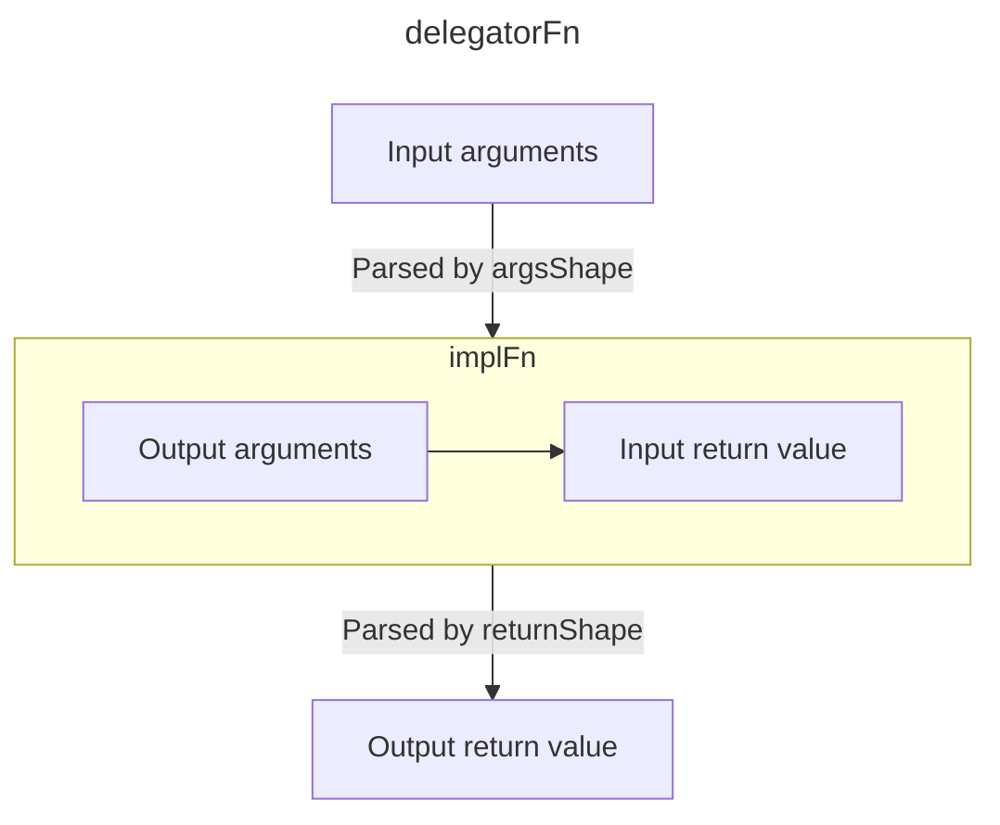

<p align="center">
  <a href="#readme">
    
  </a>
</p>

No-hassle runtime validation and transformation library.

- TypeScript first;
- Zero dependencies;
- Sync and async validation and transformation flows;
- [Human-oriented type coercion;](#type-coercion)
- [High performance and low memory consumption;](#performance)
- [Just 12 kB gzipped](https://bundlephobia.com/result?p=doubter) and tree-shakable;

🔥&ensp;[**Try Doubter on CodeSandbox**](https://codesandbox.io/s/doubter-example-y5kec4)

```shell
npm install --save-prod doubter
```

**Core features**

- [Basics](#basics)
- [Shapes](#shapes)
- [Parsing and trying](#parsing-and-trying)
- [Validation errors](#validation-errors)
- [Checks](#checks)
- [Refinements](#refinements)
- [Transformations](#transformations)
- [Parsing context](#parsing-context)
- [Shape piping](#shape-piping)
- [Exclude](#exclude)
- [Include](#include)
- [Replace](#replace)
- [Optional and non-optional](#optional-and-non-optional)
- [Nullable and nullish](#nullable-and-nullish)
- [Deep partial](#deep-partial)
- [Fallback value](#fallback-value)
- [Branded types](#branded-types)
- [Introspection](#introspection)
- [Localization](#localization)
- [Integrations](#integrations)

[**Type coercion**](#type-coercion)

- [Coerce to string](#coerce-to-string)
- [Coerce to number](#coerce-to-number)
- [Coerce to boolean](#coerce-to-boolean)
- [Coerce to bigint](#coerce-to-bigint)
- [Coerce to enum](#coerce-to-enum)
- [Coerce to array](#coerce-to-array)
- [Coerce to `Date`](#coerce-to-date)
- [Coerce to `Promise`](#coerce-to-promise)
- [Coerce to `Map`](#coerce-to-map)
- [Coerce to `Set`](#coerce-to-set)

[**Cookbook**](#cookbook)

- [Rename object keys](#rename-object-keys)
- [Type-safe URL query params](#type-safe-url-query-params)

[**Performance**](#performance)

[**Data types**](#data-types)

- Strings<br>
  [`string`](#string)

- Numbers<br>
  [`number`](#number)
  [`integer`](#integer)
  [`int`](#integer)
  [`finite`](#finite)
  [`nan`](#nan)
  [`bigint`](#bigint)

- Booleans<br>
  [`boolean`](#boolean)
  [`bool`](#boolean)

- Symbols<br>
  [`symbol`](#symbol)

- Literal values<br>
  [`enum`](#enum)
  [`const`](#const)
  [`null`](#null)
  [`undefined`](#undefined)
  [`void`](#void)

- Objects<br>
  [`object`](#object)
  [`record`](#record)
  [`instanceOf`](#instanceof)

- Collections<br>
  [`array`](#array)
  [`tuple`](#tuple)
  [`set`](#set)
  [`map`](#map)

- Dates<br>
  [`date`](#date)

- Promises<br>
  [`promise`](#promise)

- Functions<br>
  [`function`](#function)
  [`fn`](#function)

- Shape composition<br>
  [`union`](#union)
  [`or`](#union)
  [`intersection`](#intersection)
  [`and`](#intersection)

- Unconstrained values<br>
  [`any`](#any)
  [`unknown`](#unknown)
  [`never`](#never)

- Other<br>
  [`transform`](#transform)
  [`lazy`](#lazy)
  [`json`](#json)

# Basics

Let's create a simple shape of a user object:

```ts
import * as d from 'doubter';

const userShape = d.object({
  name: d.string(),
  age: d.int().gte(18).lt(100)
});
// ⮕ Shape<{ name: string, age: number }>
```

This shape can be used to validate a value:

```ts
userShape.parse({
  name: 'John Belushi',
  age: 30
});
// ⮕ { name: 'John Belushi', age: 30 }
```

If an incorrect value is provided, a validation error is thrown:

```ts
userShape.parse({
  name: 'Peter Parker',
  age: 17
});
// ❌ ValidationError: numberGreaterThanOrEqual at /age: Must be greater than or equal to 18
```

Infer user type from the shape:

```ts
type User = typeof userShape['output'];

const user: User = {
  name: 'Dan Aykroyd',
  age: 27
};
```

# Shapes

Shapes are validation and transformation pipelines that have an input and an output. Here's a shape that restricts an
input to a string and produces a string as an output:

```ts
d.string();
// ⮕ Shape<string>
```

Shapes can have different input and output types. For example, the shape below allows strings and
[replaces `undefined`](#optional-and-non-optional) input values with a default value "Mars":

```ts
const shape = d.string().optional('Mars');
// ⮕ Shape<string | undefined, string>

shape.parse('Pluto');
// ⮕ 'Pluto'

shape.parse(undefined);
// ⮕ 'Mars'
```

Infer the input and output types of the shape:

```ts
type ShapeInput = typeof shape['input'];
// ⮕ string | undefined

type ShapeOutput = typeof shape['output'];
// ⮕ string
```

## Async shapes

[Transformations](#transformations) and reliance on [promise shapes](#promise) make your shapes async.

Here's a shape of a promise that is expected to be fulfilled with a number:

```ts
const asyncShape = d.promise(d.number());
// ⮕ Shape<Promise<number>>
```

You can check that the shape is async:

```ts
asyncShape.isAsync // ⮕ true
```

Async shapes don't support synchronous `parse` method, and would throw an error if it is called:

```ts
asyncShape.parse(Promise.resolve(42));
// ❌ Error: Shape is async
```

Use `parseAsync` with async shapes instead:

```ts
asyncShape.parseAsync(Promise.resolve(42));
// ⮕ Promise<42>
```

Any shape that relies on an async shape becomes async as well:

```ts
const objectShape = d.object({
  foo: asyncShape
});
// ⮕ Shape<{ foo: Promise<number> }>

objectShape.isAsync // ⮕ true
```

# Parsing and trying

Each shape can parse input values and there are several methods for that purpose.

Methods listed in this section can be safely detached from the shape instance:

```ts
const { parseOrDefault } = d.string();

parseOrDefault('Jill');
// ⮕ 'Jill'

parseOrDefault(42);
// ⮕ undefined
```

## `parse`

You're already familiar with `parse` that takes an input value and returns an output value, or throws a validation error
if parsing fails:

```ts
const shape = d.number();
// ⮕ Shape<number>

shape.parse(42);
// ⮕ 42

shape.parse('Mars');
// ❌ ValidationError: type at /: Must be a number
```

Use `parseAsync` with [async shapes](#async-shapes). It has the same semantics and returns a promise.

## `parseOrDefault`

Sometimes you don't care about validation errors, and want a default value to be returned if things go south:

```ts
const shape = d.number();
// ⮕ Shape<number>

shape.parseOrDefault(42);
// ⮕ 42

shape.parseOrDefault('Mars');
// ⮕ undefined

shape.parseOrDefault('Pluto', 5.3361);
// ⮕ 5.3361
```

If you need a fallback value for a nested shape [consider using `catch`](#fallback-value).

Use `parseOrDefaultAsync` with [async shapes](#async-shapes). It has the same semantics and returns a promise.

## `try`

It isn't always convenient to write a try-catch blocks to handle validation errors. Use `try` method in such cases:

```ts
const shape = d.number();
// ⮕ Shape<number>

shape.try(42);
// ⮕ { ok: true, value: 42 }

shape.try('Mars');
// ⮕ { ok: false, issues: [{ code: 'type', … }] }
```

Use `tryAsync` with [async shapes](#async-shapes). It has the same semantics and returns a promise.

# Validation errors

Validation errors which are thrown by `parse*` methods, and
[`Err`](https://smikhalevski.github.io/doubter/interfaces/Err.html) objects returned by `try*` methods have the `issues`
property which holds an array of validation issues:

```ts
const shape = d.object({ age: d.number() });
// ⮕ Shape<{ age: number }>

const result = shape.try({ age: 'Seventeen' });
```

The `result` contains the [`Err`](https://smikhalevski.github.io/doubter/interfaces/Err.html) object:

```ts
{
  ok: false,
  issues: [
    {
      code: 'type',
      path: ['age'],
      input: 'Seventeen',
      message: 'Must be a number',
      param: 'number',
      meta: undefied
    }
  ]
}
```

<dl>
<dt><code>code</code></dt>
<dd>

The code of the validation issue. Shapes provide various checks and each check has a unique code. In the example above,
`type` code refers to a failed number type check. See the table of known codes below. You can add
[a custom check](#checks) to any shape and return an issue with your custom code.

</dd>
<dt><code>path</code></dt>
<dd>

The object path as an array of keys. Keys can be strings, numbers (for example, array indices), symbols, and any other
values since they can be `Map` keys.

</dd>
<dt><code>input</code></dt>
<dd>

The input value that caused a validation issue. Note that if [coercion](#type-coercion) is enabled this contains a
coerced value.

</dd>
<dt><code>message</code></dt>
<dd>

The human-readable issue message. Refer to [Localization](#localization) section for more details.

</dd>
<dt><code>param</code></dt>
<dd>

The parameter value associated with the issue. For built-in checks, the parameter value depends on `code`, see the table
below.

</dd>
<dt><code>meta</code></dt>
<dd>

The optional metadata associated with the issue. Refer to [Metadata](#metadata) section for more details.

</dd>
</dl>

<br/>

| Code | Caused by | Param |
| :-- | :-- | :-- |
| `arrayMinLength` | [`d.array().min(n)`](#array) | The minimum array length `n` |
| `arrayMaxLength` | [`d.array().max(n)`](#array) | The maximum array length `n` |
| `const` | [`d.const(x)`](#const) | The expected constant value `x` |
| `enum` | [`d.enum([x, y, z])`](#enum) | The list of unique expected values`[x, y, z]` |
| `exclusion` | [`shape.exclude(x)`](#exclude) | The excluded value `x` |
| `instance` | [`instanceOf(Class)`](#instanceof) | The class constructor `Class` |
| `intersection` | [`d.and(…)`](#intersection) | — |
| `json` | [`d.json()`](#json) | The message from `JSON.parse()` |
| `predicate` | [`shape.refine(…)`](#refinements) | The callback passed to `refine`  |
| `numberInteger` | [`d.integer()`](#integer) | — |
| `numberFinite` | [`d.finite()`](#finite) | — |
| `numberGreaterThan` | [`d.number().gt(x)`](#number) | The exclusive minimum value `x` |
| `numberGreaterThanOrEqual` | [`d.number().gte(x)`](#number) | The minimum value `x` |
| `numberLessThan` | [`d.number().lt(x)`](#number) | The exclusive maximum value `x` |
| `numberLessThanOrEqual` | [`d.number().lte(x)`](#number) | The maximum value `x` |
| `numberMultipleOf` | [`d.number().multipleOf(x)`](#number) | The divisor `x` |
| `setMinSize` | [`d.set().min(n)`](#set) | The minimum `Set` size `n` |
| `setMaxSize` | [`d.set().max(n)`](#set) | The maximum `Set` size `n` |
| `stringMinLength` | [`d.string().min(n)`](#string) | The minimum string length `n` |
| `stringMaxLength` | [`d.string().max(n)`](#string) | The maximum string length `n` |
| `stringRegex` | [`d.string().regex(re)`](#string) | The regular expression `re` |
| `type` | All shapes | The expected [input value type](#introspection) |
| `tuple` | [`d.tuple([…])`](#tuple) | The expected tuple length |
| `union` | [`d.or(…)`](#union) | [Issues raised by a union](#issues-raised-by-a-union) |
| `unknownKeys` | [`d.object().exact()`](#unknown-keys) | The array of unknown keys |

# Checks

Checks allow constraining the input value beyond type assertions. For example, if you want to constrain a numeric input
to be greater than 5:

```ts
const shape1 = d.number().check(value => {
  if (value <= 5) {
    // 🟡 Return a partial issue, or an array of issues
    return { code: 'kaputs' };
  }
});
// ⮕ Shape<number>

shape1.parse(10);
// ⮕ 10

shape1.parse(3);
// ❌ ValidationError: kaputs at /
```

A check callback receives the shape output value and must return a partial issue or an array of partial issues if the
value is invalid.

> **Note**&ensp;Check callbacks can throw a [`ValidationError`](#validation-errors) to notify Doubter that parsing
> issues occurred. While this has the same effect as returning an array of issues, it is recommended to throw a
> `ValidationError` as the last resort since catching errors has a high performance penalty.

If value is valid, a check callback must return `null` or `undefined`.

Most shapes have a set of built-in checks. The check we've just implemented above is called `gt` (greater than):

```ts
d.number().gt(5);
```

Add as many checks as you need to the shape. You can mix custom and built-in checks, they are executed in the same order
they were added.

```ts
d.string().max(4).regex(/a/).try('Pluto');
```

In the example above, an [`Err`](https://smikhalevski.github.io/doubter/interfaces/Err.html) object is returned:

```ts
{
  ok: false,
  issues: [
    {
      code: 'stringMaxLength',
      path: [],
      input: 'Pluto',
      message: 'Must have the maximum length of 4',
      param: 4,
      meta: undefied
    }
  ]
}
```

> **Note**&ensp;You can find the list of issue codes and corresponding param values in
> [Validation errors](#validation-errors) section.

Doubter halts parsing and raises a validation error as soon as the first issue was encountered. Sometimes you may want
to collect all issues that prevent input from being successfully parsed. To do this, pass a `verbose` option to the
[parse method](#parsing-and-trying).

```ts
d.string().max(4).regex(/a/).try('Pluto', { verbose: true });
```

This would return the [`Err`](https://smikhalevski.github.io/doubter/interfaces/Err.html) object with two issues:

```ts
{
  ok: false,
  issues: [
    {
      code: 'stringMaxLength',
      path: [],
      input: 'Pluto',
      message: 'Must have the maximum length of 4',
      param: 4,
      meta: undefied
    },
    {
      code: 'stringRegex',
      path: [],
      input: 'Pluto',
      message: 'Must match the pattern /a/',
      param: /a/,
      meta: undefied
    }
  ]
}
```

## Safe and unsafe checks

Checks that you add using a `check` method are "safe" by default, which means they are not executed if any of the
preceding checks has failed. For example, let's declare the shape of a greeting message:

```ts
const helloCheck: d.CheckCallback<string> = value => {
  if (!value.startsWith('Hello')) {
    return { message: 'Must start with "Hello"' };
  }
};

const noDigitsCheck: d.CheckCallback<string> = value => {
  if (value.match(/\d/)) {
    return { message: 'Must not contain digits' };
  }
};

const greetingShape1 = d.string()
  .check(helloCheck)
  .check(noDigitsCheck);
```

If the input violates the `helloCheck`, then `noDigitsCheck` isn't applied:

```ts
greetingShape1.parse('Adiós, R2D2', { verbose: true });
// ❌ ValidationError: type at /: Must start with "Hello"
```

To force `noDigitsCheck` to be called even if the preceding check has failed, pass the `unsafe` option:

```ts
const greetingShape2 = d.string()
  .check(helloCheck)
  .check(noDigitsCheck, { unsafe: true });
```

Safe and unsafe checks are applied only if the type of the input is valid.

```ts
greetingShape2.parse(42);
// ❌ ValidationError: type at /: Must be a number
```

In the example above checks aren't applied, since the input value 42 is of the invalid type, despite that
`noDigitsCheck` is marked as unsafe.

For some composite shapes, unsafe checks may become truly unsafe. Let's consider an object with a custom safe check:

```ts
const userShape = d.object({
  age: d.number(),
  yearsOfExperience: d.number()
}).check(value => {
  if (value.age < value.yearsOfExperience) {
    return { code: 'inconsistentAge' };
  }
});
// ⮕ Shape<{ age: number, yearsOfExperience: number }>
```

The check relies on `value` to be an object with the valid set of properties. So if any issues are detected in the input
object the check won't be called:

```ts
// 🟡 Check isn't applied
nameShape.parse({ age: 18 });
// ❌ ValidationError: type at /yearsOfExperience: Must be a number
```

Adding the `unsafe` option would cause the check to be applied even if _object properties are invalid_.

Some shapes cannot guarantee that the input value is of the required type. For example, if any of the underlying shapes
in an intersection have raised issues, an intersection itself cannot guarantee that its checks would receive the value
of the expected type, so it won't apply its unsafe checks.

These shapes won't apply unsafe checks if an underlying shape has raised an issue:

- `ExcludeShape`
- `IntersectionShape`
- `LazyShape`
- `PipeShape`
- `ReplaceShape`
- `TransformShape`
- `UnionShape`

## Add, get and delete checks

Let's consider the same check being added to the shape twice:

```ts
const emailCheck: d.CheckCallback<string> = (value, options) => {
  if (!value.includes('@')) {
    return { code: 'email' };
  }
};

const shape = d.string().check(emailCheck).check(emailCheck);
// ⮕ Shape<string>
```

Doubter ensures that checks are distinct, so `emailCheck` check is added to the shape only once.

Retrieve a check by its key:

```ts
shape.check(emailCheck);

shape.getCheck(emailCheck);
// ⮕ { callback: emailCheck, unsafe: false, param: undefined }
```

Delete a check:

```ts
shape.deleteCheck(emailCheck);
// ⮕ Shape<string>
```

Using a check callback as an identity isn't always convenient. Pass a `key` option:

```ts
shape.check(emailCheck, { key: 'email' });
// ⮕ Shape<string>
```

Now you should use the key to get or delete the check:

```ts
shape.deleteCheck('email');
// ⮕ Shape<string>
```

## Metadata

Built-in checks have the `meta` option. Its value is later assigned to the `meta` property of the raised
[validation issue](#validation-errors).

```ts
const shape = d.number().gt(5, { meta: 'Useful data' });
// ⮕ Shape<number>

const result = shape.try(2);
// ⮕ { ok: false, issues: … }

if (!result.ok) {
  result.issues[0].meta // ⮕ 'Useful data'
}
```

This comes handy if you want to enhance an issue with an additional data that can be used later during issues
processing. For example, during [localization](#localization).

# Refinements

Refinements are a simplified checks that use a predicate to validate an input. For example, the shape below would raise
an issue if the input string is less than three characters long.

```ts
d.string().refine(value => value.length >= 3);
// ⮕ Shape<string>
```

Use refinements to [narrow](https://www.typescriptlang.org/docs/handbook/2/narrowing.html) the output type of the shape:

```ts
function isMarsOrPluto(value: string): 'Mars' | 'Pluto' {
  return value === 'Mars' || value === 'Pluto';
}

d.string().refine(isMarsOrPluto)
// ⮕ Shape<string, 'Mars' | 'Pluto'>
```

# Transformations

Along with validation, shapes can transform values. Let's consider a shape that takes a string as an input and converts
it to a number:

```ts
const shape = d.string().transform(parseFloat);
// ⮕ Shape<string, number>
```

This shape ensures that the input value is a string and passes it to a transformation callback:

```ts
shape.parse('42');
// ⮕ 42

shape.parse('Seventeen');
// ⮕ NaN
```

Throw a `ValidationError` inside the transformation callback to notify parser that transformation cannot be successfully
completed:

```ts
function toNumber(input: string): number {
  const output = parseFloat(input);

  if (isNaN(output)) {
    throw new d.ValidationError([{ code: 'kaputs' }]);
  }
  return output;
}

const shape = d.string().transform(toNumber);

shape.parse('42');
// ⮕ 42

shape.parse('Seventeen');
// ❌ ValidationError: kaputs at /
```

## Async transformations

Let's consider a _sync_ transformation:

```ts
const syncShape1 = d.string().transform(
  value => 'Hello, ' + value
);
// ⮕ Shape<string>

syncShape1.isAsync // ⮕ false

syncShape1.parse('Jill');
// ⮕ 'Hello, Jill'
```

The transformation callback receives and returns a string and so does `syncShape1`.

Now lets return a promise from the transformation callback:

```ts
const syncShape2 = d.string().transform(
  value => Promise.resolve('Hello, ' + value)
);
// ⮕ Shape<string, Promise<string>>

syncShape2.isAsync // ⮕ false

syncShape2.parse('Jill');
// ⮕ Promise<string>
```

Notice that `syncShape2` is asymmetric: it expects a string input and transforms it to a `Promise<string>`. `syncShape2`
is still sync, since the transformation callback _synchronously wraps_ a value in a promise.

Now let's create an _async_ shape using the async transformation:

```ts
const asyncShape1 = d.string().transformAsync(
  value => Promise.resolve('Hello, ' + value)
);
// ⮕ Shape<string>

// 🟡 Notice that the shape is async
asyncShape1.isAsync // ⮕ true

await asyncShape1.parseAsync('Jill');
// ⮕ 'Hello, Jill'
```

Notice that `asyncShape1` still transforms the input string value to output string but the transformation itself is
async.

A shape is async if it uses async transformations. Here's an async object shape:

```ts
const asyncShape2 = d.object({
  foo: d.string().transformAsync(
    value => Promise.resolve(value)
  )
});
// ⮕ Shape<{ foo: string }>

asyncShape2.isAsync // ⮕ true
```

> **Note**&ensp;Composite shapes are async if they rely on a [`promise`](#promise) shape:
>
> ```ts
> const shape = d.object({
>   foo: d.promise(d.string())
> });
> // ⮕ Shape<{ foo: Promise<string> }>
> 
> shape.isAsync // ⮕ true
> ```

# Parsing context

Inside [check](#checks) and [transform](#transformations) callbacks you can access options passed to the parser. The
`context` option may store arbitrary data, which is `undefined` by default.

The example below shows how you can transform numbers to formatted strings using context:

```ts
const shape = d.number().transform(
  (value, options) => new Intl.NumberFormat(options.context.locale).format(value)
);
// ⮕ Shape<number, string>

shape.parse(
  1000,
  {
    // 🟡 Pass a context
    context: { locale: 'en-US' }
  }
);
// ⮕ '1,000'
```

# Shape piping

With shape piping you to can pass the shape output to another shape.

```ts
const shape1 = d.string().transform(parseFloat);
// ⮕ Shape<string, number>

shape1.to(number().lt(5).gt(10));
// ⮕ Shape<string, number>
```

Piping is particularly useful in conjunction with [transformations](#transformations) and [JSON shape](#json). The
example below shows how you can parse input JSON string and ensure that the output is an object:

```ts
const shape2 = d.json().to(
  d.object({ foo: d.bigint() }).coerce()
);

shape2.parse('{"foo":"6889063"}');
// ⮕ { foo: BigInt(6889063) }
```

# Exclude

Consider the enum shape:

```ts
const shape1 = d.enum(['Mars', 'Pluto', 'Jupiter']);
// ⮕ Shape<'Mars' | 'Pluto' | 'Jupiter'>
```

To exclude a value from this enum you can use `exclude`:

```ts
shape1.exclude('Pluto');
// ⮕ Shape<'Mars' | 'Jupiter'>
```

Value exclusion works with any shape. For example, you can exclude a number:

```ts
const shape2 = d.number().exclude(42);
// ⮕ Shape<number>

shape2.parse(33);
// ⮕ 33

shape2.parse(42);
// ❌ ValidationError: exclusion at /: Must not be equal to 42
```

Exclude prohibits value for _both input and output_:

```ts
const shape3 = d.number().transform(value => value * 2).exclude(42);
// ⮕ Shape<number>

shape3.parse(21);
// ❌ ValidationError: exclusion at /: Must not be equal to 42
```

# Include

You can add a value to a multitude of input values:

```ts
d.const('Mars').include('Pluto');
// ⮕ Shape<'Mars' | 'Pluto'>
```

Included values don't go through checks and transformations of the underlying shape:

```ts
const shape = d.number().gt(3).include('Seventeen');
// ⮕ Shape<number | 'Seventeen'>

shape.parse(2);
// ❌ ValidationError: numberGreaterThan at /: Must be greater than 3

shape.parse(100);
// ⮕ Shape<100>

// 🟡 Notice that parsed value doesn't satisfy the number type and gt constraints
shape.parse('Seventeen');
// ⮕ 'Seventeen'
```

# Replace

Include a value as an input and replace it with another value on the output side:

```ts
const shape = d.const('Mars').replace('Pluto', 'Jupiter');
// ⮕ Shape<'Mars' | 'Pluto', 'Mars' | 'Jupiter'>

shape.parse('Mars');
// ⮕ 'Mars'

shape.parse('Pluto');
// ⮕ 'Jupiter'
```

Note that `replace` narrows passed values to literal types but in TypeScript type system not all values have a separate
literal type. For example, there's no literal type for `NaN` which may cause an unexpected result:

```ts
// 🔴 Note that the output is typed as 0
d.number().replace(NaN, 0);
// ⮕ Shape<number, 0>
```

Why is output inferred as 0 and not as a `number`? This occurs because `typeof NaN` is `number` and it is excluded from
the output type of the shape. For this particular case use `nan` method of [number shape](#number):

```ts
// 🟡 Note that the shape output is a number
const shape = d.number().nan(0);
// ⮕ Shape<number>

shape.parse(NaN);
// ⮕ 0
```

# Optional and non-optional

Marking a shape as optional allows `undefined` in both its input and output:

```ts
d.string().optional();
// ⮕ Shape<string | undefined>
```

You can provide a default value of any type, so it would be used as an output if input value is `undefined`:

```ts
d.string().optional(42);
// ⮕ Shape<string | undefined, string | 42>
```

You can achieve the same behaviour as `optional` using a union:

```ts
d.or([
  d.string(),
  d.undefined()
]);
// ⮕ Shape<string | undefined>
```

Or using an inclusion:

```ts
d.string().include(undefined);
// ⮕ Shape<string | undefined>
```

You can mark any shape as non-optional which effectively [excludes `undefined`](#exclude) values from both input and
output. For example, lets consider a union of an optional string and a number:

```ts
const shape1 = d.or([
  d.string().optional(),
  d.number()
]);
// ⮕ Shape<string | undefined | number>

shape1.parse(undefined);
// ⮕ undefined
```

Now let's mark this shape as non-optional:

```ts
const shape2 = shape1.nonOptional();
// ⮕ Shape<string | number>

shape2.parse(undefined);
// ❌ ValidationError: exclusion at /: Must not be equal to undefined
```

# Nullable and nullish

Marking a shape as nullable allows `null` for both input and output:

```ts
d.string().nullable();
// ⮕ Shape<string | null>
```

You can provide a default value, so it would be used as an output if input value is `null`:

```ts
d.string().nullable(42);
// ⮕ Shape<string | null, string | 42>
```

To allow both `null` and `undefined` values use `nullish`:

```ts
d.string().nullish();
// ⮕ Shape<string | null | undefined>
```

`nullish` also supports the default value:

```ts
d.string().nullish(8080);
// ⮕ Shape<string | null | undefined, string | 8080>
```

# Deep partial

All object-like shapes (objects, arrays, maps, sets, promises, etc.) can be converted to a deep partial alternative
using `deepPartial` method:

```ts
const shape1 = d.array(
  d.object({
    name: d.string(),
    age: d.number()
  })
);
// ⮕ Shape<{ name: string, age: number }[]>

shape1.deepPartial();
// ⮕ Shape<Array<{ name?: string, age?: number } | undefined>>
```

Unions, intersections and lazy shapes can also be converted to deep partial:

```ts
const shape2 = d.or([
  d.number(),
  d.object({ name: d.string() })
]).deepPartial()
// ⮕ Shape<number | { name?: string }>

shape2.parse(42);
// ⮕ 42

shape2.parse({ name: undefined });
// ⮕ { name: undefined }

shape2.parse({ name: 'Frodo' });
// ⮕ { name: 'Frodo' }

shape2.parse({ name: 8080 });
// ❌ ValidationError: type at /name: Must be a string
```

Deep partial isn't applied to transformed and branded shapes:

```ts
const shape2 = d.object({
  years: d.array(d.string()).transform(parseFloat)
}).deepPartial();
// ⮕ Shape<{ years?: string[] }, { years?: number[] }>
```

Note that array elements aren't optional after `deepPartial` was applied.

# Fallback value

If issues were detected during parsing a shape can return a fallback value.

```ts
const shape1 = d.string().catch('Mars');

shape1.parse('Pluto');
// ⮕ 'Pluto'

shape1.parse(42);
// ⮕ 'Mars'
```

Pass a callback as a fallback value, it would be executed every time the catch clause is reached:

```ts
const shape2 = d.number().catch(Date.now);

shape2.parse(42)
// ⮕ 42

shape2.parse('Pluto');
// ⮕ 1671565311528

shape2.parse('Mars');
// ⮕ 1671565326707
```

# Branded types

TypeScript's type system is structural, which means that any two types that are structurally equivalent are considered
the same.

```ts
interface Cat {
  name: string;
}

interface Dog {
  name: string;
}

declare function petCat(cat: Cat): void;

const fidoDog: Dog = {
  name: 'Fido'
};

petCat(fidoDog);
// ✅ Ok, yet types are different
```

In some cases, its can be desirable to simulate nominal typing inside TypeScript. For instance, you may wish to write a
function that only accepts an input that has been validated by Doubter. This can be achieved with branded types:

```ts
const catShape = d.object({ name: d.string() }).brand<'Cat'>();

type Cat = typeof catShape['input'];

declare function petCat(cat: Cat): void;

petCat(catShape.parse({ name: 'Simba' }));
// ✅ Ok, since the cat was validated

petCat({ name: 'Fido' });
// ❌ Error: Expected BRAND to be Cat
```

Under the hood, this works by attaching a "brand" to the inferred type using an intersection type. This way,
plain/unbranded data structures are no longer assignable to the inferred type of the shape.

Note that branded types do not affect the runtime result of `parse`. It is a static-only construct.

# Introspection

Doubter provides various features to introspect your shapes at runtime. Let's start by detecting input types supported
by a particular shape.

The supported input types of a shape can be accessed through a `inputTypes` property:

```ts
const shape = d.or([d.string(), d.boolean()]);
// ⮕ Shape<string | boolean>

shape.inputTypes;
// ⮕ ['string', 'boolean']
```

To detect the type of the value use `Shape.typeOf`:

```ts
d.Shape.typeOf('Mars');
// ⮕ 'string'
```

Types returned from `Shape.typeOf` are a superset of types returned from the `typeof` operator.

<table>
<tr><th><code>Shape.typeOf</code></th><th><code>typeof</code></th></tr>
<tr><td><code>object</code></td><td rowspan="4"><code>object</code></td></tr>
<tr><td><code>array</code></td></tr>
<tr><td><code>date</code></td></tr>
<tr><td><code>null</code></td></tr>
<tr><td><code>function</code></td><td><code>function</code></td></tr>
<tr><td><code>string</code></td><td><code>string</code></td></tr>
<tr><td><code>symbol</code></td><td><code>symbol</code></td></tr>
<tr><td><code>number</code></td><td><code>number</code></td></tr>
<tr><td><code>bigint</code></td><td><code>bigint</code></td></tr>
<tr><td><code>boolean</code></td><td><code>boolean</code></td></tr>
<tr><td><code>undefined</code></td><td><code>undefined</code></td></tr>
</table>

`inputTypes` array can also contain two additional types `any` and `never`.

## `any` value type

`any` type emerges when type cannot be inferred at runtime. This happens when [`d.any`](#any), [`d.unknown`](#unknown),
or [`d.transform`](#transform) is used:

```ts
const shape1 = d.transfrorm(parseFloat);
// ⮕ Shape<any>

shape1.inputTypes;
// ⮕ ['any']
```

`any` absorbs other types in unions:

```ts
const shape2 = d.or([d.string(), d.any()]);
// ⮕ Shape<any>

shape2.inputType;
// ⮕ ['any']
```

`any` absorbs other types in intersections, except when intersected with `never`:

```ts
const shape3 = d.and([d.string(), d.any()]);
// ⮕ Shape<any>

shape3.inputType;
// ⮕ ['any']

const shape4 = d.and([d.never(), d.any()]);
// ⮕ Shape<never>

shape4.inputType;
// ⮕ ['never']
```

## `never` value type

The `never` type represents the type of values that never occur and tells that the shape would always raise a validation
issue when parsing any input.

```ts
const neverShape = d.never();

neverShape.inputTypes;
// ⮕ ['never']

neverShape.parse('Pluto');
// ❌ ValidationError: type at /: Must not be used
```

`never` is erased in unions:

```ts
const shape1 = d.or([d.string(), d.never()]);

shape1.inputType;
// ⮕ ['string']
```

`never` absorbs other types in intersections:

```ts
const shape2 = d.and([d.string(), d.never()]);

shape2.inputType;
// ⮕ ['never']
```

Intersections of shapes that don't support any common types produce `never` type:

```ts
// This shape cannot be satisfied.
const shape3 = d.and([d.string(), d.boolean()]);

shape3.inputType;
// ⮕ ['never']
```

## Nested shapes

Object, array, union ond other shapes provide access to their nested shapes:

```ts
const objectShape = d.object({
  name: d.string(),
  age: d.number()
});
// ⮕ Shape<{ name: string, age: number }>

objectShape.shapes.name;
// ⮕ Shape<number>

const unionShape = d.or([d.string(), objectShape]);
// ⮕ Shape<string | { name: string, age: number }>

unionShape.shapes[1];
// ⮕ objectShape
```

`at` method derives a sub-shape at the given key, and if there's no key `null` is returned:

```ts
objectShape.at('age');
// ⮕ Shape<number>

objectShape.at('unknownKey');
// ⮕ null
```

This is especially useful with composite shapes:

```ts
const shape = d.or([
  d.object({
    foo: d.string()
  }),
  d.object({
    foo: d.number()
  })
]);

shape.at('foo')
// ⮕ Shape<string | number>

shape.at('bar')
// ⮕ null
```

## Introspecting checks

To introspect checks added to a shape, use `getCheck`:

```ts
const shape1 = d.number().min(10);
// ⮕ Shape<number>

shape1.getCheck('numberGreaterThanOrEqual')?.param;
// ⮕ 10
```

The check-to-param mapping can be found in [Validation errors](#validation-errors) section.

If you add a custom check, you can provide a `param` to enhance further introspection:

```ts
function includes(value: any): d.CheckCallback<any[]> {
  return array => {
    if (!array.includes(value)) {
      return { message: 'Must incude ' + value };
    }
  };
}

const shape2 = d.array().check(includes('Mars'), { param: 'Mars' });
// ⮕ Shape<any[]>

shape2.getCheck(includes)?.param;
// ⮕ 'Mars'
```

More about adding and deleting checks in [Add, get and delete checks](#add-get-and-delete-checks) section.

# Localization

All shape factories and built-in checks support custom issue messages:

```ts
d.string('Hey, string here').min(3, 'Too short');
```

[Checks that have a param](#validation-errors), such as `min` constraint in the example above, can use a `%s`
placeholder that would be interpolated with the param value.

```ts
d.string().min(3, 'Minimum length is %s');
```

Pass a function as a message, and it would receive a check param, an [issue code](#validation-errors), an input value,
[a metadata](#metadata), and parsing options and should return a formatted message value. The returned formatted message
can be of any type.

For example, when using with React you may return a JSX element:

```tsx
const gtMessage: d.Message = (param, code, input, meta, options) => (
  <span style={{ color: 'red' }}>
    Minimum length is {param}
  </span>
);

d.number().gt(5, gtMessage);
```

All rules described above are applied to the `message` option as well:

```ts
d.string().length(3, { message: 'Expected length is %s' })
```

# Integrations

How to validate an email or UUID? Combine Doubter with your favourite predicate library:

```ts
import * as d from 'doubter';
import isEmail from 'validator/lib/isEmail';

const emailShape = d.string().refine(isEmail, 'Must be an email');
// ⮕ Shape<string>

emailShape.parse('Not an email');
// ❌ ValidationError: predicate at /: Must be an email

emailShape.getCheck(isEmail);
// ⮕ { key: isEmail, unsafe: false, param: isEmail }
```

Read more about [Refinements](#refinements) and how to [Add, get and delete checks](#add-get-and-delete-checks).

# Type coercion

Type coercion is the process of converting value from one type to another (such as string to number, array to `Set`,
and so on).

When coercion is enabled, input values are implicitly converted to the required input type whenever possible.
For example, you can coerce input values to string type:

```ts
const shape1 = d.string().coerce();

shape1.isCoerced // ⮕ true

shape1.parse([8080]);
// ⮕ '8080'

shape1.parse(null);
// ⮕ ''
```

Coercion can be enabled on shape-by-shape basis (as shown in the example above), or it can be enabled for all shapes
when `coerced` option is passed to a [parsing method](#parsing-and-trying):

```ts
const shape2 = d.object({
  name: d.string(),
  birthday: d.date()
});

shape2.parse(
  {
    name: ['Jake'],
    birthday: '1949-01-24'
  },
  { coerced: true }
);
// ⮕ { name: 'Jake', birthday: new Date(-660700800000) }
```

Coercion rules differ from JavaScript so the behavior is more predictable and human-like.

## Coerce to string

`null` and `undefined` are converted to an empty string:

```ts
const shape = d.string().coerce();

shape.parse(null);
// ⮕ ''
```

Finite numbers, boolean and bigint values are converted via `String(value)`:

```ts
shape.parse(BigInt(2398955));
// ⮕ '2398955'

shape.parse(8080);
// ⮕ '8080'

shape.parse(-Infinity);
// ❌ ValidationError: type at /: Must be a string
```

Valid dates are converted to an ISO formatted string:

```ts
shape.parse(new Date(1674352106419));
// ⮕ '2023-01-22T01:48:26.419Z'

shape.parse(new Date(NaN));
// ❌ ValidationError: type at /: Must be a string
```

Arrays with a single element are unwrapped and the value is coerced:

```ts
shape.parse([undefined]);
// ⮕ ''

shape.parse(['Jill', 'Sarah']);
// ❌ ValidationError: type at /: Must be a string
```

## Coerce to number

`null` and `undefined` values are converted to 0:

```ts
const shape = d.number().coerce();

shape.parse(null);
// ⮕ 0
```

Strings, boolean values and `Date` objects are converted using `+value`:

```ts
shape.parse('42');
// ⮕ 42

shape.parse('Seventeen');
// ❌ ValidationError: type at /: Must be a number
```

Arrays with a single element are unwrapped and the value is coerced:

```ts
shape.parse([new Date('2023-01-22')]);
// ⮕ 1674345600000

shape.parse([1997, 1998]);
// ❌ ValidationError: type at /: Must be a number
```

## Coerce to boolean

`null`, `undefined`, `'false'` and 0 are converted to `false`:

```ts
const shape = d.boolean().coerce();

shape.parse(null);
// ⮕ false
```

`'true'` and 1 are converted to `true`:

```ts
shape.parse('true');
// ⮕ true

shape.parse('yes');
// ❌ ValidationError: type at /: Must be a boolean
```

Arrays with a single element are unwrapped and the value is coerced:

```ts
shape.parse([undefined]);
// ⮕ false

shape.parse([0, 1]);
// ❌ ValidationError: type at /: Must be a boolean
```

## Coerce to bigint

`null` and `undefined` are converted to 0:

```ts
const shape = d.bigint().coerce();

shape.parse(null);
// ⮕ BigInt(0)
```

Number, string and boolean values are converted via `BigInt(value)`:

```ts
shape.parse('18588');
// ⮕ BigInt(18588)

shape.parse('Unexpected')
// ❌ ValidationError: type at /: Must be a bigint
```

Arrays with a single element are unwrapped and the value is coerced:

```ts
shape.parse([0xdea]);
// ⮕ BigInt(3562)

shape.parse([BigInt(1), BigInt(2)]);
// ❌ ValidationError: type at /: Must be a bigint
```

## Coerce to enum

If an enum is defined via a native TypeScript enum or via a const object, then enum element names are coerced to
corresponding values:

```ts
enum Users {
  JILL,
  SARAH,
  JAMES
}

const shape = d.enum(Users).coerce();

shape.parse('SARAH');
// ⮕ 1
```

Arrays with a single element are unwrapped and the value is coerced:

```ts
shape.parse(['JAMES']);
// ⮕ 2

shape.parse([1]);
// ⮕ 1

shape.parse([1, 2]);
// ❌ ValidationError: enum at /: Must be equal to one of 0,1,2
```

## Coerce to array

Iterables and array-like objects are converted to array via `Array.from(value)`:

```ts
const shape = d.array(d.string()).coerce();

shape.parse(new Set(['John', 'Jack']));
// ⮕ ['John', 'Jack']

shape.parse({ 0: 'Bill', 1: 'Jill', length: 2 });
// ⮕ ['Bill', 'Jill']
```

Scalars, non-iterable and non-array-like objects are wrapped into an array:

```ts
shape.parse('Rose');
// ⮕ ['Rose']
```

## Coerce to `Date`

Strings and numbers are converted via `new Date(value)` and if an invalid date is produced then an issue is raised:

```ts
const shape = d.date().coerce();

shape.parse('2023-01-22');
// ⮕ Date

shape.parse('Yesterday');
// ❌ ValidationError: type at /: Must be a Date
```

Arrays with a single element are unwrapped and the value is coerced:

```ts
shape.parse([1674352106419]);
// ⮕ Date

shape.parse(['2021-12-03', '2023-01-22']);
// ❌ ValidationError: type at /: Must be a Date
```

## Coerce to `Promise`

All values are converted to a promise by wrapping it in `Promise.resolve()`:

```ts
const shape = d.promise(d.number()).coerce();

shape.parseAsync(42);
// ⮕ Promise<number>
```

## Coerce to `Map`

Arrays, iterables and array-like objects that withhold entry-like elements (a tuple with two elements) are converted to
`Map` entries via `Array.from(value)`:

```ts
const shape = d.map(d.string(), d.number()).coerce();

shape.parse([
  ['Mars', 0.1199],
  ['Pluto', 5.3361]
]);
// ⮕ Map { 'Mars' → 0.1199, 'Pluto' → 5.3361 }

shape.parse(['Jake', 'Bill']);
// ❌ ValidationError: type at /: Must be a Map
```

Other objects are converted to an array of entries via `new Map(Object.entries(value))`:

```ts
shape.parse({
  Jake: 31,
  Jill: 28
});
// ⮕ Map { 'Jake' → 31, 'Jill' → 28 }
```

## Coerce to `Set`

Arrays, iterables and array-like objects converted to `Set` values via `Array.from(value)`:

```ts
const shape = d.set(d.string()).coerce();

shape.parse(['Boris', 'K']);
// ⮕ Set { 'Boris', 'K' }
```

Scalars, non-iterable and non-array-like objects are wrapped into an array:

```ts
shape.parse('J');
// ⮕ Set { 'J' }
```

# Cookbook

## Rename object keys

```ts
const keyShape = d.enum(['foo', 'bar']).transform(
  value => value.toUpperCase() as 'FOO' | 'BAR'
);
// ⮕ Shape<'foo' | 'bar', 'FOO' | 'BAR'>

const shape = d.record(keyShape, d.number());
// ⮕ Shape<Record<'foo' | 'bar', number>, Record<'FOO' | 'BAR', number>>

shape.parse({ foo: 1, bar: 2 });
// ⮕ { FOO: 1, BAR: 2 }
```

## Type-safe URL query params

```ts
import qs from 'qs';

const queryShape = d.object({
  name: d.string().optional(),
  age: d.int().gt(0).coerce().catch().optional()
});
// ⮕ Shape<{ name: string | undefined, age: number | undefined }>

queryShape.parse(qs.parse('name=Frodo&age=50'));
// ⮕ { name: 'Frodo', age: 50 }

queryShape.parse(qs.parse('age=-33'));
// ⮕ { age: undefined }
```

# Performance

The chart below showcases the performance comparison in terms of millions of operations per second (greater is better).

<p align="center">
  
</p>

Tests were conducted using [TooFast](https://github.com/smikhalevski/toofast) and results were collected for the
following object shape:

```ts
d.object({
  key1: d.array(d.int()),
  key2: d.string().min(3),
  key3: d.boolean(),
  key4: d.object({
    key5: d.enum(['foo', 'bar']),
    key6: d.number()
  })
});
```

Clone this repo and use `npm ci && npm run perf` to run the performance testsuite.

# Data types

🔎 [API documentation is available here.](https://smikhalevski.github.io/doubter/)

## `any`

An unconstrained value that is inferred as `any`:

```ts
d.any();
// ⮕ Shape<any>
```

Use `any` to create shapes that are unconstrained at runtime but constrained at compile time:

```ts
d.any<{ foo: string }>();
// ⮕ Shape<{ foo: string }>
```

Create a shape that is constrained by a
[narrowing predicate](https://www.typescriptlang.org/docs/handbook/2/narrowing.html):

```ts
d.any((value): value is string => typeof value === 'string');
// ⮕ Shape<any, string>
```

## `array`

Constrains a value to be an array:

```ts
d.array();
// ⮕ Shape<any[]>
```

Restrict array element types:

```ts
d.array(d.number());
// ⮕ Shape<number[]>
```

Constrain the length of an array:

```ts
d.array(d.string()).min(1).max(10);
```

Limit both minimum and maximum array length at the same time:

```ts
d.array(d.string()).length(5);
```

Transform array values during parsing:

```ts
d.array(d.string().transform(parseFloat));
// ⮕ Shape<string[], number[]>
```

## `bigint`

Constrains a value to be a bigint.

```ts
d.bigint();
// ⮕ Shape<bigint>
```

## `boolean`

Constrains a value to be boolean.

```ts
d.boolean();
// or
d.bool();
// ⮕ Shape<boolean>
```

## `const`

Constrains a value to be an exact value:

```ts
d.const('Mars');
// ⮕ Shape<'Mars'>
```

There are shortcuts for [`null`](#null), [`undefined`](#undefined) and [`nan`](#nan) constants.

Consider using [`enum`](#enum) if you want a value to be one of multiple literal values.

## `date`

Constrains a value to be a valid date.

```ts
d.date();
// ⮕ Shape<Date>
```

## `enum`

Constrains a value to be equal to one of predefined values:

```ts
d.enum(['Mars', 'Pluto', 'Jupiter']);
// ⮕ Shape<'Mars', 'Pluto', 'Jupiter'>
```

Or use a native TypeScript enum to limit possible values:

```ts
enum Planet {
  MARS,
  PLUTO,
  JUPITER
}

d.enum(Planet);
// ⮕ Shape<Planet>
```

Or use
[an object with a `const` assertion](https://www.typescriptlang.org/docs/handbook/release-notes/typescript-3-4.html#const-assertions):

```ts
const planets = {
  MARS: 'Mars',
  PLUTO: 'Pluto',
  JUPITER: 'Jupiter'
} as const;

d.enum(plants);
// ⮕ Shape<'Mars', 'Pluto', 'Jupiter'>
```

## `finite`

Constrains a value to be a finite number.

```ts
d.finite();
// ⮕ Shape<number>
```

This is a shortcut for a number shape declaration:

```ts
d.number().finite();
// ⮕ Shape<number>
```

## `function`

Constrain a value to be a function that has a particular signature.

A function that has no arguments and returns `any`:

```ts
d.function()
// ⮕ Shape<() => any>

// or use a shorter alias
d.fn();
```

Provide an array of argument shapes:

```ts
d.fn([d.string(), d.number()]);
// ⮕ Shape<(arg1: string, arg2: number) => any>
```

Or provide a shape that constrains an array of arguments:

```ts
d.fn(d.array(d.string()));
// ⮕ Shape<(...args: string[]) => any>
```

Any shape that constrains an array type would do, you can even use a union:

```ts
d.fn(
  d.or([
    d.array(d.string()),
    d.tuple([d.string(), d.number()])
  ])
);
// ⮕ Shape<(...args: string[] | [string, number]) => any>
```

To constrain the return value of a function shape, use the `return` method.

```ts
d.fn().return(d.string());
// ⮕ Shape<() => string>
```

To constrain a value of `this`:

```ts
d.fn().this(d.object({ foo: d.string }));
// ⮕ Shape<(this: { foo: d.string }) => any>
```

### Parsing a function

Function shapes check that an input value is a function:

```ts
const shape1 = d.fn();

shape1.parse(() => 42);
// ⮕ () => any

shape1.parse('Mars');
// ❌ ValidationError: type at /: Must be a function
```

The result of parsing is a delegator function that parses arguments, return and `this` values.
See [Implementing a function](#implementing-a-function) for more details.

If you want to prevent the parsed function from being wrapped in a delegator, use `bare`:

```ts
const shape2 = d.fn().bare();

function implFn() {
}

shape2.parse(implFn) === implFn // ⮕ true
```

### Implementing a function

You can delegate a function implementation using a function shape. This would guarantee that the function implementation
is called with arguments of requested types, and delegator returns the value of the requested type.

Let's declare a function shape that takes two number arguments and returns a number:

```ts
const sumShape = d.fn([d.number(), d.number()]).return(d.number());
// ⮕ Shape<(arg1: number, arg2: number) => number>
```

Now let's provide a concrete implementation:

```ts
function sumImpl(arg1: number, arg2: number): number {
  return arg1 + arg2;
}

const sum = sumShape.delegate(sumImpl);
// ⮕ (arg1: number, arg2: number) => number

sum(2, 3);
// ⮕ 5
```

The function `sum` (a delegator function) delegates its implementation to `sumImpl` (an implementation function) and
guarantees that `sumImpl` is called with exactly two number arguments and returns a number.

`sum` would throw a [`ValidationError`](#validation-errors) if the required signature is violated at runtime:

```ts
sum(2, '3');
// ❌ ValidationError: type at /arguments/1: Must be a number

sum(1, 2, 3);
// ❌ ValidationError: arrayMaxLength at /arguments: Must have the maximum length of 2
```

> **Note**&ensp;In the example above TypeScript compiler would raise an error since the function signature doesn't match
> the provided parameters.

Using function shape you can parse the return value and `this`.

```ts
const userShape = d.object({
  name: d.string(),
});
// ⮕ Shape<{ name: string }>

const getLastNameShape = d.fn().this(userShape).return(d.string());
// ⮕ Shape<(this: { name: string }) => string>

const getLastName = getLastNameShape.delegate(user => {
  // 🟡 Returns undefined at runtime if name doesn't include a space char. 
  return user.name.split(' ')[1]
});
// ⮕ (this: { name: string }) => string
```

When called with a valid user as `this`, `getLastName` would extract the last name:

```ts
getLastName.call({ name: 'Indiana Jones' });
// ⮕ 'Jones'
```

But if user is invalid, an error would be thrown:

```ts
getLastName.call({});
// ❌ ValidationError: type at /arguments/0/name: Must be a string
```

The implementation of `getLastName` expects that the first and the last name are separated with a space character. This
may cause an unexpected behaviour if an input string doesn't contain a space char: and `undefined` would be returned.
But since `getLastNameShape` constrains the return value with `d.string`, an error is thrown at runtime:

```ts
getLastName.call({ name: 'Indiana' });
// ❌ ValidationError: type at /return: Must be a string
```

### Coercing arguments

Function shapes go well with type coercion:

```ts
const plus2Shape = d.fn([d.number().coerce()]).return(d.number());
// ⮕ Shape<(arg: number) => number>

function plus2Impl(arg: number): number {
  return arg + 2;
}

const plus2 = plus2Shape.delegate(plus2Impl);
// ⮕ (arg: number) => number
```

While `plus2` requires a single number parameter, we can call it at runtime with a number-like string and get an
expected numeric result because of an argument coercion:

```ts
plus2('40');
// ⮕ 42
```

In the meantime `plus2Impl` would return the result of string concatenation:

```ts
plus2Impl('40');
// ⮕ '402'
```

### Transforming arguments and return values

Here's a function shape that transforms the input argument by converting a string to a number:

```ts
const shape = d.fn([d.string().transform(parseFloat)]);
// ⮕ Shape<(arg: number) => any, (arg: string) => any>
```

Note that the input and output functions described by this shape have different signatures. Let's delegate the
implementation of this function:

```ts
function implFn(arg: number) {
  return arg + 2;
}

const delegatorFn = shape.delegate(implFn);
// ⮕ (arg: string) => any
```

The argument of the implementation function is the output of the shape that parses arguments. The graph below
demonstrates the data flow between the delegator and the implementation:



## `instanceOf`

Constrains a value to be an object that is an instance of a class:

```ts
class User {
  name?: string;
}

d.instanceOf(User);
// ⮕ Shape<User>
```

## `integer`

Constrains a value to be an integer.

```ts
d.integer().min(5);
// ⮕ Shape<number>

d.int().max(5);
// ⮕ Shape<number>
```

This is a shortcut for number shape declaration:

```ts
d.number().integer();
// ⮕ Shape<number>
```

Integers follow [number type coercion rules](#coerce-to-number).

## `intersection`

Creates a shape that checks that the input value conforms to all shapes.

```ts
d.intersection([
  d.object({
    name: d.string()
  }),
  d.object({
    age: d.number()
  })
]);
// ⮕ Shape<{ name: string } & { age: number }>
```

Or use a shorter alias `and`:

```ts
d.and([
  d.array(d.string()),
  d.array(d.enum(['Peter', 'Paul']))
]);
// ⮕ Shape<string[] & Array<'Peter' | 'Paul'>>
```

### Intersecting objects

When working with objects, [extend objects](#extending-objects) instead of intersecting them whenever possible, since
object shapes are more performant than object intersection shapes.

There's a logical difference between extended and intersected objects. Let's consider two shapes that both contain the
same key:

```ts
const shape1 = d.object({
  foo: d.string(),
  bar: d.boolean(),
});

const shape2 = d.object({
  // 🟡 Notice that the type of foo property in shape2 differs from shape1.
  foo: d.number()
});
```

When you [extend an object](#extending-objects) properties of the left object are overwritten with properties of the
right object:

```ts
const shape = shape1.extend(shape2);
// ⮕ Shape<{ foo: number, bar: boolean }>
```

The intersection requires the input value to conform both shapes at the same time, it's no possible since there are no
values that can satisfy the `string | number` type. So the type of property `foo` becomes `never` and no value would be
able to satisfy the resulting intersection shape.

```ts
const shape = d.and([shape1, shape2]);
// ⮕ Shape<{ foo: never, bar: boolean }>
```

## `json`

Parses input strings as JSON:

```ts
d.json();
// ⮕ Shape<string, any>
```

Works best with [shape piping](#shape-piping):

```ts
const shape = d.json().to(
  d.object({
    foo: d.number()
  })
);
// ⮕ Shape<string, { foo: number }>

shape.parse('{"foo":42}');
// ⮕ { foo: 42 }
```

## `lazy`

With `lazy` you can declare recursive shapes. To showcase how to use it, let's create a shape that validates JSON data:

```ts
type JSON =
  | number
  | string
  | boolean
  | null
  | JSON[]
  | { [key: string]: JSON };

const jsonShape: d.Shape<JSON> = d.lazy(() =>
  d.or([
    d.number(),
    d.string(),
    d.boolean(),
    d.null(),
    d.array(jsonShape),
    d.record(jsonShape)
  ])
);

jsonShape.parse({ name: 'Jill' });
// ⮕ { name: 'Jill' }

jsonShape.parse({ tag: Symbol() });
// ❌ ValidationError: intersection at /tag: Must conform the intersection
```

Note that the `JSON` type is defined explicitly, because it cannot be inferred from the shape which references itself
directly in its own initializer.

> **Warning**&ensp;While Doubter supports cyclic types, it doesn't support cyclic data structures. The latter would
> cause an infinite loop at runtime.

## `map`

Constrains an input to be a `Map` instance:

```ts
d.map(d.string(), d.number());
// ⮕ Shape<Map<string, number>>
```

## `nan`

A shape that requires an input to be equal to `NaN`:

```ts
d.nan();
// ⮕ Shape<number>
```

If you want to constrain a number and allow `NaN` values, use [`number`](#number):

```ts
d.number().nan();
// ⮕ Shape<number>
```

## `never`

A shape that always raises a validation issue regardless of an input value:

```ts
d.never();
// ⮕ Shape<never>
```

## `null`

A shape that requires an input to be `null`:

```ts
d.null();
// ⮕ Shape<null>
```

## `number`

A shape that requires an input to be a number.

```ts
d.number();
// ⮕ Shape<number>
```

Allow `NaN` input values:

```ts
d.number().nan();
// ⮕ Shape<number>
```

Replace `NaN` with a default value:

```ts
d.number().nan(0).parse(NaN);
// ⮕ 0
```

Limit the allowed range:

```ts
// The number must be greater than 5 and less then of equal to 10
d.number().gt(0.5).lte(2.5)
// ⮕ Shape<number>
```

Constrain a number to be a multiple of a divisor:

```ts
// Number must be divisible by 5 without a remainder
d.number().multipleOf(5);
```

Constrain the number to be an integer:

```ts
d.number().integer();
// or
d.int();
```

Constrain the input to be a finite number (not `NaN`, `Infinity` or `-Infinity`):

```ts
d.number().finite();
// or
d.finite()
```

The finite and integer assertions are always _applied before other checks_.

## `object`

Constrains a value to be an object with a set of properties:

```ts
d.object({
  name: d.string(),
  age: d.number()
});
// ⮕ Shape<{ name: string, age: number }>
```

### Optional properties

If the inferred type of the property shape is a union with `undefined` then the property becomes optional:

```ts
d.object({
  name: d.string().optional(),
  age: d.number()
});
// ⮕ Shape<{ name?: string | undefined, age: number }>
```

Or you can define optional properties as a union:

```ts
d.object({
  name: d.or([d.string(), d.undefined()]),
});
// ⮕ Shape<{ name?: string | undefined }>
```

If the transformation result extends `undefined` then the output property becomes optional:

```ts
d.object({
  name: d.string().transform(
    value => value !== 'Google' ? value : undefined
  ),
});
// ⮕ Shape<{ name: string }, { name?: string | undefined }>
```

### Index signature

Add an index signature to the object type, so all properties that aren't listed explicitly are validated with the rest
shape:

```ts
const shape = d.object({
  foo: d.string(),
  bar: d.number()
});
// ⮕ Shape<{ foo: string, bar: number }>

const restShape = d.or([
  d.string(),
  d.number()
]);
// ⮕ Shape<string | number>

shape.rest(restShape);
// ⮕ Shape<{ foo: string, bar: number, [key: string]: string | number }>
```

Unlike an index signature in TypeScript, a rest shape is applied only to keys that aren't explicitly specified among
object property shapes.

### Unknown keys

Keys that aren't defined explicitly can be handled in several ways:

- constrained by the [rest shape](#index-signature);
- stripped;
- preserved as is, this is the default behavior;
- prohibited.

Force an object to have only known keys. If an unknown key is met, a validation issue is raised.

```ts
d.object({
  foo: d.string(),
  bar: d.number()
}).exact();
```

Strip unknown keys, so the object is cloned if an unknown key is met, and only known keys are preserved.

```ts
d.object({
  foo: d.string(),
  bar: d.number()
}).strip();
```

Derive the new shape and override the strategy for unknown keys:

```ts
const shape = d.object({ foo: d.string() }).exact();

// Unknonwn keys are now preserved
shape.preserve();
```

### Picking and omitting properties

Picking keys from an object creates the new shape that contains only listed keys:

```ts
const shape1 = d.object({
  foo: d.string(),
  bar: d.number()
});

const shape2 = shape1.pick(['foo']);
// ⮕ Shape<{ foo: string }>
```

Omitting keys of an object creates the new shape that contains all keys except listed ones:

```ts
const shape = d.object({
  foo: d.string(),
  bar: d.number()
});

shape.omit(['foo']);
// ⮕ Shape<{ bar: number }>
```

### Extending objects

Add new properties to the object shape:

```ts
const shape = d.object({
  name: d.string()
});

shape.extend({
  age: d.number()
});
// ⮕ Shape<{ name: string, age: number }>
```

Merging object shapes preserves the index signature of the left-hand shape:

```ts
const fooShape = d.object({
  foo: d.string()
}).rest(d.or([d.string(), d.number()]));

const barShape = d.object({
  bar: d.number()
});

fooShape.extend(barShape);
// ⮕ Shape<{ foo: string, bar: number, [key: string]: string | number }>
```

### Making objects partial and required

Object properties are optional if their type extends `undefined`. Derive an object shape that would have its properties
all marked as optional:

```ts
const shape1 = d.object({
  foo: d.string(),
  bar: d.number()
});

shape1.partial()
// ⮕ Shape<{ foo?: string | undefined, bar?: number | undefined }>
```

Specify which fields should be marked as optional:

```ts
const shape2 = d.object({
  foo: d.string(),
  bar: d.number()
});

shape2.partial(['foo'])
// ⮕ Shape<{ foo?: string | undefined, bar: number }>
```

In the same way, properties that are optional can be made required:

```ts
const shape3 = d.object({
  foo: d.string().optional(),
  bar: d.number()
});

shape3.required(['foo'])
// ⮕ Shape<{ foo: string, bar: number }>
```

Note that `required` would force the value of both input and output to be non-`undefined`.

### Object keys

Derive a shape that constrains keys of an object:

```ts
const shape = d.object({
  name: d.string(),
  age: d.number()
});

const keyShape = shape.keyof();
// ⮕ Shape<'name' | 'age'>
```

## `promise`

A shape that constrains to the resolved value of a `Promise`.

```ts
d.promise(d.string());
// ⮕ Shape<Promise<string>>
```

Transform the value inside a promise:

```ts
const shape = d.promise(
  d.string().transform(parseFloat)
);
// ⮕ Shape<Promise<string>, Promise<number>>
```

## `record`

Constrain keys and values of a dictionary-like object:

```ts
d.record(d.number())
// ⮕ Shape<Record<string, number>>
```

Constrain both keys and values of a dictionary-like object:

```ts
d.record(d.string(), d.number())
// ⮕ Shape<Record<string, number>>
```

Pass any shape that extends `Shape<string>` as a key constraint:

```ts
const keyShape = d.enum(['foo', 'bar']);
// ⮕ Shape<'foo' | 'bar'>

d.record(keyShape, d.number());
// ⮕ Shape<Record<'foo' | 'bar', number>>
```

## `set`

Constrains an input to be a `Set` instance:

```ts
d.set(d.number());
// ⮕ Shape<Set<number>>
```

Constrain the size of a `Set`:

```ts
d.set(d.string()).min(1).max(10);
```

Limit both minimum and maximum size at the same time:

```ts
d.set(d.string()).size(5);
```

## `string`

Constrains a value to be string.

```ts
d.string();
// ⮕ Shape<string>
```

Constrain the string length limits:

```ts
d.string().min(1).max(10);
```

Limit both minimum and maximum string length at the same time:

```ts
d.string().length(5);
```

Constrain a string with a regular expression:

```ts
d.string().regex(/foo|bar/);
```

## `symbol`

A shape that constrains a value to be an arbitrary symbol.

```ts
d.symbol();
// ⮕ Shape<symbol>
```

To constrain an input to an exact symbol, use [`const`](#const):

```ts
const TAG = Symbol('tag');

d.const(TAG);
// ⮕ Shape<typeof TAG>
```

Or use an [`enum`](#enum) to allow several exact symbols:

```ts
const FOO = Symbol('foo');
const BAR = Symbol('bar');

d.enum([FOO, BAR]);
// ⮕  Shape<typeof FOO | typeof BAR>
```

## `transform`

Transforms the input value:

```ts
const shape = d.transform(parseFloat);
// ⮕ Shape<any, number>
```

Use `transform` in conjunction with [shape piping](#shape-piping):

```ts
shape.to(d.number().min(3).max(5));
```

Apply async transformations with `transformAsync`:

```ts
d.transformAsync(value => Promise.resolve('Hello, ' + value));
// ⮕ Shape<any, string>
```

For more information, see [Async transformations](#async-transformations) section.

## `tuple`

Constrains a value to be a tuple where elements at particular positions have concrete types:

```ts
d.tuple([d.string(), d.number()]);
// ⮕ Shape<[string, number]>
```

Specify a rest tuple elements:

```ts
d.tuple([d.string(), d.number()], d.boolean());
// ⮕ Shape<[string, number, ...boolean]>

// Or
d.tuple([d.string(), d.number()]).rest(d.boolean());
// ⮕ Shape<[string, number, ...boolean]>
```

## `undefined`

A shape that requires an input to be `undefined`:

```ts
d.undefined();
// ⮕ Shape<undefined>
```

## `union`

A constraint that allows a value to be one of the given types:

```ts
d.union([d.string(), d.number()]);
// ⮕ Shape<string | number>
```

Use a shorter alias `or`:

```ts
d.or([d.string(), d.number()]);
```

### Discriminated unions

A discriminated union is a union of object shapes that all share a particular key.

Doubter automatically applies various performance optimizations to union shapes and
[discriminated union](https://www.typescriptlang.org/docs/handbook/unions-and-intersections.html#discriminating-unions)
detection is one of them. As an example, let's create a discriminated union of objects representing various business
types.

Sole entrepreneur goes first:

```ts
const entrepreneurShape = d.object({
  bisinessType: d.const('entrepreneur'),
  name: d.string(),
  age: d.int().gte(18)
});
// ⮕ Shape<{ type: 'entrepreneur', name: string, age: number }>
```

We're going to use `bisinessType` property as the discriminator in our union. Now let's define a shape for a company:

```ts
const companyShape = d.object({
  businessType: d.or([
    d.const('llc'),
    d.enum(['corporation', 'partnership'])
  ]),
  headcount: d.int().positive()
});
// ⮕ Shape<{ type: 'llc' | 'corporation' | 'partneership', headcount: number }>
```

Notice that we declared `businessType` as a composite shape. This would work just fine until shape restricts its input
to a set of literal values.

The final step is to define a discriminated union shape:

```ts
const businessShape = d.union([entrepreneurShape, companyShape]);
```

`union` would detect that all object shapes in the union have the `businessType` property with distinct values and would
enable a discriminated union optimization.

Discriminated unions raise fewer issues because only one shape from the union can be applied to an input:

```ts
businessType.parse({
  businessType: 'corporation',
  headcount: 0
});
// ❌ ValidationError: numberGreaterThan at /headcount: Must be greater than 0
```

### Issues raised by a union

If there are multiple shapes in the union that have raised issues during parsing, then union returns a grouping issue.

```ts
const shape = d.or([
  d.object({
    name: d.string()
  }),
  d.object({
    age: d.number()
  })
]);

shape.try({ name: 47, age: null });
```

The result of `try` would contain a grouping issue:

```ts
{
  code: 'union',
  path: [],
  input: {
    name: 47,
    age: null
  },
  message: 'Must conform the union',
  param: {
    inputTypes: ['object'],
    issueGroups: [
      [
        {
          code: 'type',
          path: ['name'],
          input: 47,
          message: 'Must be a string',
          param: 'string'
        }
      ],
      [
        {
          code: 'type',
          path: ['age'],
          message: 'Must be a number',
          param: 'number'
        }
      ]
    ]
  }
}
```

<dl>
<dt><code>inputTypes</code></dt>
<dd>

An array of all [input value types](#introspection) that the union supports.

</dd>
<dt><code>issueGroups</code></dt>
<dd>

An array of issue groups where each group contains issues raised by a separate shape in the union; or `null`.

Union checks the input only against shapes that support the corresponding input value type, so `issueGroups` only
contains issues raised by shapes that support the input.

If there were no shapes in the union that support the type of the provided input, then `issueGroups` is `null`. For
example, if you have a `number | string` union and parse a boolean value, there's no shape that supports `boolean`
input type. So the raised union issue would have `issueGroups` set to `null`.

`path` of issues in `issueGroups` is relative to the grouping issue.

</dd>
</dl>

When union detects that only one of its shapes supports the provided input then issues produced by this shape are
returned as is:

```ts
d.or([d.number(), d.string().min(6)]).try('Okay')
```

In this example, only `d.string` can parse the `'Okay'` input value, so the result of `try` would contain a single
string-related issue:

```ts
{
  code: 'stringMinLength',
  path: [],
  input: 'Okay',
  message: 'Must have the minimum length of 6',
  param: 6
}
```

This behaviour is applied to discriminated unions as well.

## `unknown`

An unconstrained value that is inferred as `unknown`:

```ts
d.unknown();
// ⮕ Shape<unknown>
```

## `void`

A shape that requires an input to be `undefined` that is typed as `void`:

```ts
d.void();
// ⮕ Shape<void>
```
