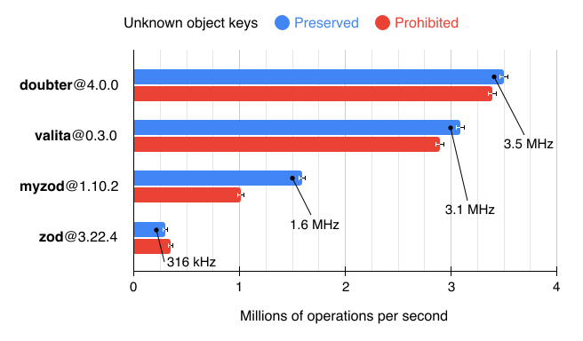

<p align="center">
  <a href="#readme"><picture>
    <source media="(prefers-color-scheme: dark)" srcset="./assets/logo-dark.png" />
    <source media="(prefers-color-scheme: light)" srcset="./assets/logo-light.png" />
    
  </picture></a>
</p>

<p align="center">
  <a href="https://codesandbox.io/s/y5kec4"></a>
  <a href="https://smikhalevski.github.io/doubter/next/"><picture>
    <source media="(prefers-color-scheme: dark)" srcset="./assets/button-api-docs-dark.png" />
    <source media="(prefers-color-scheme: light)" srcset="./assets/button-api-docs-light.png" />
    
  </picture></a>
</p>

<br>

Runtime validation and transformation library.

- TypeScript first;
- Sync and async validation and transformation flows;
- [Circular object references support;](#circular-object-references)
- Collect all validation issues, or [exit early;](#early-return)
- [Runtime type introspection;](#introspection)
- [Human-oriented type coercion;](#type-coercion)
- [High performance and low memory consumption;](#performance)
- No dynamic code evaluation;
- Zero dependencies;
- [Pluggable architecture;](#plugins)
- [Just 12 kB gzipped](https://bundlephobia.com/result?p=doubter) and tree-shakable;
- Check out the [Cookbook](#cookbook) for real-life examples!

```shell
npm install --save-prod doubter
```

> [!IMPORTANT]\
> Docs on the [`next`](https://github.com/smikhalevski/doubter/tree/next#readme) branch describe the canary release
> [`doubter@next`](https://www.npmjs.com/package/doubter/v/next). Navigate to the
> [`latest`](https://github.com/smikhalevski/doubter/tree/latest#readme) branch for docs that describe the latest stable
> release.

<br>

🚀&ensp;**Features**

- [Basics](#basics)
- [Shapes](#shapes)
- [Validation errors](#validation-errors)
- [Checks](#checks)
- [Refinements](#refinements)
- [Alterations](#alterations)
- [Conversions](#conversions)
- [Metadata](#metadata)
- [Parsing context](#parsing-context)
- [Shape piping](#shape-piping)
- [Replace, allow, and deny a value](#replace-allow-and-deny-a-value)
- [Optional and non-optional](#optional-and-non-optional)
- [Nullable and nullish](#nullable-and-nullish)
- [Exclude a shape](#exclude-a-shape)
- [Deep partial](#deep-partial)
- [Fallback value](#fallback-value)
- [Branded types](#branded-types)
- [Type coercion](#type-coercion)
- [Introspection](#introspection)
- [Localization](#localization)
- [Plugins](#plugins)
- [Advanced shapes](#advanced-shapes)

⏱&ensp;[**Performance**](#performance)

🎯&ensp;**Data types**

- Strings<br>
  [`string`](#string)

- Numbers<br>
  [`number`](#number)
  [`bigint`](#bigint)
  [`nan`](#nan)

- Booleans<br>
  [`boolean`](#boolean-bool)
  [`bool`](#boolean-bool)

- Symbols<br>
  [`symbol`](#symbol)

- Literal values<br>
  [`enum`](#enum)
  [`const`](#const)
  [`null`](#null)
  [`undefined`](#undefined)
  [`void`](#void)

- Objects<br>
  [`object`](#object)
  [`record`](#record)
  [`instanceOf`](#instanceof)

- Collections<br>
  [`array`](#array)
  [`tuple`](#tuple)
  [`set`](#set)
  [`map`](#map)

- Dates<br>
  [`date`](#date)

- Promises<br>
  [`promise`](#promise)

- Functions<br>
  [`function`](#function-fn)
  [`fn`](#function-fn)

- Shape composition<br>
  [`union`](#union-or)
  [`or`](#union-or)
  [`intersection`](#intersection-and)
  [`and`](#intersection-and)
  [`not`](#not)

- Unconstrained values<br>
  [`any`](#any)
  [`unknown`](#unknown)

- Other<br>
  [`convert`](#convert-convertasync)
  [`lazy`](#lazy)
  [`never`](#never)

🍪&ensp;**Cookbook**

- [Type-safe URL query params](#type-safe-url-query-params)
- [Type-safe environment variables](#type-safe-environment-variables)
- [Type-safe CLI arguments](#type-safe-cli-arguments)
- [Type-safe `localStorage`](#type-safe-localstorage)
- [Rename object keys](#rename-object-keys)
- [Conditionally applied shapes](#conditionally-applied-shapes)

# Basics

Let's create a simple shape of a user object:

```ts
import * as d from 'doubter';

const userShape = d.object({
  name: d.string(),
  age: d.number().int().gte(18).lt(100)
});
// ⮕ Shape<{ name: string, age: number }>
```

This shape can be used to validate a value:

```ts
userShape.parse({
  name: 'John Belushi',
  age: 30
});
// ⮕ { name: 'John Belushi', age: 30 }
```

If an incorrect value is provided, a validation error is thrown:

```ts
userShape.parse({
  name: 'Peter Parker',
  age: 17
});
// ❌ ValidationError: number.gte at /age: Must be greater than or equal to 18
```

Infer the user type from the shape:

```ts
type User = d.Output<typeof userShape>;

const user: User = {
  name: 'Dan Aykroyd',
  age: 27
};
```

# Shapes

Shapes are validation and transformation pipelines that have an input and an output. Here's a shape that restricts an
input to a string and produces a string as an output:

```ts
d.string();
// ⮕ Shape<string>
```

Shapes can have different input and output types. For example, the shape below allows strings and
[replaces `undefined`](#optional-and-non-optional) input values with a default value "Mars":

```ts
const shape = d.string().optional('Mars');
// ⮕ Shape<string | undefined, string>

shape.parse('Pluto');
// ⮕ 'Pluto'

shape.parse(undefined);
// ⮕ 'Mars'
```

Infer the input and output types of the shape:

```ts
type MyInput = d.Input<typeof shape>;
// ⮕ string | undefined

type MyOutput = d.Output<typeof shape>;
// ⮕ string
```

You can get input types and literal values that the shape accepts using [shape introspection](#introspection):

```ts
shape.inputs;
// ⮕ [Type.STRING, undefined]
```

## Parsing and trying

Each shape can parse input values and there are several methods for that purpose.

Methods listed in this section can be safely detached from the shape instance:

```ts
const { parseOrDefault } = d.string();

parseOrDefault('Jill');
// ⮕ 'Jill'

parseOrDefault(42);
// ⮕ undefined
```

Parsing methods accept options argument.

```ts
d.number().parse('42', { earlyReturn: true });
// ⮕ 42
```

Following options are available:

<dl>
<dt><code>earlyReturn</code></dt>
<dd>

If `true` then parsing is aborted after the first issue is encountered. Refer to [Early return](#early-return) section
for more details.

</dd>
<dt><code>context</code></dt>
<dd>

The custom context that can be accessed from custom check callbacks, refinement predicates, alteration callbacks,
converters, and fallback functions. Refer to [Parsing context](#parsing-context) section for more details.

</dd>
<dt><code>errorMessage</code></dt>
<dd>

This option is only available for [`parse` and `parseAsync`](#parse) methods. It configures a `ValidationError`
message. If a callback is provided it receives issues and an input value, and must return a string message. If a string
is provided, it is used as is. You can also configure global issue formatter that is used by `ValidationError`, refer to
[Global error message formatter](#global-error-message-formatter) section for more details.

</dd>
</dl>

### [`parse`](https://smikhalevski.github.io/doubter/next/classes/core.Shape.html#parse)

You've already met `parse` in the [Basics](#basics) section. This method takes an input value and returns an output
value, or throws a [validation error](#validation-errors) if parsing fails:

```ts
const shape = d.number();
// ⮕ Shape<number>

shape.parse(42);
// ⮕ 42

shape.parse('Mars');
// ❌ ValidationError: type at /: Must be a number
```

Use [`parseAsync`](https://smikhalevski.github.io/doubter/next/classes/core.Shape.html#parseAsync) method with
[async shapes.](#async-shapes) It has the same semantics and returns a promise.

### [`parseOrDefault`](https://smikhalevski.github.io/doubter/next/classes/core.Shape.html#parseOrDefault)

Sometimes you don't care about validation errors, and want a default value to be returned if things go south:

```ts
const shape = d.number();
// ⮕ Shape<number>

shape.parseOrDefault(42);
// ⮕ 42

shape.parseOrDefault('Mars');
// ⮕ undefined

shape.parseOrDefault('Pluto', 5.3361);
// ⮕ 5.3361
```

If you need a fallback value for a nested shape [consider using `catch`](#fallback-value).

Use [`parseOrDefaultAsync`](https://smikhalevski.github.io/doubter/next/classes/core.Shape.html#parseOrDefaultAsync)
method with [async shapes.](#async-shapes) It has the same semantics and returns a promise.

### [`try`](https://smikhalevski.github.io/doubter/next/classes/core.Shape.html#try)

It isn't always convenient to write a try-catch blocks to handle validation errors. Use `try` method in such cases:

```ts
const shape = d.number();
// ⮕ Shape<number>

shape.try(42);
// ⮕ { ok: true, value: 42 }

shape.try('Mars');
// ⮕ { ok: false, issues: [{ code: 'type', … }] }
```

Use [`tryAsync`](https://smikhalevski.github.io/doubter/next/classes/core.Shape.html#tryAsync) method with
[async shapes.](#async-shapes) It has the same semantics and returns a promise.

## Operations

At the final stage of the parsing process, a shape applies operations that were added to it.

```ts
const shape = d.string().use(
  next => (input, output, options, issues) => {
    return next(input, output.trim(), options, issues);
  }
);

shape.parse('  Space  ');
// ⮕ 'Space'
```

> [!IMPORTANT]\
> Most of the time you don't need to add operations directly. Instead, you can use the higher-level API:
> [checks](#checks), [refinements](#refinements), and [alterations](#alterations).

Operations can alter the shape output, populate issues, and delegate parsing to the next operation. They are
executed in the same order they were added. You can access all operations that were added to the shape using the
[`operations`](https://smikhalevski.github.io/doubter/next/classes/core.Shape.html#operations) property.

## Async shapes
 
What can make a shape asynchronous:

- [Async value conversions;](#async-conversions)
- Usage of [`d.promise`](#promise) that constrains the resolved value;
- Usage of [custom async shapes.](#advanced-shapes)

Here's a shape of a promise that is expected to be fulfilled with a number:

```ts
const shape = d.promise(d.number());
// ⮕ Shape<Promise<number>>
```

You can check that the shape is async:

```ts
shape.isAsync // ⮕ true
```

Async shapes don't support synchronous [`parse`](#parse) method, and would throw an error if it is called:

```ts
shape.parse(Promise.resolve(42));
// ❌ Error: Shape is async
```

Use [`parseAsync`](#parse) with async shapes instead:

```ts
shape.parseAsync(Promise.resolve(42));
// ⮕ Promise<42>
```

A shape that relies on an async shape becomes async as well:

```ts
const userShape = d.object({
  name: d.promise(d.string())
});
// ⮕ Shape<{ name: Promise<string> }>

userShape.isAsync // ⮕ true
```

# Validation errors

Validation errors which are thrown by [`parse*` methods](#parse), and
[`Err`](https://smikhalevski.github.io/doubter/next/interfaces/core.Err.html) objects returned by
[`try*` methods](#try) have the `issues` property which holds an array of validation issues:

```ts
const shape = d.object({ age: d.number() });
// ⮕ Shape<{ age: number }>

const result = shape.try({ age: 'seventeen' });
```

The `result` contains the [`Err`](https://smikhalevski.github.io/doubter/next/interfaces/core.Err.html) object
with the array of issues:

```json5
{
  ok: false,
  issues: [
    {
      code: 'type',
      path: ['age'],
      input: 'seventeen',
      message: 'Must be a number',
      param: Type.NUMBER,
      meta: undefied
    }
  ]
}
```

<dl>
<dt><code>code</code></dt>
<dd>

The code of the validation issue. Shapes provide various checks and each check has a unique code. In the example above,
`type` code refers to a failed number type check. See the table of known codes below. You can add
[a custom check](#checks) to any shape and return an issue with your custom code.

</dd>
<dt><code>path</code></dt>
<dd>

The object path as an array of keys, or `undefined` if there's no path. Keys can be strings, numbers (for example, array
indices), symbols, and any other values since they can be [`Map` keys.](#map)

</dd>
<dt><code>input</code></dt>
<dd>

The input value that caused a validation issue. Note that if [coercion](#type-coercion) is enabled this may contain an
already coerced value.

</dd>
<dt><code>message</code></dt>
<dd>

The human-readable issue message. Refer to [Localization](#localization) section for more details.

</dd>
<dt><code>param</code></dt>
<dd>

The parameter value associated with the issue. For built-in checks, the parameter value depends on `code`, see the table
below.

</dd>
<dt><code>meta</code></dt>
<dd>

The optional metadata associated with the issue. Refer to [Metadata](#metadata) section for more details.

</dd>
</dl>

<br/>

| Code                | Caused by                                           | Param                                                 |
|:--------------------|:----------------------------------------------------|:------------------------------------------------------|
| `any.deny`          | [`shape.deny(x)`](#deny-a-value)                    | The denied value `x`                                  |
| `any.exclude`       | [`shape.exclude(…)`](#exclude-a-shape)              | The excluded shape                                    |
| `any.refine`        | [`shape.refine(…)`](#refinements)                   | The predicate callback                                |
| `array.includes`    | [`d.array().includes(x)`](#array)                   | The included value `x`                                |
| `array.min`         | [`d.array().min(n)`](#array)                        | The minimum array length `n`                          |
| `array.max`         | [`d.array().max(n)`](#array)                        | The maximum array length `n`                          |
| `bigint.min`        | [`d.bigint().min(n)`](#bigint)                      | The minimum value `n`                                 |
| `bigint.max`        | [`d.bigint().max(n)`](#bigint)                      | The maximum value `n`                                 |
| `date.min`          | [`d.date().min(n)`](#date)                          | The minimum value `n`                                 |
| `date.max`          | [`d.date().max(n)`](#date)                          | The maximum value `n`                                 |
| `number.finite`     | [`d.number().finite()`](#number)                    | —                                                     |
| `number.int`        | [`d.number().int()`](#number)                       | —                                                     |
| `number.gt`         | [`d.number().gte(x)`](#number)                      | The minimum value `x`                                 |
| `number.lt`         | [`d.number().lte(x)`](#number)                      | The maximum value `x`                                 |
| `number.gte`        | [`d.number().gt(x)`](#number)                       | The exclusive minimum value `x`                       |
| `number.lte`        | [`d.number().lt(x)`](#number)                       | The exclusive maximum value `x`                       |
| `number.multipleOf` | [`d.number().multipleOf(x)`](#number)               | The divisor `x`                                       |
| `object.allKeys`    | [`d.object().allKeys(keys)`](#key-relationships)    | The `keys` array                                      |
| `object.notAllKeys` | [`d.object().notAllKeys(keys)`](#key-relationships) | The `keys` array                                      |
| `object.orKeys`     | [`d.object().orKeys(keys)`](#key-relationships)     | The `keys` array                                      |
| `object.xorKeys`    | [`d.object().xorKeys(keys)`](#key-relationships)    | The `keys` array                                      |
| `object.oxorKeys`   | [`d.object().oxorKeys(keys)`](#key-relationships)   | The `keys` array                                      |
| `object.exact`      | [`d.object().exact()`](#unknown-keys)               | The array of unknown keys                             |
| `object.plain`      | [`d.object().plain()`](#object)                     | —                                                     |
| `set.min`           | [`d.set().min(n)`](#set)                            | The minimum `Set` size `n`                            |
| `set.max`           | [`d.set().max(n)`](#set)                            | The maximum `Set` size `n`                            |
| `string.nonBlank`   | [`d.string().nonBlank()`](#string)                  | —                                                     |
| `string.min`        | [`d.string().min(n)`](#string)                      | The minimum string length `n`                         |
| `string.max`        | [`d.string().max(n)`](#string)                      | The maximum string length `n`                         |
| `string.regex`      | [`d.string().regex(re)`](#string)                   | The regular expression `re`                           |
| `string.includes`   | [`d.string().includes(x)`](#string)                 | The included string `x`                               |
| `string.startsWith` | [`d.string().startsWith(x)`](#string)               | The substring `x`                                     |
| `string.endsWith`   | [`d.string().endsWith(x)`](#string)                 | The substring `x`                                     |
| `type`              | All shapes                                          | The expected [input value type](#introspection)       |
| `type.const`        | [`d.const(x)`](#const)                              | The expected constant value `x`                       |
| `type.enum`         | [`d.enum(…)`](#enum)                                | The array of unique value                             |
| `type.instanceOf`   | [`d.instanceOf(Class)`](#instanceof)                | The class constructor `Class`                         |
| `type.intersection` | [`d.and(…)`](#intersection-and)                     | —                                                     |
| `type.never`        | [`d.never()`](#never)                               | —                                                     |
| `type.tuple`        | [`d.tuple([…])`](#tuple)                            | The expected tuple length                             |
| `type.union`        | [`d.or(…)`](#union-or)                              | [Issues raised by a union](#issues-raised-by-a-union) |

## Global error message formatter

By default, `ValidationError` uses `JSON.stringify` to produce an error message from an array of issues. While you can
provide a custom error message by passing [`errorMessage` option](#parse) to `parse` and `parseAsync`, you also can
configure the global formatter.

```ts
d.ValidationError.formatIssues = issues => {
  // Return a human-readable error message that describes issues
  return 'Something went wrong';
};

new d.ValidationError([]).message;
// ⮕ 'Something went wrong'

new d.ValidationError([], 'Kaputs').message;
// ⮕ 'Kaputs'
```

`formatIssues` is called whenever a
[`message` constructor argument](https://smikhalevski.github.io/doubter/next/classes/core.ValidationError.html#constructor)
is omitted. 

# Checks

Checks are the most common [operations](#operations) that allow constraining the input value beyond type assertions. For
example, if you want to constrain a numeric input to be greater than 5:

```ts
const shape = d.number().check(value => {
  if (value <= 5) {
    // 🟡 Return an issue, or an array of issues
    return { code: 'kaputs' };
  }
});
// ⮕ Shape<number>

shape.parse(10);
// ⮕ 10

shape.parse(3);
// ❌ ValidationError: kaputs at /
```

A check callback receives the shape output value and must return an issue or an array of issues if the value is invalid.

> [!NOTE]\
> Check callbacks can throw a [`ValidationError`](#validation-errors) to notify Doubter that parsing
> issues occurred. While this has the same effect as returning an array of issues, it is recommended to throw a
> `ValidationError` as the last resort since catching errors has a high performance penalty.

If value is valid, a check callback must return `null`, `undefined`, or an empty array.

Most shapes have a set of built-in checks. The check we've just implemented above is called `gt` (greater than):

```ts
d.number().gt(5);
```

Add as many checks as you need to the shape. You can mix custom and built-in checks, they are executed in the same order
they were added.

```ts
d.string().max(4).regex(/a/).try('Pluto');
```

In the example above, an [`Err`](https://smikhalevski.github.io/doubter/next/interfaces/core.Err.html) object is
returned:

```json5
{
  ok: false,
  issues: [
    {
      code: 'string.max',
      path: [],
      input: 'Pluto',
      message: 'Must have the maximum length of 4',
      param: 4,
      meta: undefied
    },
    {
      code: 'string.regex',
      path: [],
      input: 'Pluto',
      message: 'Must match the pattern /a/',
      param: /a/,
      meta: undefied
    }
  ]
}
```

> [!NOTE]\
> You can find the list of issue codes and corresponding param values in [Validation errors](#validation-errors)
> section.

## Parameterized checks

You can pass an additional parameter when adding a check:

```ts
const includesCheck: d.CheckCallback<string[], string> = (value, param) => {
  if (!value.includes(param)) {
    return { message: 'Must include ' + param };
  }
};

const shape = d.array(d.string()).check(includesCheck, { param: 'Mars' });
// ⮕ Shape<any[]>

shape.parse(['Mars', 'Pluto']);
// ⮕ ['Mars', 'Pluto']

shape.parse(['Venus']);
// ❌ ValidationError: unknown at /: Must include Mars
```

## Early return

By default, Doubter collects all issues during parsing. In some cases, you may want to halt parsing and raise a
validation error as soon as the first issue was encountered. To do this, pass the
[`earlyReturn`](https://smikhalevski.github.io/doubter/next/interfaces/core.ApplyOptions.html#earlyReturn)
option to the [`parse*` method.](#parsing-and-trying)

```ts
d.string()
  .max(4)
  .regex(/a/)
  .try('Pluto', { earlyReturn: true });
```

This would return the [`Err`](https://smikhalevski.github.io/doubter/next/interfaces/core.Err.html) object with
only one issue:

```json5
{
  ok: false,
  issues: [
    {
      code: 'string.max',
      path: undefied,
      input: 'Pluto',
      message: 'Must have the maximum length of 4',
      param: 4,
      meta: undefied
    }
  ]
}
```

## Forced checks

Checks added using the
[`check`](https://smikhalevski.github.io/doubter/next/classes/core.Shape.html#check) method are type-safe by
default, which means they aren't applied if any of the preceding operations have failed.

For example, let's declare a shape with two custom checks:

```ts
const lengthCheck: d.CheckCallback<string> = value => {
  if (value.length < 10) {
    return { code: 'length' };
  }
};

const contentsCheck: d.CheckCallback<string> = value => {
  if (!/^\d+$/.test(value)) {
    return { code: 'contents' };
  }
};
```

By default, if the input violates the `lengthCheck`, then `contentsCheck` isn't applied:

```ts
d.string()
  .check(lengthCheck)
  .check(contentsCheck)
  .try('Mars');
```

This would return the [`Err`](https://smikhalevski.github.io/doubter/next/interfaces/core.Err.html) object with
only one issue produced by the `lengthCheck`:

```json5
{
  ok: false,
  issues: [
    // 🟡 Only one issue was raised
    { code: 'length' }
  ]
}
```

To force `contentsCheck` to be applied even if `lengthCheck` has failed, pass the
[`force`](https://smikhalevski.github.io/doubter/next/interfaces/core.OperationOptions.html#force) option:

```ts
d.string()
  .check(lengthCheck)
  .check(contentsCheck, { force: true })
  .try('Mars');
```

This would return the [`Err`](https://smikhalevski.github.io/doubter/next/interfaces/core.Err.html) object with
two issues produced by the `lengthCheck` and `contentsCheck`:

```json5
{
  ok: false,
  issues: [
    { code: 'length' },
    { code: 'contents' },
  ]
}
```

### Respecting the shape type

Both forced and non-forced checks are applied only if the type of the input is valid.

```ts
d.string()
  .check(lengthCheck)
  .check(contentsCheck, { force: true })
  // 🟡 Parsing a non-string value
  .try(42);
```

Neither `lengthCheck` nor `contentsCheck` are applied (and even marking `contentsCheck` as forced didn't help):

```json5
{
  ok: false,
  issues: [
    {
      code: 'type',
      path: undefied,
      input: 42,
      message: 'Must be a string',
      param: Type.STRING,
      meta: undefied,
    },
  ]
}
```

This happens because the input value 42 has a number type which is invalid since [`d.string`](#string) shape was used.

### Loosing type-safety

For composite shapes, forced checks may become non-type-safe. Let's consider an object with a custom check:

```ts
const userShape = d
  .object({
    age: d.number(),
    yearsOfExperience: d.number()
  })
  .check(user => {
    if (user.age < user.yearsOfExperience) {
      return { code: 'age' };
    }
  });
// ⮕ Shape<{ age: number, yearsOfExperience: number }>
```

The check relies on `user` to be an object with the valid set of properties. So if any issues are detected in the input
object the check won't be called:

```ts
// 🟡 Check isn't applied
nameShape.parse({ age: 18 });
// ❌ ValidationError: type at /yearsOfExperience: Must be a number
```

Adding the `force` option to the `check` call, in this case would cause the check to be applied even if _object
properties have invalid types_.

Some shapes cannot guarantee that the input value is of the required type. For example, if any of the underlying shapes
in an intersection have raised issues, an intersection itself cannot guarantee that its checks would receive the value
of the expected type, so it won't apply its forced checks.

These shapes won't apply forced checks if an underlying shape has raised an issue:

- [`DenyShape`](#deny-a-value)
- [`IntersectionShape`](#intersection-and)
- [`LazyShape`](#lazy)
- [`PipeShape`](#shape-piping)
- [`ReplaceShape`](#replace-a-value)
- [`ConvertShape`](#conversions)
- [`UnionShape`](#union-or)

# Refinements

Refinements are a simplified alternative to [checks](#checks) that use a predicate callback to validate an input. For
example, the shape below would raise an issue if the input string is less than six characters long.

```ts
const shape1 = d.string().refine(value => value.length >= 6);
// ⮕ Shape<string>

shape1.parse('Uranus');
// ⮕ 'Uranus'

shape1.parse('Mars');
// ❌ ValidationError: any.refine at /: Must conform the predicate
```

Use refinements to [narrow](https://www.typescriptlang.org/docs/handbook/2/narrowing.html) the output type of the shape:

```ts
function isMarsOrPluto(value: string): 'Mars' | 'Pluto' {
  return value === 'Mars' || value === 'Pluto';
}

d.string().refine(isMarsOrPluto)
// ⮕ Shape<string, 'Mars' | 'Pluto'>
```

By default, `refine` raises issues which have the [`"any.refine"`](#validation-errors) code. You can provide a custom
code:

```ts
const shape2 = d.string().refine(
  isMarsOrPluto,
  {
    code: 'planet',
    message: 'Must be Mars or Pluto'
  }
);

shape2.parse('Venus');
// ❌ ValidationError: planet at /: Must be Mars or Pluto
```

> [!NOTE]\
> Refinements [can be parameterized](#parameterized-checks) and [forced](#forced-checks) the same way as checks.

# Alterations

Alterations are [operations](#operations) that synchronously transform the shape output value without changing its type.
For example, let's consider a string shape that trims the value and then checks that it has at least 3 characters:

```ts
d.string()
  .alter(value => value.trim())
  .min(3);
// ⮕ StringShape
```

Note that we can still use the built-in `min` check after `alter` was applied. This is the case since `alter` returns
the same shape class as the one it was applied to. This is helpful when you want to chain multiple operations that check
and alter the value of the same type.

Use any transformation library in conjunction with alternations:

```ts
d.number().alter(Math.abs).alter(Math.pow, { param: 3 });
```

Alteration callbacks must return the value of the same type, so consequent operations are type-safe. If you want to
convert the shape output value to another type, consider using [conversions.](#conversions)

> [!NOTE]\
> Alterations [can be parameterized](#parameterized-checks) and [forced](#forced-checks) the same way as checks.

# Conversions

Conversions are close relatives of [alterations](#alterations) that also transform shape output value. The main
difference from alterations is that conversions can change the shape output type. Let's consider a shape that takes a
string as an input and converts it to a number:

```ts
const shape = d.string().convert(parseFloat);
// ⮕ Shape<string, number>
```

This shape ensures that the input value is a string and passes it to a converter callback:

```ts
shape.parse('42');
// ⮕ 42

shape.parse('seventeen');
// ⮕ NaN
```

Throw a [`ValidationError`](https://smikhalevski.github.io/doubter/next/classes/core.ValidationError.html)
inside the callback to notify parser that the conversion cannot be successfully completed:

```ts
function toNumber(input: string): number {
  const output = parseFloat(input);

  if (isNaN(output)) {
    throw new d.ValidationError([{ code: 'nan' }]);
  }
  return output;
}

const shape = d.string().convert(toNumber);

shape.parse('42');
// ⮕ 42

shape.parse('seventeen');
// ❌ ValidationError: nan at /
```

## Async conversions

Let's consider a _sync_ conversion:

```ts
const syncShape1 = d.string().convert(
  value => 'Hello, ' + value
);
// ⮕ Shape<string>

syncShape1.isAsync // ⮕ false

syncShape1.parse('Jill');
// ⮕ 'Hello, Jill'
```

The converter callback receives and returns a string and so does `syncShape1`.

Now lets return a promise from the converter callback:

```ts
const syncShape2 = d.string().convert(
  value => Promise.resolve('Hello, ' + value)
);
// ⮕ Shape<string, Promise<string>>

syncShape2.isAsync // ⮕ false

syncShape2.parse('Jill');
// ⮕ Promise<string>
```

Notice that `syncShape2` is asymmetric: it expects a string input and converts it to a `Promise<string>`. `syncShape2`
is still sync, since the converter callback _synchronously wraps_ a value in a promise.

Now let's create an _async_ shape using the async conversion:

```ts
const asyncShape1 = d.string().convertAsync(
  value => Promise.resolve('Hello, ' + value)
);
// ⮕ Shape<string>

// 🟡 Notice that the shape is async
asyncShape1.isAsync // ⮕ true

await asyncShape1.parseAsync('Jill');
// ⮕ Promise { 'Hello, Jill' }
```

Notice that `asyncShape1` converts the input string value to output string but the conversion itself is async.

A shape is async if it uses async conversions. Here's an async object shape:

```ts
const asyncShape2 = d.object({
  foo: d.string().convertAsync(
    value => Promise.resolve(value)
  )
});
// ⮕ Shape<{ foo: string }>

asyncShape2.isAsync // ⮕ true
```

> [!NOTE]\
> Composite shapes are async if they rely on a [`promise`](#promise) shape that constrains a resolved value:
>
> ```ts
> const shape = d.object({
>   foo: d.promise(d.string())
> });
> // ⮕ Shape<{ foo: Promise<string> }>
> 
> shape.isAsync // ⮕ true
> ```

# Metadata

Shapes and issues can be enriched with additional metadata.

Add an annotation to a shape:

```ts
const shape = d.string().annotate({ description: 'Username' });

shape.annotations;
// ⮕ { description: 'Username' }
```

`annotate` returns the clone of the shape with updated annotations. Annotations are merged when you add them:

```ts
shape.annotate({ foo: 'bar' }).annotations;
// ⮕ { description: 'Username', foo: 'bar' }
```

[Validation issues](#validation-errors) have a
[`meta`](https://smikhalevski.github.io/doubter/next/interfaces/core.Issue.html#meta) property that you can use
to store an arbitrary data.

You can pass the [`meta`](https://smikhalevski.github.io/doubter/next/interfaces/core.ConstraintOptions.html#meta)
option to any [built-in check](#checks) and its value is assigned to the `meta` property of the raised validation issue.

```ts
const shape = d.number().gt(5, { meta: 'Useful data' });
// ⮕ Shape<number>

const result = shape.try(2);
// ⮕ { ok: false, issues: … }

if (!result.ok) {
  result.issues[0].meta // ⮕ 'Useful data'
}
```

This comes handy if you want to enhance an issue with an additional data that can be used later during issues
processing. For example, during [localization.](#localization)

# Parsing context

Inside [check](#checks) callbacks, [refinement predicates](#refinements), [alteration](#alterations) callbacks,
[converters](#conversions), [fallback](#fallback-value) functions, and [message](#localization) callbacks you can access
options passed to the parser. The
[`context`](https://smikhalevski.github.io/doubter/next/interfaces/core.ApplyOptions.html#context) option may
store an arbitrary data, which is `undefined` by default.

For example, here's how you can use context to convert numbers to formatted strings:

```ts
const shape = d.number().convert(
  (value, options) => new Intl.NumberFormat(options.context.locale).format(value)
);
// ⮕ Shape<number, string>

shape.parse(
  1000,
  {
    // 🟡 Pass a context
    context: { locale: 'en-US' }
  }
);
// ⮕ '1,000'
```

# Shape piping

With shape piping you to can pass the shape output to another shape.

```ts
d.string()
  .convert(parseFloat)
  .to(d.number().lt(5).gt(10));
// ⮕ Shape<string, number>
```

For example, you can validate that an input value is an [instance of a class](#instanceof) and then validate its
properties using [`object`](#object):

```ts
class Planet {
  constructor(readonly name: string) {}
}

const shape = d.instanceOf(Planet).to(
  d.object({
    name: d.string().min(4)
  })
);

shape.parse({ name: 'Pluto' });
// ❌ ValidationError: type.instanceOf at /: Must be a class instance

shape.parse(new Planet('X'));
// ❌ ValidationError: string.min at /name: Must have the minimum length of 4

shape.parse(new Planet('Mars'));
// ⮕ Planet { name: 'Mars' }
```

# Replace, allow, and deny a value

All shapes support [`replace`](https://smikhalevski.github.io/doubter/next/classes/core.Shape.html#replace),
[`allow`](https://smikhalevski.github.io/doubter/next/classes/core.Shape.html#allow), and
[`deny`](https://smikhalevski.github.io/doubter/next/classes/core.Shape.html#deny) methods that change how
separate literal values are processed.

## Replace a value

You can replace an input value with an output value:

```ts
const shape1 = d.enum(['Mars', 'Pluto']).replace('Pluto', 'Jupiter');
// ⮕ Shape<'Mars' | 'Pluto', 'Mars' | 'Jupiter'>

shape1.parse('Mars');
// ⮕ 'Mars'

shape1.parse('Pluto');
// ⮕ 'Jupiter'
```

With `replace` you can extend possible input values:

```ts
d.const('Venus').replace('Mars', 'Uranus');
// ⮕ Shape<'Venus' | 'Mars', 'Venus' | 'Uranus'>
```

This would also work with non-literal input types:

```ts
d.number().replace(0, 'zero');
// ⮕ Shape<number, number | 'zero'>
```

`replace` narrows its arguments to literal type but in TypeScript type system not all values have a separate literal
type. For example, there's no literal type for `NaN` and `Infinity` values. In such cases `replace` doesn't exclude the
replaced value type from the output type:

```ts
d.enum([33, 42]).replace(NaN, 0);
// ⮕ Shape<number, 33 | 42 | 0>
```

Replaced values aren't processed by the underlying shape:

```ts
const shape2 = d.number().gte(3).replace(0, 'zero');
// ⮕ Shape<number | 'zero'>

shape2.parse(2);
// ❌ ValidationError: number.gte at /: Must be greater than 3

// 🟡 Notice that 0 doesn't satisfy the gte constraint
shape2.parse(0);
// ⮕ 'zero'
```

## Allow a value

You can allow a value as both input and output:

```ts
d.const('Mars').allow('Pluto');
// ⮕ Shape<'Mars' | 'Pluto'>
```

`allow` follows exactly the same semantics as [`replace`](#replace-a-value).

You can allow a value for a non-literal input types:

```ts
const shape = d.number().finite().allow(NaN);
// ⮕ Shape<number>

shape.parse(NaN);
// ⮕ NaN

shape.parse(Infinity);
// ❌ ValidationError: number.finite at /: Must be a finite number
```

## Deny a value

Consider the enum shape:

```ts
const shape1 = d.enum(['Mars', 'Pluto', 'Jupiter']);
// ⮕ Shape<'Mars' | 'Pluto' | 'Jupiter'>
```

To remove a value from this enum you can use the
[`deny`](https://smikhalevski.github.io/doubter/next/classes/core.Shape.html#deny) method:

```ts
shape1.deny('Pluto');
// ⮕ Shape<'Mars' | 'Jupiter'>
```

Value denial works with any shape. For example, you can deny a specific number:

```ts
const shape2 = d.number().deny(42);
// ⮕ Shape<number>

shape2.parse(33);
// ⮕ 33

shape2.parse(42);
// ❌ ValidationError: any.deny at /: Must not be equal to 42
```

`deny` prohibits value for _both input and output_:

```ts
const shape3 = d.number().convert(value => value * 2).deny(42);
// ⮕ Shape<number>

shape3.parse(21);
// ❌ ValidationError: any.deny at /: Must not be equal to 42
```

# Optional and non-optional

Marking a shape as optional [allows `undefined`](#allow-a-value) in both its input and output:

```ts
d.string().optional();
// ⮕ Shape<string | undefined>
```

You can provide a default value of any type, so it would be used as an output if input value is `undefined`:

```ts
d.string().optional(42);
// ⮕ Shape<string | undefined, string | 42>
```

You can achieve the same behaviour using a union:

```ts
d.or([
  d.string(),
  d.undefined()
]);
// ⮕ Shape<string | undefined>
```

Or using [`allow`](#allow-a-value):

```ts
d.string().allow(undefined);
// ⮕ Shape<string | undefined>
```

You can mark any shape as non-optional which effectively [denies `undefined`](#deny-a-value) values from both
input and output. For example, lets consider a union of an optional string and a number:

```ts
const shape1 = d.or([
  d.string().optional(),
  d.number()
]);
// ⮕ Shape<string | undefined | number>

shape1.parse(undefined);
// ⮕ undefined

const shape2 = shape1.nonOptional();
// ⮕ Shape<string | number>

shape2.parse(undefined);
// ❌ ValidationError: any.deny at /: Must not be equal to undefined
```

# Nullable and nullish

Marking a shape as nullable [allows `null`](#allow-a-value) for both input and output:

```ts
d.string().nullable();
// ⮕ Shape<string | null>
```

You can provide a default value, so it would be used as an output if input value is `null`:

```ts
d.string().nullable(42);
// ⮕ Shape<string | null, string | 42>
```

To allow both `null` and `undefined` values use `nullish`:

```ts
d.string().nullish();
// ⮕ Shape<string | null | undefined>
```

`nullish` also supports the default value:

```ts
d.string().nullish(8080);
// ⮕ Shape<string | null | undefined, string | 8080>
```

# Exclude a shape

Shape exclusions work the same way as `Exclude` helper type in TypeScript. When an exclusion is applied, the output
value returned by the underlying shape _must not conform_ the excluded shape.

```ts
const shape = d.enum(['Mars', 'Venus', 'Pluto']).exclude(d.const('Pluto'));
// ⮕ Shape<'Mars' | 'Venus' | 'Pluto', 'Mars' | 'Venus'>

shape.parse('Mars');
// ⮕ 'Mars'

shape.parse('Pluto');
// ❌ ValidationError: any.exclude at /: Must not conform the excluded shape
```

Exclusions work with any shape combinations:

```ts
d.or([d.number(), d.string()]).exclude(d.string());
// ⮕ Shape<number | string, number>
```

Sometimes you need an exclusion at runtime, but don't need it on the type level. For example, let's define a shape that
allows any number except the \[3, 5] range:

```ts
// 🟡 Note that the shape output is inferred as never
d.number().exclude(d.number().min(3).max(5));
// ⮕ Shape<number, never>
```

Since the excluded shape constrains the `number` type, the output type is inferred as `never`. While the excluded shape
only restricts a limited range of numbers, there's no way to express this in TypeScript. So here's the workaround:

```ts
d.number().not(d.number().min(3).max(5));
// ⮕ Shape<number>
```

`not` works exactly like `exclude` at runtime, but it doesn't perform the exclusion on the type level.

```ts
d.enum(['Bill', 'Jill']).not(d.const('Jill'));
// ⮕ Shape<'Bill', 'Jill'>
```

You can also use [`d.not`](#not) to negate an arbitrary shape.

# Deep partial

All object-like shapes (objects, arrays, maps, sets, promises, etc.) can be converted to a deep partial alternative
using `deepPartial` method:

```ts
const shape1 = d.array(
  d.object({
    name: d.string(),
    age: d.number()
  })
);
// ⮕ Shape<{ name: string, age: number }[]>

shape1.deepPartial();
// ⮕ Shape<Array<{ name?: string, age?: number } | undefined>>
```

Unions, intersections and lazy shapes can also be converted to deep partial:

```ts
const shape2 = d
  .or([
    d.number(),
    d.object({ name: d.string() })
  ])
  .deepPartial()
// ⮕ Shape<number | { name?: string }>

shape2.parse(42);
// ⮕ 42

shape2.parse({ name: undefined });
// ⮕ { name: undefined }

shape2.parse({ name: 'Frodo' });
// ⮕ { name: 'Frodo' }

shape2.parse({ name: 8080 });
// ❌ ValidationError: type at /name: Must be a string
```

Deep partial isn't applied to [converted shapes](#conversions):

```ts
const shape2 = d
  .object({
    years: d.array(d.string())
      .convert(years => years.map(parseFloat))
  })
  .deepPartial();
// ⮕ Shape<{ years?: string[] }, { years?: number[] }>
```

In the example above, array elements don't allow `undefined` even after `deepPartial` was applied, this happened because
array is converted during parsing.

# Fallback value

If issues were detected during parsing a shape can return a fallback value.

```ts
const shape1 = d.string().catch('Mars');

shape1.parse('Pluto');
// ⮕ 'Pluto'

shape1.parse(42);
// ⮕ 'Mars'
```

Pass a callback as a fallback value, it would be executed every time the catch clause is reached:

```ts
const shape2 = d.number().catch(Date.now);

shape2.parse(42);
// ⮕ 42

shape2.parse('Pluto');
// ⮕ 1671565311528

shape2.parse('Mars');
// ⮕ 1671565326707
```

Fallback functions receive an input value, an array of issues and
[parsing options](https://smikhalevski.github.io/doubter/next/interfaces/core.ApplyOptions.html) (so you can
access your [custom context](#parsing-context) if needed).

```ts
d.string().catch((input, issues, options) => {
  // Return a fallback value
});
```

A fallback function can throw a [`ValidationError`](#validation-errors) to indicate that a fallback value cannot be
produced. Issues from this error would be incorporated in the parsing result.

```ts
const shape3 = d.object({
  name: d.string().catch(() => {
    throw new d.ValidationError([{ code: 'kaputs' }]);
  })
});

shape3.parse({ name: 47 });
// ❌ ValidationError: kaputs at /name
```

# Branded types

In TypeScript, values are considered to be of equivalent type if they are structurally the same. For example, plain
strings are assignable to one another:

```ts
function bookTicket(flightCode: string): void {
  // Booking logic
}

// 🟡 No type errors, but "Bill" isn't a flight code
bookTicket('Bill');
```

In some cases, it can be desirable to simulate nominal typing inside TypeScript. For instance, you may wish to write a
function that only accepts an input that has been validated by Doubter. This can be achieved with branded types:

```ts
const flightCodeShape = d.string().refine(isFlightCode).brand<'flightCode'>();
// ⮕ Shape<string, Branded<string, 'flightCode'>>

type FlightCode = d.Output<typeof flightCodeShape>;

// 🟡 Note that the argument type isn't a plain string
function bookTicket(flightCode: FlightCode): void {
  // Booking logic
}

bookTicket(flightCodeShape.parse('BA2490'));
// Ok, valid flight code

bookTicket('Bill');
// ❌ Error: Expected BRAND to be flightCode
```

> [!NOTE]\
> Branded types don't affect the runtime result of `parse`. It is a static-type-only construct.

# Type coercion

Type coercion is the process of converting value from one type to another (such as a string to a number, an array to
a `Set`, and so on).

When coercion is enabled, input values are implicitly converted to the required input type whenever possible. For
example, you can coerce input values to a number type:

```ts
const shape = d.number().coerce();
// ⮕ NumberShape

shape.isCoercing // ⮕ true

shape.parse([new String('8080')]);
// ⮕ 8080

shape.parse(null);
// ⮕ 0
```

Coercion rules differ from JavaScript so the behavior is more predictable and human-like. With Doubter, you can coerce
input to the following types:

- [string](#coerce-to-a-string)
- [number](#coerce-to-a-number)
- [boolean](#coerce-to-a-boolean)
- [bigint](#coerce-to-a-bigint)
- [const](#coerce-to-a-const)
- [enum](#coerce-to-an-enum)
- [array](#coerce-to-an-array)
- [`Date`](#coerce-to-a-date)
- [`Promise`](#coerce-to-a-promise)
- [`Map`](#coerce-to-a-map)
- [`Set`](#coerce-to-a-set)

## Custom type coercion

If you want to implement a custom coercion, you can use [`catch`](#fallback-value) to handle invalid input values:

```ts
const yesNoShape = d.boolean().catch((value, issues) => {
  if (value === 'yes') {
    return true;
  }
  if (value === 'no') {
    return false;
  }
  throw new ValidationError(issues);
});

yesNoShape.parse('yes');
// ⮕ true

d.array(yesNoShape).parse([true, 'no']);
// ⮕ [true, false]

yesNoShape.parse('true');
// ❌ ValidationError: type at /: Must be a boolean
```

Or you can use [`d.convert`](#convert-convertasync) to preprocess all input values:

```ts
const yesNoShape = d
  .convert(value => {
    if (value === 'yes') {
      return true;
    }
    if (value === 'no') {
      return false;
    }
    // Let the consequent shape handle this value
    return value;
  })
  .to(d.boolean());

yesNoShape.parse('yes');
// ⮕ true

yesNoShape.parse('true');
// ❌ ValidationError: type at /: Must be a boolean
```

# Introspection

Doubter provides various features to introspect your shapes at runtime. Let's start by accessing a shape input types
using the [`inputs`](https://smikhalevski.github.io/doubter/next/classes/core.Shape.html#inputs) property:

```ts
const shape1 = d.or([d.string(), d.boolean()]);
// ⮕ Shape<string | boolean>

shape1.inputs;
// ⮕ [Type.STRING, Type.BOOLEAN]
```

`inputs` array may contain literal values:

```ts
d.enum(['Mars', 42]).inputs;
// ⮕ ['Mars', 42]
```

Literal values are absorbed by their type in unions.

```ts
const shape2 = d.or([
  d.enum(['Uranus', 1984]),
  d.number()
]);
// ⮕ Shape<'Uranus' | number>

shape2.inputs;
// ⮕ ['Uranus', Type.NUMBER]
```

If `inputs` is an empty array, it means that the shape doesn't accept any input values, and would _always_ raise
validation issues.

```ts
const shape3 = d.and([d.number(), d.const('Mars')]);
// ⮕ Shape<never>
        
shape3.inputs;
// ⮕ []
```

To detect the type of the value use
[`Type.of`](https://smikhalevski.github.io/doubter/next/classes/core.Type.html#of):

```ts
Type.of('Mars');
// ⮕ Type.STRING

Type.of(Type.NUMBER);
// ⮕ Type.NUMBER
```

Types returned from `Type.of` are a superset of types returned from the `typeof` operator.

<table>
<tr><th><code>Type.of</code></th><th><code>typeof</code></th></tr>
<tr><td><code>Type.OBJECT</code></td><td rowspan="7"><code>'object'</code></td></tr>
<tr><td><code>Type.ARRAY</code></td></tr>
<tr><td><code>Type.DATE</code></td></tr>
<tr><td><code>Type.PROMISE</code></td></tr>
<tr><td><code>Type.SET</code></td></tr>
<tr><td><code>Type.MAP</code></td></tr>
<tr><td><code>Type.NULL</code></td></tr>
<tr><td><code>Type.FUNCTION</code></td><td><code>'function'</code></td></tr>
<tr><td><code>Type.STRING</code></td><td><code>'string'</code></td></tr>
<tr><td><code>Type.SYMBOL</code></td><td><code>'symbol'</code></td></tr>
<tr><td><code>Type.NUMBER</code></td><td><code>'number'</code></td></tr>
<tr><td><code>Type.BIGINT</code></td><td><code>'bigint'</code></td></tr>
<tr><td><code>Type.BOOLEAN</code></td><td><code>'boolean'</code></td></tr>
<tr><td><code>Type.UNDEFINED</code></td><td><code>'undefined'</code></td></tr>
<tr><td><code>Type.UNKNOWN</code></td><td>—</tr>
</table>

## Unknown value type

`Type.UNKNOWN` type emerges when accepted inputs cannot be statically inferred. For example, if [`d.any`](#any),
[`d.unknown`](#unknown), or [`d.convert`](#convert-convertasync) are used:

```ts
const shape1 = d.convert(parseFloat);
// ⮕ Shape<any>

shape1.inputs;
// ⮕ [Type.UNKNOWN]
```

`Type.UNKNOWN` behaves like TypeScript's `unknown`.

It absorbs other types in unions:

```ts
const shape2 = d.or([d.string(), d.unknown()]);
// ⮕ Shape<unknown>

shape2.inputs;
// ⮕ [Type.UNKNOWN]
```

And it is erased in intersections:

```ts
const shape3 = d.and([d.string(), d.unknown()]);
// ⮕ Shape<string>

shape3.inputs;
// ⮕ [Type.STRING]

const shape4 = d.and([d.never(), d.unknown()]);
// ⮕ Shape<never>

shape4.inputs;
// ⮕ []
```

## Check that an input is accepted

To check that the shape accepts a particular input type or value use the
[`accepts`](https://smikhalevski.github.io/doubter/next/classes/core.Shape.html#accepts) method:

```ts
const shape1 = d.string();
// ⮕ Shape<string>

shape1.accepts(Type.STRING);
// ⮕ true

shape1.accepts('Venus');
// ⮕ true
```

Check that a value is accepted:

```ts
const shape2 = d.enum(['Mars', 'Venus']);
// ⮕ Shape<'Mars' | 'Venus'>

shape2.accepts('Mars');
// ⮕ true

shape2.accepts('Pluto');
// ⮕ false

// 🟡 Enum doesn't accept arbitrary strings
shape2.accepts(Type.STRING);
// ⮕ false
```

For example, you can check that the shape is [optional](#optional-and-non-optional) by checking that it accepts
`undefined` input value:

```ts
const shape3 = d.number().optional();
// ⮕ Shape<number | undefined>

shape3.accepts(1984);
// ⮕ true

shape3.accepts(undefined);
// ⮕ true

// 🟡 Note that null isn't accepted
shape3.accepts(null);
// ⮕ false
```

The fact that a shape accepts a particular input type or value, does not guarantee that it wouldn't raise a validation
issue. For example, consider the [pipe](#shape-piping) from [`d.any`](#any) to [`d.string`](#string):

```ts
const fuzzyShape = d.any().to(d.string());
// ⮕ Shape<any, string>
```

`fuzzyShape` accepts [`Type.UNKNOWN`](#unknown-value-type) because it is based on `d.any`:

```ts
fuzzyShape.inputs;
// ⮕ [Type.UNKNOWN]
```

Since `fuzzyShape` accepts any values, an `undefined` is also accepted:

```ts
fuzzyShape.accepts(undefined);
// ⮕ true
```

But parsing `undefined` with `fuzzyShape` would produce an error, since `undefined` doesn't satisfy `d.string` on the
right-hand side of the pipe:

```ts
fuzzyShape.parse(undefined);
// ❌ ValidationError: type at /: Must be a string
```

## Nested shapes

Object, array, union ond other composite shapes provide access to their nested shapes:

```ts
const userShape = d.object({
  name: d.string(),
  age: d.number()
});
// ⮕ Shape<{ name: string, age: number }>

userShape.propShapes.name;
// ⮕ Shape<number>

const userOrNameShape = d.or([userShape, d.string()]);
// ⮕ Shape<{ name: string, age: number } | string>

userOrNameShape.shapes[0];
// ⮕ userShape
```

[`Shape.at`](https://smikhalevski.github.io/doubter/next/classes/core.Shape.html#at) method derives a sub-shape at the
given type, and if there's no such type then `null` is returned:

```ts
userShape.at('age');
// ⮕ Shape<number>

userShape.at('emotionalDamage');
// ⮕ null
```

This is especially useful with unions and intersections:

```ts
const shape = d.or([
  d.object({
    foo: d.string()
  }),
  d.object({
    foo: d.number()
  })
]);

shape.at('foo')
// ⮕ Shape<string | number>

shape.at('bar')
// ⮕ null
```

# Localization

All shape factories and built-in checks support custom issue messages:

```ts
d.string('Hey, string here').min(3, 'Too short');
```

[Built-in checks that have a param](#validation-errors), such as
[`min`](https://smikhalevski.github.io/doubter/next/classes/core.StringShape.html#min) constraint in the example above,
can use a `%s` placeholder that would be interpolated with the param value.

```ts
d.string().min(3, 'Minimum length is %s');
```

[Pass a function as a message](https://smikhalevski.github.io/doubter/next/types/core.MessageCallback.html), and
it would receive an [issue](#validation-errors) that would be raised, and parsing options. You can assign
`issue.message` or return a message. For example, when using with React you may return a JSX element:

```tsx
const message: d.Message = (issue, options) => (
  <span style={{ color: 'red' }}>
    Minimum length is {issue.param}
  </span>
);

d.number().min(5, message);
```

Semantics described above are applied to the
[`message` option](https://smikhalevski.github.io/doubter/next/interfaces/core.ConstraintOptions.html#message)
as well:

```ts
d.string().length(3, { message: 'Expected length is %s' })
```

## Override messages globally

Default issue messages can be overridden globally:

```ts
import * as d from 'doubter';

d.Shape.messages['type.string'] = 'Yo, not a string!';

d.string().parse(42);
// ❌ ValidationError: type at /: Yo, not a string!
```

Default issue messages can be callbacks and support `%s` placeholder. For example, you can implement a context-based
message defaults using callbacks:

```ts
d.Shape.messages['type.boolean'] = (issue, options) => {
  return options.context?.i18n?.bool || 'Must be a boolean';
};

d.boolean().parse(42);
// ❌ ValidationError: type at /: Must be a boolean

const greek = {
  bool: 'Πρέπει να είναι boolean'
};

d.boolean({ context: { i18n: greek } }).parse(42);
// ❌ ValidationError: type at /: Πρέπει να είναι boolean
```

# Plugins

By default, when you import Doubter, you also get all [built-in plugins](#built-in-plugins) as well:

```ts
import * as d from 'doubter';

d.string().min(2); // ✅ min is defined

d.number().gte(3); // ✅ gte is defined
```

If you import `doubter/core`, you would get only core set of shapes without any plugins:

```ts
import * as d from 'doubter/core';

d.string().min(2); // ❌ min is undefined

d.number().gte(3); // ❌ gte is undefined
```

You can cherry-pick plugins that you need:

```ts
import * as d from 'doubter/core';
import enableStringEssentials from 'doubter/plugin/string-essentials';

enableStringEssentials(d.StringShape.prototype);

d.string().min(2); // ✅ min is defined

d.number().gte(3); // ❌ gte is undefined
```

## Built-in plugins

- [**Array essentials**](https://smikhalevski.github.io/doubter/next/modules/plugin_array_essentials.html)<br/>
  [`length`](https://smikhalevski.github.io/doubter/next/classes/core.ArrayShape.html#length)
  [`min`](https://smikhalevski.github.io/doubter/next/classes/core.ArrayShape.html#min)
  [`max`](https://smikhalevski.github.io/doubter/next/classes/core.ArrayShape.html#max)
  [`nonEmpty`](https://smikhalevski.github.io/doubter/next/classes/core.ArrayShape.html#nonEmpty)
  [`includes`](https://smikhalevski.github.io/doubter/next/classes/core.ArrayShape.html#includes)

- [**Bigint essentials**](https://smikhalevski.github.io/doubter/next/modules/plugin_bigint_essentials.html)<br/>
  [`positive`](https://smikhalevski.github.io/doubter/next/classes/core.BigIntShape.html#positive)
  [`negative`](https://smikhalevski.github.io/doubter/next/classes/core.BigIntShape.html#negative)
  [`nonPositive`](https://smikhalevski.github.io/doubter/next/classes/core.BigIntShape.html#nonPositive)
  [`nonNegative`](https://smikhalevski.github.io/doubter/next/classes/core.BigIntShape.html#nonNegative)
  [`min`](https://smikhalevski.github.io/doubter/next/classes/core.BigIntShape.html#min)
  [`max`](https://smikhalevski.github.io/doubter/next/classes/core.BigIntShape.html#max)

- [**Date essentials**](https://smikhalevski.github.io/doubter/next/modules/plugin_date_essentials.html)<br/>
  [`min`](https://smikhalevski.github.io/doubter/next/classes/core.DateShape.html#min)
  [`max`](https://smikhalevski.github.io/doubter/next/classes/core.DateShape.html#max)
  [`after`](https://smikhalevski.github.io/doubter/next/classes/core.DateShape.html#after)
  [`before`](https://smikhalevski.github.io/doubter/next/classes/core.DateShape.html#before)
  [`toISOString`](https://smikhalevski.github.io/doubter/next/classes/core.DateShape.html#toISOString)
  [`toTimestamp`](https://smikhalevski.github.io/doubter/next/classes/core.DateShape.html#toTimestamp)

- [**Number essentials**](https://smikhalevski.github.io/doubter/next/modules/plugin_number_essentials.html)<br/>
  [`finite`](https://smikhalevski.github.io/doubter/next/classes/core.NumberShape.html#finite)
  [`int`](https://smikhalevski.github.io/doubter/next/classes/core.NumberShape.html#int)
  [`positive`](https://smikhalevski.github.io/doubter/next/classes/core.NumberShape.html#positive)
  [`negative`](https://smikhalevski.github.io/doubter/next/classes/core.NumberShape.html#negative)
  [`nonPositive`](https://smikhalevski.github.io/doubter/next/classes/core.NumberShape.html#nonPositive)
  [`nonNegative`](https://smikhalevski.github.io/doubter/next/classes/core.NumberShape.html#nonNegative)
  [`gt`](https://smikhalevski.github.io/doubter/next/classes/core.NumberShape.html#gt)
  [`lt`](https://smikhalevski.github.io/doubter/next/classes/core.NumberShape.html#lt)
  [`gte`](https://smikhalevski.github.io/doubter/next/classes/core.NumberShape.html#gte)
  [`lte`](https://smikhalevski.github.io/doubter/next/classes/core.NumberShape.html#lte)
  [`min`](https://smikhalevski.github.io/doubter/next/classes/core.NumberShape.html#min)
  [`max`](https://smikhalevski.github.io/doubter/next/classes/core.NumberShape.html#max)
  [`multipleOf`](https://smikhalevski.github.io/doubter/next/classes/core.NumberShape.html#multipleOf)
  [`safe`](https://smikhalevski.github.io/doubter/next/classes/core.NumberShape.html#safe)

- [**Object essentials**](https://smikhalevski.github.io/doubter/next/modules/plugin_object_essentials.html)<br/>
  [`plain`](https://smikhalevski.github.io/doubter/next/classes/core.ObjectShape.html#plain)
  [`allKeys`](https://smikhalevski.github.io/doubter/next/classes/core.ObjectShape.html#allKeys)
  [`notAllKeys`](https://smikhalevski.github.io/doubter/next/classes/core.ObjectShape.html#notAllKeys)
  [`orKeys`](https://smikhalevski.github.io/doubter/next/classes/core.ObjectShape.html#orKeys)
  [`xorKeys`](https://smikhalevski.github.io/doubter/next/classes/core.ObjectShape.html#xorKeys)
  [`oxorKeys`](https://smikhalevski.github.io/doubter/next/classes/core.ObjectShape.html#oxorKeys)

- [**Set essentials**](https://smikhalevski.github.io/doubter/next/modules/plugin_set_essentials.html)<br/>
  [`size`](https://smikhalevski.github.io/doubter/next/classes/core.SetShape.html#size)
  [`min`](https://smikhalevski.github.io/doubter/next/classes/core.SetShape.html#min)
  [`max`](https://smikhalevski.github.io/doubter/next/classes/core.SetShape.html#max)
  [`nonEmpty`](https://smikhalevski.github.io/doubter/next/classes/core.SetShape.html#nonEmpty)

- [**String essentials**](https://smikhalevski.github.io/doubter/next/modules/plugin_string_essentials.html)<br/>
  [`length`](https://smikhalevski.github.io/doubter/next/classes/core.StringShape.html#length)
  [`min`](https://smikhalevski.github.io/doubter/next/classes/core.StringShape.html#min)
  [`max`](https://smikhalevski.github.io/doubter/next/classes/core.StringShape.html#max)
  [`regex`](https://smikhalevski.github.io/doubter/next/classes/core.StringShape.html#regex)
  [`includes`](https://smikhalevski.github.io/doubter/next/classes/core.StringShape.html#includes)
  [`startsWith`](https://smikhalevski.github.io/doubter/next/classes/core.StringShape.html#startsWith)
  [`endsWith`](https://smikhalevski.github.io/doubter/next/classes/core.StringShape.html#endsWith)
  [`nonBlank`](https://smikhalevski.github.io/doubter/next/classes/core.StringShape.html#nonBlank)
  [`nonEmpty`](https://smikhalevski.github.io/doubter/next/classes/core.StringShape.html#nonEmpty)
  [`trim`](https://smikhalevski.github.io/doubter/next/classes/core.StringShape.html#trim)
  [`toLowerCase`](https://smikhalevski.github.io/doubter/next/classes/core.StringShape.html#toLowerCase)
  [`toUpperCase`](https://smikhalevski.github.io/doubter/next/classes/core.StringShape.html#toUpperCase)

## Recommended plugins

- [@doubter/plugin-string-format](https://github.com/smikhalevski/doubter-plugin-string-format#readme)<br>
  Extends `StringShape` with email, FQDN, MIME, BIC, ISIN, Luhn, and many other format checks.

## Integrations

You can combine Doubter with your favourite predicate library using [refinements.](#refinements)

For example, create a shape that validates that input is an email using
[Validator.js](https://github.com/validatorjs/validator.js):

```ts
import * as d from 'doubter';
import isEmail from 'validator/lib/isEmail';

const emailShape = d.string().refine(isEmail, 'Must be an email');
// ⮕ Shape<string>

emailShape.parse('Not an email');
// ❌ ValidationError: any.refine at /: Must be an email

emailShape.parse('foo@bar.com');
// ⮕ 'foo@bar.com'
```

You can use Doubter [alterations](#alterations) with various utility libraries, such as [Lodash](https://lodash.com/):

```ts
import * as d from 'doubter';
import * as _ from 'lodash';

const shape = d.array(d.number()).alter(_.uniq);

shape.parse([1, 2, 3, 3, 2]);
// ⮕ [1, 2, 3])
```

Or use native JavaScript methods as alteration callbacks:

```ts
const shape = d.number().alter(Math.abs).alter(Math.round).min(3);

shape.parse(-3.1415);
// ⮕ 3

shape.parse(2);
// ❌ ValidationError: number.gte at /: Must be greater than or equal to 3
```

## Authoring a plugin

Plugins use
[TypeScript's module augmentation](https://www.typescriptlang.org/docs/handbook/declaration-merging.html#module-augmentation)
to extend functionality of shapes exported from the
[doubter/core](https://smikhalevski.github.io/doubter/next/classes/core.html) module.

Below is an example, how you can implement a naive `email` check and extend the
[`StringShape`](https://smikhalevski.github.io/doubter/next/classes/core.StringShape.html).

```ts
import { StringShape } from 'doubter/core';

declare module 'doubter/core' {
  interface StringShape {
    email(): this;
  }
}

StringShape.prototype.email = function () {
  return this.refine(str => str.includes('@'), 'Must be an email');
};
```

Now you can use the check when building a string shape:

```ts
const shape = d.string().email();

shape.parse('foo@bar.com');
// ⮕ 'foo@bar.com'

shape.parse('foo');
// ❌ ValidationError: any.refine at /: Must be an email
```

You can use generic [operations](#operations), [checks](#checks), [refinements](#refinements),
[alterations](#alterations), [conversions](#conversions), and any other functionality of the shape that is being
extended.

# Advanced shapes

You can create custom shapes by extending the
[`Shape`](https://smikhalevski.github.io/doubter/next/classes/core.Shape.html) class.

`Shape` has several protected methods that you can override to change different aspects of the shape logic.

<dl>
<dt>
  <a href="https://smikhalevski.github.io/doubter/next/classes/core.Shape.html#_apply">
    <code>_apply(input, options, nonce)</code>
  </a>
</dt>
<dd>

Synchronous input parsing is delegated to this method. It receives an `input` that must be parsed and should return
the [`Result`](https://smikhalevski.github.io/doubter/next/types/core.Result.html):

- `null` if the output is the same as the input;
- an [`Ok`](https://smikhalevski.github.io/doubter/next/interfaces/core.Ok.html) object if the output contains a
  new value;
- an array of [`Issue`](https://smikhalevski.github.io/doubter/next/interfaces/core.Issue.html) objects if
  parsing failed.

</dd>
<dt>
  <a href="https://smikhalevski.github.io/doubter/next/classes/core.Shape.html#_applyAsync">
    <code>_applyAsync(input, options, nonce)</code>
  </a>
</dt>
<dd>

Asynchronous input parsing is delegated to this method. It has the same semantics as `_apply` but returns a `Promise`.
You need to override this method only if you have a separate logic for async parsing.

</dd>
<dt>
  <a href="https://smikhalevski.github.io/doubter/next/classes/core.Shape.html#_isAsync">
    <code>_isAsync()</code>
  </a>
</dt>
<dd>

The value returned from this method is toggles which method is used for parsing:

- if `true` is returned then `_applyAsync` would be used for parsing, and `_apply` would always throw an error;
- if `false` is returned then `_apply` would be used for parsing, and `_applyAsync` would always redirect to `_apply`.

</dd>
<dt>
  <a href="https://smikhalevski.github.io/doubter/next/classes/core.Shape.html#_getInputs">
    <code>_getInputs()</code>
  </a>
</dt>
<dd>

Must return an array of types and values that can be processed by the shape. Elements of the returned array don't have
to be unique. Refer to [Introspection](#introspection) section for more details about types.

</dd>
</dl>

Let's create a custom shape that parses an input string as a number:

```ts
class NumberLikeShape extends d.Shape<string, number> {

  protected _apply(input: unknown, options: d.ApplyOptions, nonce: number): d.Result<number> {

    // 1️⃣ Validate the input and return issues if it is invalid
    if (typeof input !== 'string' || isNaN(parseFloat(input))) {
      return [{
        code: 'kaputs',
        message: 'Must be a number-like',
        input,
      }];
    }

    // 2️⃣ Apply operations to the output value
    return this._applyOperations(input, parseFloat(input), options, null);
  }
}
```

Now let's use this shape alongside with other built-in shapes:

```ts
const shape = d.array(new NumberLikeShape());
// ⮕ Shape<string[], number[]>

shape.parse(['42', '33']);
// ⮕ [42, 33]

shape.parse(['seventeen']);
// ❌ ValidationError: kaputs at /0: Must be a number-like
```

## Implementing deep partial support

To enable `deepPartial` support, your shape must implement
[`DeepPartialProtocol`](https://smikhalevski.github.io/doubter/next/interfaces/core.DeepPartialProtocol.html).

```ts
class MyShape
  extends Shape
  implements DeepPartialProtocol<MyDeepPartialShape> {

  deepPartial(): MyDeepPartialShape {
    // Create and return a deep partial version of MyShape
  }
}
```

This is sufficient to enable type inference and runtime support for `deepPartial` method.

# Performance

The chart below showcases the performance comparison of Doubter and its peers, in terms of millions of operations per
second (greater is better).

<p align="center">
  
</p>

Tests were conducted using [TooFast](https://github.com/smikhalevski/toofast#readme) on Apple M1 with Node.js v20.4.0.

To reproduce [the performance test suite](./src/test/perf/overall.perf.js) results, clone this repo and run:

```shell
npm ci
npm run build
npm run perf -- -t overall
```

# `any`

[`d.any`](https://smikhalevski.github.io/doubter/next/functions/core.any.html) returns a
[`Shape`](https://smikhalevski.github.io/doubter/next/classes/core.Shape.html) instance.

An unconstrained value that is inferred as `any`:

```ts
d.any();
// ⮕ Shape<any>
```

Use `any` to create shapes that are unconstrained at runtime but constrained at compile time:

```ts
d.any<{ foo: string }>();
// ⮕ Shape<{ foo: string }>
```

Create a shape that is constrained by a
[narrowing predicate](https://www.typescriptlang.org/docs/handbook/2/narrowing.html):

```ts
d.any((value): value is string => typeof value === 'string');
// ⮕ Shape<any, string>
```

# `array`

[`d.array`](https://smikhalevski.github.io/doubter/next/functions/core.array.html) returns an
[`ArrayShape`](https://smikhalevski.github.io/doubter/next/classes/core.ArrayShape.html) instance.

Constrains a value to be an array:

```ts
d.array();
// ⮕ Shape<any[]>
```

Restrict array element types:

```ts
d.array(d.number());
// ⮕ Shape<number[]>
```

Constrain the length of an array:

```ts
d.array(d.string()).min(1).max(10);
```

Limit both minimum and maximum array length at the same time:

```ts
d.array(d.string()).length(5);
```

Convert array values during parsing:

```ts
d.array(d.string().convert(parseFloat));
// ⮕ Shape<string[], number[]>
```

## Coerce to an array

Iterables and array-like objects are converted to array via `Array.from(value)`:

```ts
const shape = d.array(d.string()).coerce();

shape.parse(new Set(['John', 'Jack']));
// ⮕ ['John', 'Jack']

shape.parse({ 0: 'Bill', 1: 'Jill', length: 2 });
// ⮕ ['Bill', 'Jill']
```

Scalars, non-iterable and non-array-like objects are wrapped into an array:

```ts
shape.parse('Rose');
// ⮕ ['Rose']
```

# `bigint`

[`d.bigint`](https://smikhalevski.github.io/doubter/next/functions/core.bigint.html) returns a
[`BigIntShape`](https://smikhalevski.github.io/doubter/next/classes/core.BigIntShape.html) instance.

Constrains a value to be a bigint.

```ts
d.bigint();
// ⮕ Shape<bigint>
```

## Coerce to a bigint

`null` and `undefined` are converted to 0:

```ts
const shape = d.bigint().coerce();

shape.parse(null);
// ⮕ BigInt(0)
```

Number, string and boolean values are converted via `BigInt(value)`:

```ts
shape.parse('18588');
// ⮕ BigInt(18588)

shape.parse('Unexpected')
// ❌ ValidationError: type at /: Must be a bigint
```

Arrays with a single element are unwrapped and the value is coerced:

```ts
shape.parse([0xdea]);
// ⮕ BigInt(3562)

shape.parse([BigInt(1), BigInt(2)]);
// ❌ ValidationError: type at /: Must be a bigint
```

# `boolean`, `bool`

[`d.boolean`](https://smikhalevski.github.io/doubter/next/functions/core.boolean.html) returns a
[`BooleanShape`](https://smikhalevski.github.io/doubter/next/classes/core.BooleanShape.html) instance.

Constrains a value to be boolean.

```ts
d.boolean();
// or
d.bool();
// ⮕ Shape<boolean>
```

## Coerce to a boolean

`null`, `undefined`, `'false'` and 0 are converted to `false`:

```ts
const shape = d.boolean().coerce();

shape.parse(null);
// ⮕ false
```

`'true'` and 1 are converted to `true`:

```ts
shape.parse('true');
// ⮕ true

shape.parse('yes');
// ❌ ValidationError: type at /: Must be a boolean
```

Arrays with a single element are unwrapped and the value is coerced:

```ts
shape.parse([undefined]);
// ⮕ false

shape.parse([0, 1]);
// ❌ ValidationError: type at /: Must be a boolean
```

# `const`

[`d.const`](https://smikhalevski.github.io/doubter/next/functions/core.const.html) returns a
[`ConstShape`](https://smikhalevski.github.io/doubter/next/classes/core.ConstShape.html) instance.

Constrains a value to be an exact value:

```ts
d.const('Mars');
// ⮕ Shape<'Mars'>
```

There are shortcuts for [`null`](#null), [`undefined`](#undefined) and [`nan`](#nan) constants.

Consider using [`enum`](#enum) if you want to check that an input is one of multiple values.

## Coerce to a const

`d.const` coerces an input depending on the type of the given constant value. `const` uses
[bigint](#coerce-to-a-bigint), [number](#coerce-to-a-number), [string](#coerce-to-a-string),
[boolean](#coerce-to-a-boolean), or [`Date`](#coerce-to-a-date) coercion rules if given constant matches one of these
types. For example, if a given constant value is a string then [the string coercion rules](#coerce-to-a-string) are
applied:

```ts
const shape1 = d.const(BigInt(42)).coerce();

shape1.parse([new String('42')]);
// ⮕ BigInt(42)
```

Constant values of other types aren't coerced, but `d.const` would try to unwrap arrays with a single element to check
the element equals to the given constant:

```ts
const users = new Set(['Bill']);

const shape2 = d.const(users).coerce();

shape1.parse([users]);
// ⮕ users

shape1.parse(new Set(['Bill']));
// ❌ ValidationError: type at /: Must be equal to [object Set]
```

# `convert`, `convertAsync`

Both [`d.convert`](https://smikhalevski.github.io/doubter/next/functions/core.convert.html) and
[`d.convertAsync`](https://smikhalevski.github.io/doubter/next/functions/core.convertAsync.html) return a
[`ConvertShape`](https://smikhalevski.github.io/doubter/next/classes/core.ConvertShape.html) instance.

Converts the input value:

```ts
const shape = d.convert(parseFloat);
// ⮕ Shape<any, number>
```

Use `convert` in conjunction with [shape piping](#shape-piping):

```ts
shape.to(d.number().min(3).max(5));
```

Apply async conversions with `convertAsync`:

```ts
d.convertAsync(value => Promise.resolve('Hello, ' + value));
// ⮕ Shape<any, string>
```

For more information, see [Conversions](#conversions) section.

# `date`

[`d.date`](https://smikhalevski.github.io/doubter/next/functions/core.date.html) returns a
[`DateShape`](https://smikhalevski.github.io/doubter/next/classes/core.DateShape.html) instance.

Constrains a value to be a valid date.

```ts
d.date();
// ⮕ Shape<Date>
```

Constrain the minimum and maximum dates:

```ts
d.date().after('2003-03-12').before('2030-01-01');
```

Convert date to ISO string or timestamp:

```ts
d.date().toISOString().parse(new Date());
// ⮕ '2023-07-10T19:31:52.395Z'

d.date().toTimestamp().parse(new Date());
// ⮕ 1689017512395
```

## Coerce to a `Date`

Strings and numbers are converted via `new Date(value)` and if an invalid date is produced then an issue is raised:

```ts
const shape = d.date().coerce();

shape.parse('2023-01-22');
// ⮕ Date

shape.parse('Yesterday');
// ❌ ValidationError: type at /: Must be a Date
```

Arrays with a single element are unwrapped and the value is coerced:

```ts
shape.parse([1674352106419]);
// ⮕ Date

shape.parse(['2021-12-03', '2023-01-22']);
// ❌ ValidationError: type at /: Must be a Date
```

# `enum`

[`d.enum`](https://smikhalevski.github.io/doubter/next/functions/core.enum.html) returns an
[`EnumShape`](https://smikhalevski.github.io/doubter/next/classes/core.EnumShape.html) instance.

Constrains a value to be equal to one of predefined values:

```ts
d.enum(['Mars', 'Pluto', 'Jupiter']);
// ⮕ Shape<'Mars', 'Pluto', 'Jupiter'>
```

Or use a native TypeScript enum to limit possible values:

```ts
enum Planet {
  MARS,
  PLUTO,
  JUPITER
}

d.enum(Planet);
// ⮕ Shape<Planet>
```

Or use
[an object with a `const` assertion](https://www.typescriptlang.org/docs/handbook/release-notes/typescript-3-4.html#const-assertions):

```ts
const planets = {
  MARS: 'Mars',
  PLUTO: 'Pluto',
  JUPITER: 'Jupiter'
} as const;

d.enum(plants);
// ⮕ Shape<'Mars', 'Pluto', 'Jupiter'>
```

## Coerce to an enum

If an enum is defined via a native TypeScript enum or via a const object, then enum element names are coerced to
corresponding values:

```ts
enum Users {
  JILL,
  SARAH,
  JAMES
}

const shape1 = d.enum(Users).coerce();

shape1.parse('SARAH');
// ⮕ 1
```

Arrays with a single element are unwrapped and the value is coerced:

```ts
shape1.parse(['JAMES']);
// ⮕ 2

shape1.parse([1]);
// ⮕ 1

shape1.parse([1, 2]);
// ❌ ValidationError: type.enum at /: Must be equal to one of 0,1,2
```

Other values follow [`const` coercion rules](#coerce-to-a-const):

```ts
const shape2 = d.enum([1970, new Date(0)]).coerce();

shape2.parse(new String('1970'));
// ⮕ 1970

shape2.parse(0);
// ⮕ Date { Jan 1, 1970 }
```

# `function`, `fn`

[`d.function`](https://smikhalevski.github.io/doubter/next/functions/core.function.html) returns a
[`FunctionShape`](https://smikhalevski.github.io/doubter/next/classes/core.FunctionShape.html) instance.

Constrain a value to be a function with the given signature.

A function that has no arguments and returns `any`:

```ts
d.function()
// ⮕ Shape<() => any>

// or use a shorter alias
d.fn();
```

Provide an array of argument shapes:

```ts
d.fn([d.string(), d.number()]);
// ⮕ Shape<(arg1: string, arg2: number) => any>
```

Or provide a shape that constrains an array of arguments:

```ts
d.fn(d.array(d.string()));
// ⮕ Shape<(...args: string[]) => any>
```

Any shape that constrains an array type would do, you can even use a union:

```ts
d.fn(
  d.or([
    d.array(d.string()),
    d.tuple([d.string(), d.number()])
  ])
);
// ⮕ Shape<(...args: string[] | [string, number]) => any>
```

To constrain the return value of a function shape, use the `return` method.

```ts
d.fn().return(d.string());
// ⮕ Shape<() => string>
```

To constrain a value of `this`:

```ts
d.fn().this(
  d.object({ userId: d.string })
);
// ⮕ Shape<(this: { userId: string }) => any>
```

## Parsing a function

Function shapes check that an input value is a function:

```ts
const shape1 = d.fn();

shape1.parse(() => 42);
// ⮕ () => any

shape1.parse('Mars');
// ❌ ValidationError: type at /: Must be a function
```

By default, the input function is returned as-is during parsing. If you want a parsed function to be type-safe at
runtime use `strict` method to [ensure the parsed function signature](#ensuring-function-signature).

```ts
const callbackShape = d.fn([d.string()])
  .return(d.number().int())
  .strict();

const callback = callbackShape.parse(value => parseInt(value));
// ⮕ (arg: string) => number
```

`callback` ensures that the argument is string and the returned value is a number, or throws a `ValidationError` if
types are invalid at runtime.

## Ensuring function signature

You can ensure a function signature type-safety at runtime.

Let's declare a function shape that takes two number arguments and returns a number as well:

```ts
const sumShape = d.fn([d.number(), d.number()]).return(d.number());
// ⮕ Shape<(arg1: number, arg2: number) => number>
```

Now let's ensure a signature of a particular function:

```ts
const sum = sumShape.ensure(
  (arg1, arg2) => arg1 + arg2
);
// ⮕ (arg1: number, arg2: number) => number

sum(2, 3);
// ⮕ 5
```

`sum` would throw a [`ValidationError`](#validation-errors) if the required signature is violated at runtime:

```ts
sum(2, '3');
// ❌ ValidationError: type at /arguments/1: Must be a number

sum(NaN, 2);
// ❌ ValidationError: type at /arguments/0: Must be an number

sum(1, 2, 3);
// ❌ ValidationError: array.max at /arguments: Must have the maximum length of 2
```

Using function shape you can parse `this` and return values as well.

```ts
const callbackShape = d.fn([d.number().int()])
  .this(d.array(d.string()))
  .return(d.string());
// ⮕ Shape<(this: string[], arg: number) => string>

const callback = callbackShape.ensure(function (index) {
  // 🟡 May be undefined if index is out of bounds
  return this[index];
});
```

When called with a valid index, a string is returned: 

```ts
callback.call(['Jill', 'Sarah'], 1);
// ⮕ 'Sarah'
```

But if an index is out of bounds, an error is thrown:

```ts
callback.call(['James', 'Bob'], 33);
// ❌ ValidationError: type at /return: Must be a string
```

An error is thrown if an argument isn't an integer:

```ts
callback.call(['Bill', 'Tess'], 3.14);
// ❌ ValidationError: number.int at /arguments/0: Must be an integer
```

## Coercing arguments

Function shapes go well with [type coercion](#type-coercion):

```ts
const plus2Shape = d.fn([d.number().coerce()]).return(d.number());
// ⮕ Shape<(arg: number) => number>

const plus2 = plus2Shape.ensure(arg => arg + 2);
// ⮕ (arg: number) => number
```

While `plus2` requires a single integer parameter, we can call it at runtime with a number-like string and get an
expected numeric result because an argument is coerced:

```ts
plus2('40');
// ⮕ 42
```

## Transforming arguments and return values

Here's a function shape that converts a string argument to a number:

```ts
const shape = d.fn([d.string().convert(parseFloat)]);
// ⮕ Shape<(arg: number) => any, (arg: string) => any>
```

Note that the input and output functions described by this shape have different signatures. Let's implement of this
function:

```ts
function inputFunction(arg: number): any {
  return arg + 2;
}

const outputFunction = shape.ensure(inputFunction);
// ⮕ (arg: string) => any
```

The pseudocode below demonstrates the inner workings of the `outputFunction`:

```ts
function outputFunction(...inputArgs) {

  const outputThis = shape.thisShape.parse(this);

  const outputArgs = shape.argsShape.parse(inputArgs);

  const inputResult = inputFunction.apply(outputThis, outputArgs);
  
  const outputResult = shape.resultShape.parse(inputResult);
  
  return outputResult;
}
```

# `instanceOf`

[`d.instanceOf`](https://smikhalevski.github.io/doubter/next/functions/core.instanceOf.html) returns an
[`InstanceShape`](https://smikhalevski.github.io/doubter/next/classes/core.InstanceShape.html) instance.

Constrains a value to be an object that is an instance of a class:

```ts
class User {
  name?: string;
}

d.instanceOf(User);
// ⮕ Shape<User>
```

# `intersection`, `and`

[`d.intersection`](https://smikhalevski.github.io/doubter/next/functions/core.intersection.html) returns an
[`IntersectionShape`](https://smikhalevski.github.io/doubter/next/classes/core.IntersectionShape.html) instance.

Creates a shape that checks that the input value conforms to all shapes.

```ts
d.intersection([
  d.object({
    name: d.string()
  }),
  d.object({
    age: d.number()
  })
]);
// ⮕ Shape<{ name: string } & { age: number }>
```

Or use a shorter alias `and`:

```ts
d.and([
  d.array(d.string()),
  d.array(d.enum(['Peter', 'Paul']))
]);
// ⮕ Shape<string[] & Array<'Peter' | 'Paul'>>
```

## Intersecting objects

When working with objects, [extend objects](#extending-objects) instead of intersecting them whenever possible, since
object shapes are more performant than object intersection shapes.

There's a logical difference between extended and intersected objects. Let's consider two shapes that both contain the
same key:

```ts
const shape1 = d.object({
  foo: d.string(),
  bar: d.boolean(),
});

const shape2 = d.object({
  // 🟡 Notice that the type of foo property in shape2 differs from shape1.
  foo: d.number()
});
```

When you [extend an object](#extending-objects) properties of the left object are overwritten with properties of the
right object:

```ts
const shape = shape1.extend(shape2);
// ⮕ Shape<{ foo: number, bar: boolean }>
```

The intersection requires the input value to conform both shapes at the same time, it's not possible since there are no
values that can satisfy the `string | number` type. So the type of property `foo` becomes `never` and no value would be
able to satisfy the resulting intersection shape.

```ts
const shape = d.and([shape1, shape2]);
// ⮕ Shape<{ foo: never, bar: boolean }>
```

# `lazy`

[`d.lazy`](https://smikhalevski.github.io/doubter/next/functions/core.lazy.html) returns a
[`LazyShape`](https://smikhalevski.github.io/doubter/next/classes/core.LazyShape.html) instance.

With `lazy` you can declare recursive shapes. To showcase how to use it, let's create a shape that validates JSON data:

```ts
type JSON =
  | number
  | string
  | boolean
  | null
  | JSON[]
  | { [key: string]: JSON };

const jsonShape: d.Shape<JSON> = d.lazy(() =>
  d.or([
    d.number(),
    d.string(),
    d.boolean(),
    d.null(),
    d.array(jsonShape),
    d.record(jsonShape)
  ])
);

jsonShape.parse({ name: 'Jill' });
// ⮕ { name: 'Jill' }

jsonShape.parse({ tag: Symbol() });
// ❌ ValidationError: type.union at /tag: Must conform the union
```

Note that the `JSON` type is defined explicitly, because it cannot be inferred from the shape which references itself
directly in its own initializer.

You can also use `d.lazy` like this:

```ts
const jsonShape: d.Shape<JSON> = d.or([
  d.number(),
  d.string(),
  d.boolean(),
  d.null(),
  d.array(d.lazy(() => jsonShape)),
  d.record(d.lazy(() => jsonShape))
]);
```

## Circular object references

Doubter supports circular object references out-of-the-box:

```ts
interface User {
  friends: User[];
}

const hank: User = {
  friends: []
};

// 🟡 The circular reference
hank.friends.push(hank);

const userShape1: d.Shape<User> = d.lazy(() =>
  d.object({
    friends: d.array(userShape1)
  })
);

userShape1.parse(hank);
// ⮕ hank

userShape1.parse(hank).friends[0];
// ⮕ hank
```

You can replace circular references with a replacement value:

```ts
const userShape2: d.Shape<User> = d.lazy(() =>
  d.object({
    friends: d.array(userShape2)
  })
).circular('Me and Myself');

userShape1.parse(hank);
// ⮕ hank

userShape2.parse(hank).friends[0];
// ⮕ 'Me and Myself'
```

You can [provide a callback](https://smikhalevski.github.io/doubter/next/classes/core.LazyShape.html#circular)
that returns a value that is used as a replacement value for circular references. Or it can throw a
[`ValidationError`](#validation-errors) from the callback to indicate that circular references aren't allowed:

```ts
const userShape3: d.Shape<User> = d.lazy(() =>
  d.object({
    friends: d.array(userShape3)
  })
).circular((input, options) => {
  throw new d.ValidationError([{ code: 'kaputs' }]);
});

userShape1.parse(hank);
// ❌ ValidationError: kaputs at /friends/0
```

By default, Doubter neither parses nor validates an object if it was already seen, and returns such object as is. This
behaviour was chosen as the default for `d.lazy` because otherwise the result would be ambiguous when conversions are
introduced.

```ts
interface Foo {
  bar?: Foo;
}

const foo: Foo = {};

foo.bar = foo;

const fooShape: d.Shape<Foo, string> = d.lazy(() =>
  d.object({
    bar: fooShape.optional(),
  })
).convert(output => {
  //        ⮕ {bar?: Foo} | {bar?: string}
  return 'hello';
});

fooShape.parse(foo);
// ⮕ 'hello'
```

# `map`

[`d.map`](https://smikhalevski.github.io/doubter/next/functions/core.map.html) returns a
[`MapShape`](https://smikhalevski.github.io/doubter/next/classes/core.MapShape.html) instance.

Constrains an input to be a `Map` instance:

```ts
d.map(d.string(), d.number());
// ⮕ Shape<Map<string, number>>
```

## Coerce to a `Map`

Arrays, iterables and array-like objects that withhold entry-like elements (a tuple with two elements) are converted to
`Map` entries via `Array.from(value)`:

```ts
const shape = d.map(d.string(), d.number()).coerce();

shape.parse([
  ['Mars', 0.1199],
  ['Pluto', 5.3361]
]);
// ⮕ Map { 'Mars' → 0.1199, 'Pluto' → 5.3361 }

shape.parse(['Jake', 'Bill']);
// ❌ ValidationError: type at /: Must be a Map
```

Other objects are converted to an array of entries via `new Map(Object.entries(value))`:

```ts
shape.parse({
  Jake: 31,
  Jill: 28
});
// ⮕ Map { 'Jake' → 31, 'Jill' → 28 }
```

# `nan`

[`d.nan`](https://smikhalevski.github.io/doubter/next/functions/core.nan.html) returns a
[`ConstShape`](https://smikhalevski.github.io/doubter/next/classes/core.ConstShape.html) instance.

The shape that requires an input to be `NaN`:

```ts
d.nan();
// ⮕ Shape<number>
```

If you want to constrain a number and allow `NaN` values, use [`number`](#number):

```ts
d.number().nan();
// ⮕ Shape<number>
```

# `never`

[`d.never`](https://smikhalevski.github.io/doubter/next/functions/core.never.html) returns a
[`NeverShape`](https://smikhalevski.github.io/doubter/next/classes/core.NeverShape.html) instance.

The shape that always raises a validation issue regardless of an input value:

```ts
d.never();
// ⮕ Shape<never>
```

# `not`

[`d.not`](https://smikhalevski.github.io/doubter/next/functions/core.not.html) returns an
[`ExcludeShape`](https://smikhalevski.github.io/doubter/next/classes/core.ExcludeShape.html) instance.

The shape that allows any value that doesn't conform the negated shape:

```ts
const shape = d.not(d.string())
// ⮕ Shape<any>

shape.parse(42);
// ⮕ 42

shape.parse('Bill');
// ❌ ValidationError: any.exclude at /: Must not conform the excluded shape
```

More about exclusions in the [Exclude a shape](#exclude-a-shape) section.

# `null`

[`d.null`](https://smikhalevski.github.io/doubter/next/functions/core.null.html) returns a
[`ConstShape`](https://smikhalevski.github.io/doubter/next/classes/core.ConstShape.html) instance.

The shape that requires an input to be `null`:

```ts
d.null();
// ⮕ Shape<null>
```

# `number`

[`d.number`](https://smikhalevski.github.io/doubter/next/functions/core.number.html) returns a
[`NumberShape`](https://smikhalevski.github.io/doubter/next/classes/core.NumberShape.html) instance.

The shape that requires an input to be a number.

```ts
d.number();
// ⮕ Shape<number>
```

Allow `NaN` input values:

```ts
d.number().nan();
// ⮕ Shape<number>
```

Replace `NaN` with a default value:

```ts
d.number().nan(0).parse(NaN);
// ⮕ 0
```

Limit the allowed range:

```ts
// The number must be greater than 5 and less then or equal to 10
d.number().gt(0.5).lte(2.5)
// ⮕ Shape<number>
```

Constrain a number to be a multiple of a divisor:

```ts
// Number must be divisible by 5 without a remainder
d.number().multipleOf(5);
```

Constrain the number to be an integer:

```ts
d.number().int();
```

Constrain the input to be a finite number (not `NaN`, `Infinity` or `-Infinity`):

```ts
d.number().finite();
```

## Coerce to a number

`null` and `undefined` values are converted to 0:

```ts
const shape = d.number().coerce();

shape.parse(null);
// ⮕ 0
```

Strings, boolean values and `Date` objects are converted using `+value`:

```ts
shape.parse('42');
// ⮕ 42

shape.parse('seventeen');
// ❌ ValidationError: type at /: Must be a number
```

Arrays with a single element are unwrapped and the value is coerced:

```ts
shape.parse([new Date('2023-01-22')]);
// ⮕ 1674345600000

shape.parse([1997, 1998]);
// ❌ ValidationError: type at /: Must be a number
```

# `object`

[`d.object`](https://smikhalevski.github.io/doubter/next/functions/core.object.html) returns an
[`ObjectShape`](https://smikhalevski.github.io/doubter/next/classes/core.ObjectShape.html) instance.

Constrains a value to be an object with a set of properties:

```ts
d.object({
  name: d.string(),
  age: d.number()
});
// ⮕ Shape<{ name: string, age: number }>
```

## Optional properties

If the inferred type of the property shape is a union with `undefined` then the property becomes optional:

```ts
d.object({
  name: d.string().optional(),
  age: d.number()
});
// ⮕ Shape<{ name?: string | undefined, age: number }>
```

Or you can define optional properties as a union with [`d.undefined`](#undefined):

```ts
d.object({
  name: d.or([d.string(), d.undefined()]),
});
// ⮕ Shape<{ name?: string | undefined }>
```

If the conversion result extends `undefined` then the output property becomes optional:

```ts
d.object({
  name: d.string().convert(
    value => value !== 'Google' ? value : undefined
  ),
});
// ⮕ Shape<{ name: string }, { name?: string | undefined }>
```

## Index signature

Add an index signature to the object type, so all properties that aren't listed explicitly are validated with the rest
shape:

```ts
const shape = d.object({
  foo: d.string(),
  bar: d.number()
});
// ⮕ Shape<{ foo: string, bar: number }>

const restShape = d.or([
  d.string(),
  d.number()
]);
// ⮕ Shape<string | number>

shape.rest(restShape);
// ⮕ Shape<{ foo: string, bar: number, [key: string]: string | number }>
```

Unlike an index signature in TypeScript, a rest shape is applied only to keys that aren't explicitly specified among
object property shapes.

## Unknown keys

Keys that aren't defined explicitly can be handled in several ways:

- constrained by the [rest shape](#index-signature);
- stripped;
- preserved as is, this is the default behavior;
- prohibited.

Force an object to have only known keys. If an unknown key is met, a validation issue is raised.

```ts
d.object({
  foo: d.string(),
  bar: d.number()
}).exact();
```

Strip unknown keys, so the object is cloned if an unknown key is met, and only known keys are preserved.

```ts
d.object({
  foo: d.string(),
  bar: d.number()
}).strip();
```

Derive the new shape and override the strategy for unknown keys:

```ts
const shape = d.object({ foo: d.string() }).exact();

// Unknonwn keys are now preserved
shape.preserve();
```

## Picking and omitting properties

Picking keys from an object creates the new shape that contains only listed keys:

```ts
const shape1 = d.object({
  foo: d.string(),
  bar: d.number()
});

const shape2 = shape1.pick(['foo']);
// ⮕ Shape<{ foo: string }>
```

Omitting keys of an object creates the new shape that contains all keys except listed ones:

```ts
const shape = d.object({
  foo: d.string(),
  bar: d.number()
});

shape.omit(['foo']);
// ⮕ Shape<{ bar: number }>
```

## Extending objects

Add new properties to the object shape:

```ts
const shape = d.object({
  name: d.string()
});

shape.extend({
  age: d.number()
});
// ⮕ Shape<{ name: string, age: number }>
```

Merging object shapes preserves the index signature of the left-hand shape:

```ts
const fooShape = d.object({
  foo: d.string()
}).rest(d.or([d.string(), d.number()]));

const barShape = d.object({
  bar: d.number()
});

fooShape.extend(barShape);
// ⮕ Shape<{ foo: string, bar: number, [key: string]: string | number }>
```

## Making objects partial and required

Object properties are optional if their type extends `undefined`. Derive an object shape that would have its properties
all marked as optional:

```ts
const shape1 = d.object({
  foo: d.string(),
  bar: d.number()
});

shape1.partial()
// ⮕ Shape<{ foo?: string | undefined, bar?: number | undefined }>
```

Specify which fields should be marked as optional:

```ts
const shape2 = d.object({
  foo: d.string(),
  bar: d.number()
});

shape2.partial(['foo'])
// ⮕ Shape<{ foo?: string | undefined, bar: number }>
```

In the same way, properties that are optional can be made required:

```ts
const shape3 = d.object({
  foo: d.string().optional(),
  bar: d.number()
});

shape3.required(['foo'])
// ⮕ Shape<{ foo: string, bar: number }>
```

Note that `required` would force the value of both input and output to be non-`undefined`.

## Object keys

Derive a shape that constrains keys of an object:

```ts
const shape = d.object({
  name: d.string(),
  age: d.number()
});

shape.keysShape;
// ⮕ Shape<'name' | 'age'>
```

## Key relationships

Declare relationships between object keys using
[`allKeys`](https://smikhalevski.github.io/doubter/next/classes/core.ObjectShape.html#allKeys)
[`notAllKeys`](https://smikhalevski.github.io/doubter/next/classes/core.ObjectShape.html#notAllKeys)
[`orKeys`](https://smikhalevski.github.io/doubter/next/classes/core.ObjectShape.html#orKeys)
[`xorKeys`](https://smikhalevski.github.io/doubter/next/classes/core.ObjectShape.html#xorKeys)
[`oxorKeys`](https://smikhalevski.github.io/doubter/next/classes/core.ObjectShape.html#oxorKeys)

```ts
const shape = d.object({
  foo: d.string(),
  bar: d.number(),
  baz: d.boolean()
})
  .partial()
  .xorKeys(['foo', 'bar']);

shape.parse({ foo: 'Mars', bar: 42 });
// ❌ ValidationError: object.xorKeys at /: Must contain exactly one key: foo,bar
```

# `promise`

[`d.promise`](https://smikhalevski.github.io/doubter/next/functions/core.promise.html) returns a
[`PromiseShape`](https://smikhalevski.github.io/doubter/next/classes/core.PromiseShape.html) instance.

The shape that checks that an input is an instance of `Promise`.

```ts
d.promise();
// ⮕ Shape<Promise<any>>
```

Constrain a resolved value of a promise:

```ts
d.promise(d.string());
// ⮕ Shape<Promise<string>>
```

Convert a value inside a promise:

```ts
const shape = d.promise(
  d.string().convert(parseFloat)
);
// ⮕ Shape<Promise<string>, Promise<number>>
```

## Coerce to a `Promise`

All values are converted to a promise by wrapping it in `Promise.resolve()`:

```ts
const shape = d.promise(d.number()).coerce();

shape.parseAsync(42);
// ⮕ Promise<number>
```

# `record`

[`d.record`](https://smikhalevski.github.io/doubter/next/functions/core.record.html) returns a
[`RecordShape`](https://smikhalevski.github.io/doubter/next/classes/core.RecordShape.html) instance.

Constrain keys and values of a dictionary-like object:

```ts
d.record(d.number())
// ⮕ Shape<Record<string, number>>
```

Constrain both keys and values of a dictionary-like object:

```ts
d.record(d.string(), d.number())
// ⮕ Shape<Record<string, number>>
```

Pass any shape that extends `Shape<string>` as a key constraint:

```ts
const keyShape = d.enum(['foo', 'bar']);
// ⮕ Shape<'foo' | 'bar'>

d.record(keyShape, d.number());
// ⮕ Shape<Record<'foo' | 'bar', number>>
```

# `set`

[`d.set`](https://smikhalevski.github.io/doubter/next/functions/core.set.html) returns a
[`SetShape`](https://smikhalevski.github.io/doubter/next/classes/core.SetShape.html) instance.

Constrains an input to be a `Set` instance:

```ts
d.set(d.number());
// ⮕ Shape<Set<number>>
```

Constrain the size of a `Set`:

```ts
d.set(d.string()).min(1).max(10);
```

Limit both minimum and maximum size at the same time:

```ts
d.set(d.string()).size(5);
```

## Coerce to a `Set`

Arrays, iterables and array-like objects converted to `Set` values via `Array.from(value)`:

```ts
const shape = d.set(d.string()).coerce();

shape.parse(['Boris', 'K']);
// ⮕ Set { 'Boris', 'K' }
```

Scalars, non-iterable and non-array-like objects are wrapped into an array:

```ts
shape.parse('J');
// ⮕ Set { 'J' }
```

# `string`

[`d.string`](https://smikhalevski.github.io/doubter/next/functions/core.string.html) returns a
[`StringShape`](https://smikhalevski.github.io/doubter/next/classes/core.StringShape.html) instance.

Constrains a value to be string.

```ts
d.string();
// ⮕ Shape<string>
```

Constrain the string length limits:

```ts
d.string().min(1).max(10);
```

Limit both minimum and maximum string length at the same time:

```ts
d.string().length(5);
```

Constrain a string with a regular expression:

```ts
d.string().regex(/foo|bar/);
```

## Coerce to a string

`null` and `undefined` are converted to an empty string:

```ts
const shape = d.string().coerce();

shape.parse(null);
// ⮕ ''
```

Finite numbers, boolean and bigint values are converted via `String(value)`:

```ts
shape.parse(BigInt(2398955));
// ⮕ '2398955'

shape.parse(8080);
// ⮕ '8080'

shape.parse(-Infinity);
// ❌ ValidationError: type at /: Must be a string
```

Valid dates are converted to an ISO formatted string:

```ts
shape.parse(new Date(1674352106419));
// ⮕ '2023-01-22T01:48:26.419Z'

shape.parse(new Date(NaN));
// ❌ ValidationError: type at /: Must be a string
```

Arrays with a single element are unwrapped and the value is coerced:

```ts
shape.parse([undefined]);
// ⮕ ''

shape.parse(['Jill', 'Sarah']);
// ❌ ValidationError: type at /: Must be a string
```

# `symbol`

[`d.symbol`](https://smikhalevski.github.io/doubter/next/functions/core.symbol.html) returns a
[`SymbolShape`](https://smikhalevski.github.io/doubter/next/classes/core.SymbolShape.html) instance.

The shape that constrains a value to be an arbitrary symbol.

```ts
d.symbol();
// ⮕ Shape<symbol>
```

To constrain an input to an exact symbol, use [`const`](#const):

```ts
const TAG = Symbol('tag');

d.const(TAG);
// ⮕ Shape<typeof TAG>
```

Or use an [`enum`](#enum) to allow several exact symbols:

```ts
const FOO = Symbol('foo');
const BAR = Symbol('bar');

d.enum([FOO, BAR]);
// ⮕  Shape<typeof FOO | typeof BAR>
```

# `tuple`

[`d.tuple`](https://smikhalevski.github.io/doubter/next/functions/core.tuple.html) returns an
[`ArrayShape`](https://smikhalevski.github.io/doubter/next/classes/core.ArrayShape.html) instance.

Constrains a value to be a tuple where elements at particular positions have concrete types:

```ts
d.tuple([d.string(), d.number()]);
// ⮕ Shape<[string, number]>
```

Specify a rest tuple elements:

```ts
d.tuple([d.string(), d.number()], d.boolean());
// ⮕ Shape<[string, number, ...boolean]>

// Or
d.tuple([d.string(), d.number()]).rest(d.boolean());
// ⮕ Shape<[string, number, ...boolean]>
```

Tuples follow [array type coercion rules.](#coerce-to-an-array)

# `undefined`

[`d.undefined`](https://smikhalevski.github.io/doubter/next/functions/core.undefined.html) returns a
[`ConstShape`](https://smikhalevski.github.io/doubter/next/classes/core.ConstShape.html) instance.

The shape that requires an input to be `undefined`:

```ts
d.undefined();
// ⮕ Shape<undefined>
```

# `union`, `or`

[`d.union`](https://smikhalevski.github.io/doubter/next/functions/core.union.html) returns a
[`UnionShape`](https://smikhalevski.github.io/doubter/next/classes/core.UnionShape.html) instance.

A constraint that allows a value to be one of the given types:

```ts
d.union([d.string(), d.number()]);
// ⮕ Shape<string | number>
```

Use a shorter alias `or`:

```ts
d.or([d.string(), d.number()]);
```

## Discriminated unions

A discriminated union is a union of object shapes that all share a particular key.

Doubter automatically applies various performance optimizations to union shapes and
[discriminated union](https://www.typescriptlang.org/docs/handbook/unions-and-intersections.html#discriminating-unions)
detection is one of them. As an example, let's create a discriminated union of objects representing various business
types.

Sole entrepreneur goes first:

```ts
const entrepreneurShape = d.object({
  bisinessType: d.const('entrepreneur'),
  name: d.string(),
  age: d.number().int().gte(18)
});
// ⮕ Shape<{ type: 'entrepreneur', name: string, age: number }>
```

We're going to use `bisinessType` property as the discriminator in our union. Now let's define a shape for a company:

```ts
const companyShape = d.object({
  businessType: d.or([
    d.const('llc'),
    d.enum(['corporation', 'partnership'])
  ]),
  headcount: d.number().int().positive()
});
// ⮕ Shape<{ type: 'llc' | 'corporation' | 'partneership', headcount: number }>
```

Notice that we declared `businessType` as a composite shape. This would work just fine until shape restricts its input
to a set of literal values.

The final step is to define a discriminated union shape:

```ts
const businessShape = d.union([entrepreneurShape, companyShape]);
```

`union` would detect that all object shapes in the union have the `businessType` property with distinct values and would
enable a discriminated union optimization.

Discriminated unions raise fewer issues because only one shape from the union can be applied to an input:

```ts
businessType.parse({
  businessType: 'corporation',
  headcount: 0
});
// ❌ ValidationError: number.gte at /headcount: Must be greater than 0
```

## Issues raised by a union

If there are multiple shapes in the union that have raised issues during parsing, then union returns a grouping issue.

```ts
const shape = d.or([
  d.object({
    name: d.string()
  }),
  d.object({
    age: d.number()
  })
]);
// ⮕ Shape<{ name: string } | { age: number }>

shape.try({ name: 47, age: null });
```

The result of `try` would contain a grouping issue:

```json5
{
  code: 'type.union',
  path: [],
  input: {
    name: 47,
    age: null
  },
  message: 'Must conform the union',
  param: {
    inputs: [Type.OBJECT],
    issueGroups: [
      [
        {
          code: 'type',
          path: ['name'],
          input: 47,
          message: 'Must be a string',
          param: Type.STRING
        }
      ],
      [
        {
          code: 'type',
          path: ['age'],
          input: null,
          message: 'Must be a number',
          param: Type.NUMBER
        }
      ]
    ]
  }
}
```

<dl>
<dt><code>inputs</code></dt>
<dd>

An array of all input types and literal values that the union [accepts.](#check-that-an-input-is-accepted)

</dd>
<dt><code>issueGroups</code></dt>
<dd>

An array of issue groups where each group contains issues raised by a separate shape in the union; or `null`.

Union checks the input only against shapes that [accept](#check-that-an-input-is-accepted) the input value type. If
there were no shapes in the union that accept the provided input value type, then `issueGroups` is `null`. For example,
if you have a `number | string` union and parse a boolean value, there's no shape that accepts `boolean` input type. So
the raised union issue would have `issueGroups` set to `null`.

`path` of issues in `issueGroups` is relative to the grouping issue.

</dd>
</dl>

When union detects that only one of its shapes accepts the provided input value then issues produced by this shape are
returned as is:

```ts
d.or([d.number(), d.string().min(6)]).try('Okay')
```

In this example, only `d.string` can parse the `'Okay'` input value, so the result of `try` would contain a single
string-related issue:

```json5
{
  code: 'string.min',
  path: [],
  input: 'Okay',
  message: 'Must have the minimum length of 6',
  param: 6
}
```

This behaviour is applied to discriminated unions as well.

# `unknown`

[`d.unknown`](https://smikhalevski.github.io/doubter/next/functions/core.unknown.html) returns a
[`Shape`](https://smikhalevski.github.io/doubter/next/classes/core.Shape.html) instance.

An unconstrained value that is inferred as `unknown`:

```ts
d.unknown();
// ⮕ Shape<unknown>
```

# `void`

[`d.void`](https://smikhalevski.github.io/doubter/next/functions/core.void.html) returns a
[`ConstShape`](https://smikhalevski.github.io/doubter/next/classes/core.ConstShape.html) instance.

The shape that requires an input to be `undefined` that is typed as `void`:

```ts
d.void();
// ⮕ Shape<void>
```

# Cookbook

## Type-safe URL query params

Let's define a shape that describes the query with `name` and `age` params:

```ts
const queryShape = d
  .object({
    name: d.string(),
    age: d.number().int().nonNegative().coerce().catch()
  })
  .partial();
// ⮕ Shape<{ name?: string | undefined, age?: number | undefined }>
```

🎯&ensp;**Key takeaways**

1. Query params are strings. Since `name` is constrained by [`d.string`](#string) it doesn't require additional
attention. On the other hand, `age` is an integer, so [type coercion](#type-coercion) must be enabled.

2. We also added [`catch`](#fallback-value), so when `age` cannot be parsed as a positive integer, Doubter returns
`undefined` instead of raising a validation issue.

3. The object shape is marked as [partial](#making-objects-partial-and-required), so absence of any query param won't
raise a validation issue. You can mark individual params as optional and
[provide a default value.](#optional-and-non-optional) 

Now, let's parse the query string with [qs](https://www.npmjs.com/package/qs) and then apply our shape:

```ts
import qs from 'qs';

const query = queryShape.parse(qs.parse('name=Frodo&age=50'));
// ⮕ { name: 'Frodo', age: 50 }
```

`age` is set to `undefined` if it is invalid:

```ts
queryShape.parse(qs.parse('age=-33'));
// ⮕ { age: undefined }
```

## Type-safe environment variables

If you're developing an app that consumes environment variables you most likely want to validate them.

```ts
const envShape = d
  .object({
    NODE_ENV: d.enum(['test', 'production']),
    HELLO_DATE: d.date().coerce().optional(),
  })
  .strip();
```

🎯&ensp;**Key takeaways**

1. Since env variables are strings, we should enable [type coercion](#type-coercion) to convert the value of
`HELLO_DATE` to a `Date` instance.

2. `NODE_ENV` is the required env variable, while `HELLO_DATE` is optional. If `HELLO_DATE` is provided and cannot be
[coerced to a date](#coerce-to-a-date), a validation error would be raised.

3. Unknown env variables are [stripped](#unknown-keys), so they won't be visible inside the app. This prevents an
accidental usage of an unvalidated env variable.

```ts
const env = envShape.parse(process.env);
// ⮕ { NODE_ENV: 'test' | 'production', HELLO_DATE?: Date }
```

## Type-safe CLI arguments

If you're developing a console app you may want to validate arguments passed via CLI. For example, lets write an app
that processes the following CLI parameters:

```shell
node app.js --name Bill --age 42
```

First, install [argcat](https://github.com/smikhalevski/argcat#readme), and use it to convert an array of CLI arguments
to an object:

```ts
import { parseArgs } from 'argcat';

const args = parseArgs(process.argv.slice(2));
// ⮕ { '': [], name: ['Bill'], age: ['42'] }
```

Now let's define the shape of the parsed object:

```ts
const optionsShape = d
  .object({
    name: d.string().coerce(),
    age: d.number().int().nonNegative().coerce(),
  })
  .strip();
```

[`strip`](https://smikhalevski.github.io/doubter/next/classes/core.ObjectShape.html#strip) removes all unknown keys from
an object. It is used here to prevent unexpected arguments to be accessible inside the app. You may want to throw an
error if unknown keys are detected or ignore them. Refer to [Unknown keys](#unknown-keys) section to find out how this
can be done.

Parse CLI arguments using `optionsShape` with enabled [type coercion](#type-coercion): 

```ts
const options = optionsShape.parse(args);
// ⮕ { name: 'Bill', age: 42 }
```

## Type-safe `localStorage`

[`localStorage`](https://developer.mozilla.org/en-US/docs/Web/API/Window/localStorage) is a key-value storage which
allows persistence of string keys and string values on the client. Let's write two functions that can read and write
JSON objects from and to `localStorage` in a type-safe manner.

First lets define a shape of the data stored in the `localStorage`. In this example `localStorage` would allow only
one key `'user'` that would correspond to an object with `name` and `age` properties:

```ts
import * as d from 'doubter';

const userShape = d.object({
  name: d.string(),
  age: d.number().int().positive()
});

const localStorageItemsShape = d.object({
  user: userShape
});
```

Let's infer a type of the data in the `localStorage`:

```ts
type LocalStorageItems = d.Input<typeof localStorageItemsShape>;
```

You can read more about `d.Input` and `d.Output` in [Basics](#basics) section. In this example, we don't have any
[alterations](#alterations) or [conversions](#conversions), so the `localStorageItemsShape` has the same input and
output.

Now it's time to create a function that reads items in a type-safe manner:

```ts
function getItem<K extends keyof LocalStorageItems>(key: K): LocalStorageItems[K] | null {
  const valueShape = localStorageItemsShape.at(key);
  const value = localStorage.getItem(key);
  
  if (valueShape === null) {
    throw new Error('Unknown key: ' + key);
  }
  if (value === null) {
    return null;
  }
  return valueShape.parse(JSON.parse(value));
}
```

Read more about [`Shape.at`](https://smikhalevski.github.io/doubter/next/classes/core.Shape.html#at) method in
the [Nested shapes](#nested-shapes) section. The same approach can be taken to implement writes:

```ts
function setItem<K extends keyof LocalStorageItems>(key: K, value: LocalStorageItems[K]): void {
  const valueShape = localStorageItemsShape.at(key);

  if (valueShape === null) {
    throw new Error('Unknown key: ' + key);
  }
  localStorage.setItem(key, JSON.stringify(valueShape.parse(value)));
}
```

Note that we prevent writes of the unknown keys as well as reads. Now, let's use those functions:

```ts
setItem('user', { name: 'John', age: 42 });

getItem('user');
// ⮕ { name: 'John', age: 42 }

setItem('user', { name: 'Bill', age: -100 });
// ❌ ValidationError: number.gte at /: Must be greater than 0

getItem('account');
// ❌ Error: Unknown key: account
```

## Rename object keys

First, create a shape that describes the key transformation. In this example we are going to
[convert](#conversions) the [enumeration](#enum) of keys to an uppercase string:

```ts
const keyShape = d.enum(['foo', 'bar']).convert(
  value => value.toUpperCase() as 'FOO' | 'BAR'
);
// ⮕ Shape<'foo' | 'bar', 'FOO' | 'BAR'>
```

Then, create a [`d.record`](#record) shape that constrains keys and values or a dictionary-like object:

```ts
const shape = d.record(keyShape, d.number());
// ⮕ Shape<Record<'foo' | 'bar', number>, Record<'FOO' | 'BAR', number>>
```

Parse the input object, the output would be a new object with transformed keys:

```ts
shape.parse({ foo: 1, bar: 2 });
// ⮕ { FOO: 1, BAR: 2 }
```

## Conditionally applied shapes

If you need to apply a different shape depending on an input value, you can use
[`convert`](#convert-convertasync).

```ts
const stringShape = d.string().min(5);

const numberShape = d.number().positive();

const shape = d.convert(value => {
  if (typeof value === 'string') {
    return stringShape.parse(value)
  } else {
    return numberShape.parse(value);
  }
});
```

[`parse`](#parse) would throw a `ValidationError` that is captured by the enclosing `convert`.

```ts
shape.parse('Pluto');
// ⮕ 'Pluto'

shape.parse('Mars');
// ❌ ValidationError: string.min at /: Must have the minimum length of 5

shape.parse(42);
// ⮕ 42

shape.parse(-273.15);
// ❌ ValidationError: number.gte at /: Must be greater than 0
```

<hr/>

<p align="center">:octocat: :heart:</p>
